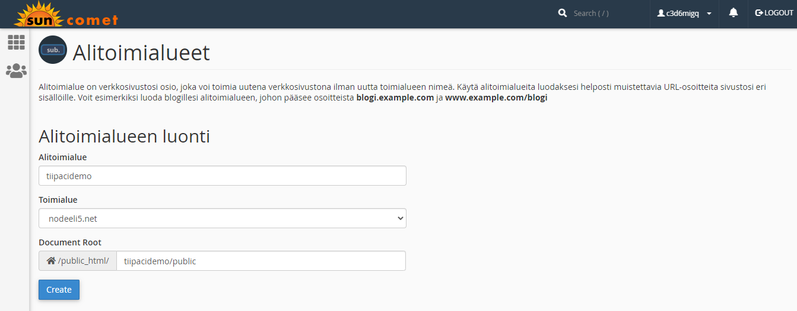
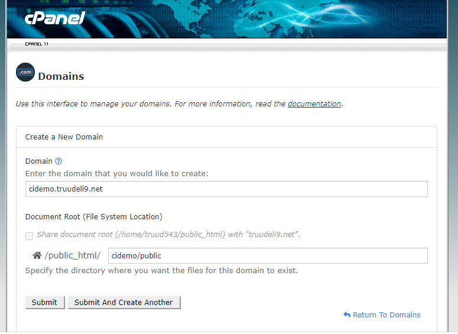

## Web-hotellin käyttäminen (cpanel)

### MySQL

Kirjaudu cpanel:iin ja tee itsellesi uusi MySQL-tietokanta (MySQL Database Wizard). Luo sille käyttäjä  (kaikki oikeudet). Nimeä tietokanta ja käyttäjä niin, että nimestä selviää mihin projektiin ja kenelle ne kuuluvat (esim. tiipar_notes_db). Tallenna em. tiedot esim. muistioon.

### Migrations/seeds

- Aloita kloonaamalla repo, jossa tietokannan migrations/seeds on (esim. systeemityodemo)
- siirry kansioon, jossa tietokanta on (esim. cd news)
- aja composer install
- aja vendor/bin/phinx init
- tallenna edellä luodut tiedot phinx.php tiedostoon kohtaan "production" (name, user, pass)
- etsi cpanel:ista host osoite (shared IP), tallenna phinx.php tiedostoon (host)
- lisää koulun IP - osoite RemoteMySQL:in White listaan
- aja migrate: vendor/bin/phinx migrate -e production
- aja seeds: vendor/bin/phinx seed:run -e production

### Testaa toimiiko remote tietokanta CI:n kanssa

- siirry kansioon, jossa CI-koodi on (esim. cd ../newsdemo)
- aja composer install
- muokkaa .env tiedostot käyttämään remote - tietokantaa:
    1. muuta env -> .env
    2. vaihda development -> production
    3. muuta tietokannan tiedot samoiksi kuin phinx.php:ssa (host, database, username)
- käynnistä: php spark serve --port 8888 (testaa toimiiko localhost + remote db)

### Subdomain:in (alitoimialueen) luominen

Tee itsellesi uusi domain/subdomain cpanel:issa. Tämä luo uuden kansion palvelimelle (public_html:n sisälle). Valitse subdomainille PHP-versioksi PHP 7.2 (MultiPHP Manager). Aseta *document root* vastaamaan sitä kansiota, jossa *index.php* on (esim. my_domain/public).





### Tiedostojen siirtäminen palvelimelle (FTP)

Lataa koneellsesi portable versio FTP-ohjelmasta kuten [WinSCP](https://winscp.net/eng/downloads.php).

Saat FTP-yhteyden kirjautusmistiedot CPANEL:ista kohdasta *FTP-accounts*.

Ota yhteys palvelimeen ja siirrä kaikki PHP-tiedostot subdomain-kansioosi.

### .htaccess

HUOM! Tätä ei tarvita CI:n kanssa (on .htaccess on automaatisesti mukana).

Jotta kaikki HTTP-pyynnöt ohjautuisivat reitittimellemme eli ohjelmamme *index.php*-tiedostolle, lisäämme *public*-kansioon vielä *.htaccess*-tiedoston, joka konffaa Apache-palvelimen toiminnan halutuksi.  

```cmd
# This file configures the Apache web server such that:
#  - index.php is served
#  - any other request is rerouted to index.php.

RewriteEngine On
RewriteRule ^/index\.php$ - [L,NC]

RewriteRule . index.php [L]
```

