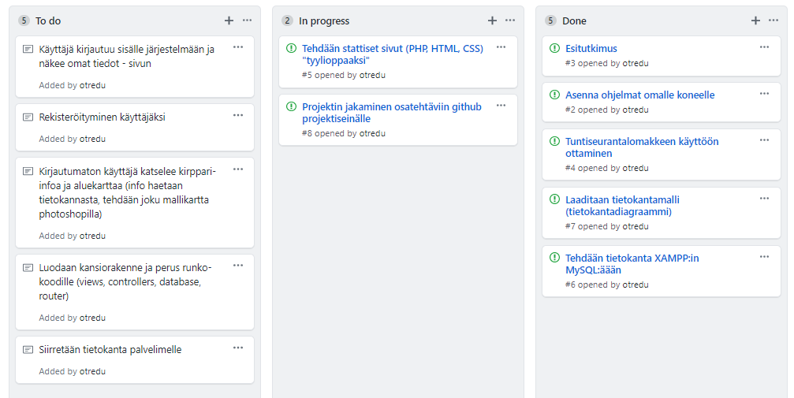

## Asiointipalveluprojekti

Materiaali täydentyy kurssin edetessä

- Tutustu [projektikuvaukseen](https://omaareena-my.sharepoint.com/:b:/g/personal/tiina_partanen_edu_tampere_fi/EVFbPKE62pRCvnffQl0XExsBYvsOqIbAeDwYFy5VaddycQ?e=3hA33J) ja tee sen pohjalta seuraavat suunnitelmat

### Esitutkimus

- [esitutkimusohje](../systeemityo/esitutkimus_uusi.md)
- piirrä kaikki diagrammit tällä ohjelmalla: [draw.io](http://draw.io)
- piirrä MockUp - [AdobeXD](https://www.adobe.com/fi/products/xd.html):llä tai jos sen asentaminen ei onnistu [Figma](https://www.figma.com/):lla

### Toiminnallinen suunnittelu

- tietokantamalli (Visio: UML)
- näyttörakennekaavio (Visio: UML luokkakaavio)
- tyyliopas (HTML + CSS)

Tarkempia [ohjeita toiminnalliseen suunnitteluun](../systeemityo/toiminnallinen.html).

### Projektin jakaminen osaprojekteihin

Tee projektisuunnitelma github:in *project*-välilehdelle. Jaa projektiosatehtäviin, ja pidä seinä aina ajantasalla siitä mitä on tekemättä, mitä on työnalla ja mitä on valmiina:

### Toteutus

- Projektiryhmä toteuttaa oman suunnitelmansa mukaan käyttötapauksia ohjelmoimalla käyttöliittymäkoodia (frontend) sekä tietokantatoimintoja (backend)

#### Osatehtävät jokaiseen käyttötapaukseet liittyen:

- Tarkempi suunnittelu
- Tietokannan toteutus ja testaus
- Käyttötapaukseen liittyvä tietokantaliittymän toteutus ja testaus
- Käyttöliittymän toteutus ja testaus
- Integrointitestaus (kaikkien toteutettujen osien testaus yhdessä)

### Testaus ja loppuraportti

Lopussa toteutetaan systeemitestaus eli koko järjestelmän testaus loppukäyttäjän näkökulmasta.

Projektista kirjoitetaan [raportti](http://www.leeniemi.net/proj19/apumateriali/WebMagiaProjektin_loppuraportti.pdf) ja projektityöskentelystä [itsearviointi sekä vertaisarviointi](https://omaareena-my.sharepoint.com/:w:/g/personal/tiina_partanen_edu_tampere_fi/ETibQLkTNhRFrbnSgoavirABFVuNBW6edN2IRveorX6G6A?e=kcKW8v).

Ohjeita [systeemitestaukseen](../testaus/index.html).

### Projektin hallinnasta

- Tunnit kirjataan joka päivä tuntiraportointi-Exceliin

- Projektipäällikkö seuraa tehtävien etenemistä (Excel tai Trello), ja vastaa siitä, että kaikilla on tekemistä (projektipäällikkö voi vaihtua viikottain). Projektin etenemisestä tehdään raportti kerran viikossa.

- Kaikki koodi tallennetaan säännöllisesti github:iin, jokainen projektin jäsen työskentelee omassa haarassaan ja integrointi tehdään hallitusti (PR ja koodikatselmointi)
-[Ohjeet github:in käyttöön projektissa](https://otredu.github.io/github/projektityo.html)

Esimerkkikuva projektin aikataulutuksesta:
- 

---
Vinkkejä:

- [Kuvien pienentäminen Photoshopilla](./images.html)

- [CPANEL-ohjeet](./cpanel.html)

- [Leenan kevään kurssin sivut](http://www.leeniemi.net/proj19/) -->
