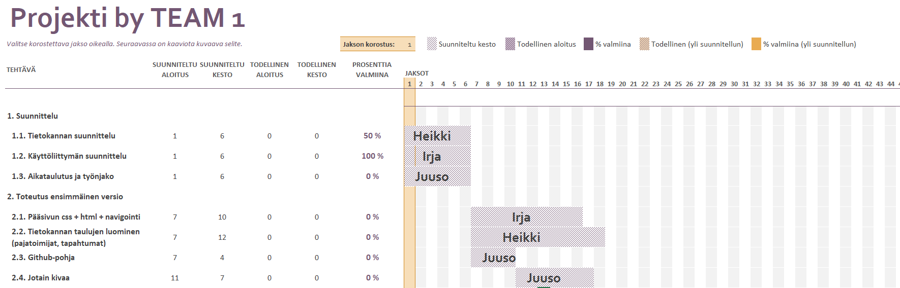

## Asiointipalveluprojekti

Materiaali täydentyy kurssin edetessä

[Leenan kevään kurssin sivut](http://www.leeniemi.net/proj19/)

Osatehtäviin jakaminen ja GANTT (excel):

Projektin aikataulu:

Projektin suunnittelu

### Esitutkimus ja projektisuunnitelma

- projektin kuvaus
- vaatimukset
- käyttötapauskaavio (Visio: UML usecase)
- MockUp (AdobeXD)
- käsiteluettelo
- projektin jakaminen osatehtäviin (määritellään mitä toimii ohjelman ensimmäisessä  versiossa, toisessa versiossa, kolmannessa versiossa)
- projektin aikataulutus ja työnjako (kuka tekee mitäkin ohjelman ensimmäisen version toteutuksessa jne)

### Toiminnallinen suunnittelu

- ER-malli (Visio: Chen) ja tietokantamalli (Visio: UML)
- näyttörakennekaavio (Visio: UML luokkakaavio)
- arkkitehtuuri (korkealla tasolla)
- tyyliopas (HTML + CSS)

### Toteutus

- Projektiryhmä toteuttaa oman suunnitelmansa mukaan käyttötapauksia ohjelmoimalla käyttöliittymäkoodia (frontend) sekä tietokantatoimintoja (backend)

Osatehtävät jokaiseen käyttötapaukseet liittyen:

- Tietokannan toteutus ja testaus
- Tietokantaliittymän toteutus ja testaus
- Käyttöliittymän toteutus ja testaus
- Systeemitestaus (koko järjestelmän testaus)

- Projektiryhmässä jokainen testaa oman osuutensa toiminnan, päivittää koodin omaan haaraansa (branch), lisää sen yhteiseen repoon eli tekee pullrequestin, katselmoi toistensa koodia ja testaa integroidun koodin toiminnan

### Projektin hallinnasta

- Tunnit kirjataan tuntiraportointi Exceliin

- Projektipäällikkö seuraa tehtävien etenemistä, ja vastaa siitä, että kaikilla on tekemistä

- 