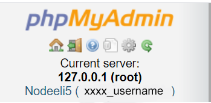
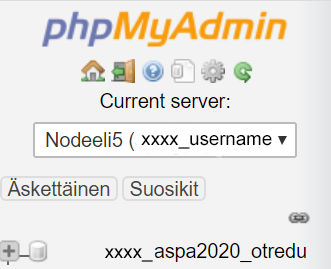
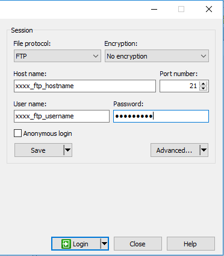
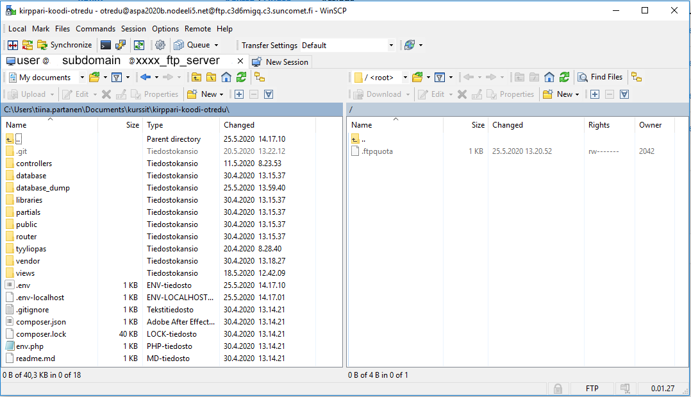

## Sivuston siirtäminen webhotelliin

### Tietokannan siirtäminen palvelimelle

MySQL-tietokanta siirretään koulun webhotelliin siirtämällä tietokanta dumppi PhpMyAdminin avulla remote-palvelimelle.

1. Ota tietokannastasi dumppi (vie), tallenna projektikansioon (database_dump)

2. Konffaa XAMPP-tietokantasi käyttämämään remote-palvelinta (nodeeli5.net)
    - avaa tiedosto: *c:\xampp\phpMyAdmin\config.inc.php*
    - kirjoita sinne:

    ```cmd
    /* Remote Server */
    $i++;
    $cfg['Servers'][$i]['connect_type'] = 'tcp';
    $cfg['Servers'][$i]['auth_type'] = 'config';
    $cfg['Servers'][$i]['host'] = 'xxxx_ip_address';
    $cfg['Servers'][$i]['verbose'] = 'Nodeeli5';
    $cfg['Servers'][$i]['user'] = 'xxxx_username';
    $cfg['Servers'][$i]['password'] = 'xxxx_password';
    $cfg['Servers'][$i]['hide_db'] = '^(mysql|performance_schema|innodb|information_schema)$'
    ```

    Korvaa kohdat:
    *xxxx_ip_address* (hostname), *xxxx_username* (database username) ja *xxxx_password* (database password) opettajan antamilla tiedoilla.

3. Avaa yhteys remote-pavelimelle, valitse tietokanta, tuo dump-tiedosto sinne

    

    

    

### Koodin siirtäminen palvelimelle

1. Tee uusi *.env*-tiedosto remote-palvelinta varten (uudelleen nimeä vanha *.env*-tiedosto *.env-localhost*:iksi). Tallenna *.env*-tiedostoon webbihotellin tietokannan kirjautumistiedot (samat kun edellä, saat ne opettajalta): xxxx_database (database name), xxxx_username (database username) ja xxxx_password (database password).

    ```cmd
    DB_DBTYPE = "MySql"
    DB_HOST = "localhost"
    DB_USERNAME = "xxxx_username"
    DB_PASSWORD = "xxxx_password"
    DB_NAME = "xxxx_database"
    DB_PORT = "3306"
    ```

2. Lataa [WinSCP-ohjelma (portable)](https://winscp.net/eng/docs/portable).

3. Avaa yhteys palvelimelle käyttäen opettajan antamia ftp-kirjautumistietoja (ftp-server, ftp-username, ftp-password, ftp-port):

    

4. Siirrä tarpeelliset tiedostot (EI .git) palvelimelle hinaamalla ne vasemmalta oikealle. Huom! *index.php*:n pitää olla kansiossa nimeltä *public*.

    

5. Nyt sivustosi pitäisi aueta osoiteesta: *xxxx_username.nodeeli5.net*.