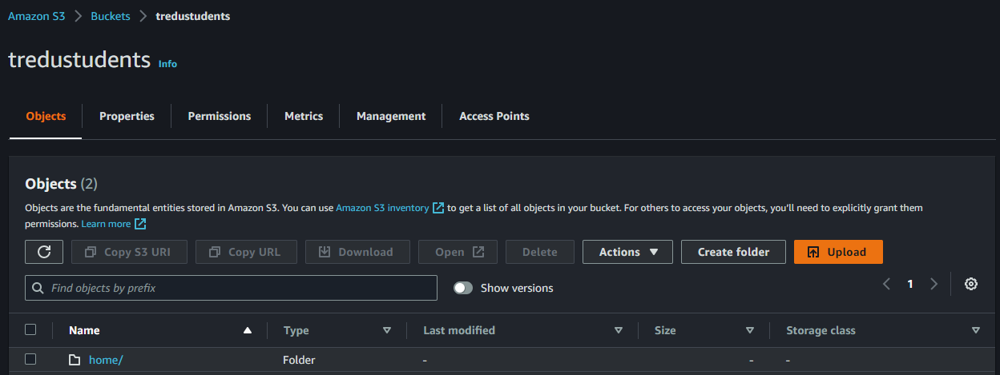
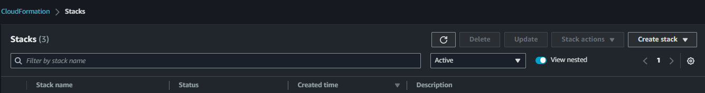
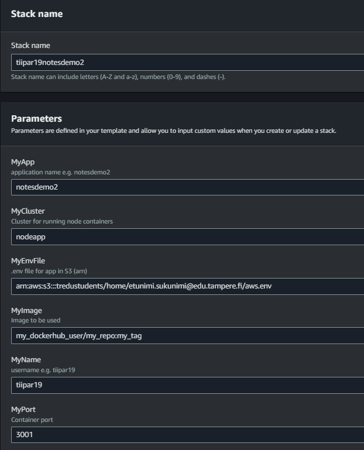

## Notesdemon siirtäminen AWS:aan

1. Tietokannan siirtäminen palvelimelle

    Siirrä tietokanta palvelimelle ([ohjeet](./knex-migrations-cpanel.html)).

2. Kontin buildaus ja testaus lokaalisti 

    Buildaa projekti Dockerfile:n avulla ([ohjeet Docker-kontin tekemiseen](../../docker/notesdemofull.html))

3. Siirrä kontti dockerhubiin 

    Siirrä kontti dockerhub:iin (public repo) ja testaa vielä kerran lokaalisti, että kaikki toimii ([ohjeet](../dockerhub/container-deployment.html)). 

4. Muokkaa .env - tiedosto AWS:n haluamaan muotoon
    - nimeä tiedosto niin, että se on esim. muotoa "notesdemo2.env" (pelkkä .env ei toimi)
    - poista välilyönnit tiedostosta env-muuttujan ja sen arvon välistä esim.:

    ```cmd
    DB_HOST=my_db_host
    DB_USER=my_db_user
    DB_PASS=my_db_pass
    DB_DATABASE=my_db
    DB_TYPE=mysql2
    DB_PORT=3306
    PORT=3001
    SECRET=tosisalainensalasanaineinienirewnrq233045j34
    ```
5. Kirjaudu AWS:ään osoitteessa: [Tredu AWS](https://toinenaste.awsapps.com/start#/)

6. Tallenna notesdemo2.env omaan kansioosi S3-bucketissa: *arn:aws:s3:::tredustudents/home/etunimi.sukunimi@edu.tampere.fi*

    

7. Siirry Cloud Formation - palveluun valitse *Create stack* (with new resources).

    

    Valitse template source:ksi *Amazon S3 URL* ja liitä siihen: 

    ```cmd
    https://tredustudents.s3.eu-north-1.amazonaws.com/templates/ecs_alb_fullstack_student_2.3_SSO.yml
    ```

8. Täydennä stack details omilla tiedoillasi ja valitse *Next->Next->Submit*:

    

    Huom1! MyName on muotoa etusuk**, jossa ** on aloitusvuosi.
    Huom2! MyCluster on aina *nodeapp*.
    Huom3! Saat aws.env-tiedoston arn:in kopioitua S3:sta.

9. Jos kaikki menee hyvin, ohjelmasi löytyy AWS:stä osoitteesta:

    https://MyNameMyApp.node.treok.io eli [esimerkin kontti](https://tiipar19notesdemo2.node.treok.io/).


