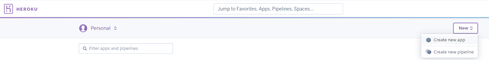
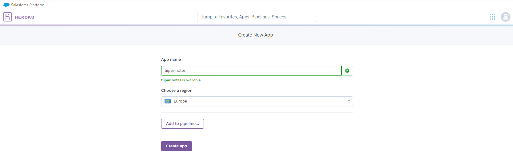

## Docker - kontin julkaiseminen Herokuun

1. Heroku-tilin luominen, uuuden app:in luominen

    Tee tili heroku.com:iin (ellei sellaista vielä ole ja luo uusi app (valitse Eurooppa).

    

    

2. Asenna heroku cli (ellei ole jo)

    ```cmd
    npm install -g heroku
    ```

3. Kirjaudu Herokuun (hyväksy selaimessa) sekä Heroku container registry:yn

    ```cmd
    heroku auth:login
    heroku container:login
    ```

4. Nimeä (tag) kontti Herokun vaatimalla tavalla (Huom! vaihda "notesdemo-xxxx":n tilalle oman app:isi nimi Herokussa) ja "notesdemo-yyyy":n tilalle konttisi nimi:

    ```cmd
    docker image tag notesdemo-yyyy registry.heroku.com/notesdemo-xxxx/web
    ```

5. Lataa kontti Heroku container registryyn:

    ```cmd
     docker image push registry.heroku.com/notesdemo-xxxx/web
     ```

6. Julkaise Herokussa

    ```cmd
    heroku container:release web -a notesdemo-xxxx
    ```

---

## Problem shooting

### C:\_netrc problem

Jos saat em. virheen, aseta homedrive:

PowerShell:

    ```cmd
    $Env:HOMEDRIVE = "C:"
    ```

CMD:

    ```cmd
    set HOMEDRIVE=C:/users/tiina.partanen

    echo %HOMEDRIVE%
    ```