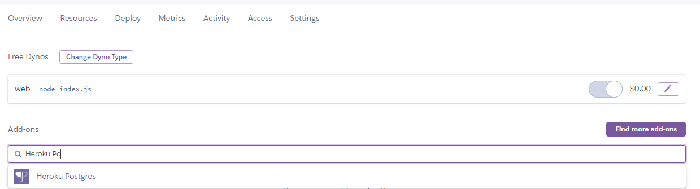
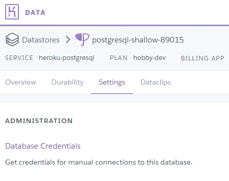

## Tietokannan siirtäminen Herokun Postgres-tietokantaan

### Tietokannan luominen Herokuun

Herokussa on mahdollisuus luoda ilmainen Postgres - tietokanta. Luo ensin uusi Heroku-app ja lisää sille uusi resurssi Heroku Postgres. Hyväksy "Hobby Dev - Free" - tilaus.



Avaa *Settings/Database Credentials* ja ota talteen Host, Database, User, Port ja Password.



### Migrations ja seeds Herokuun

Muokkaa knex.js tietostoon em. tietokannan kirjautumistiedot kohtaan "production":

```js
  production: {
    client: 'postgresql',
    connection: {
      host: 'your_host_in_heroku',
      database: 'your_database_in_heroku',
      user:     'your_user_in_heroku',
      password: 'your_password_in_heroku',
      ssl:  { rejectUnauthorized: false }
    },
```


