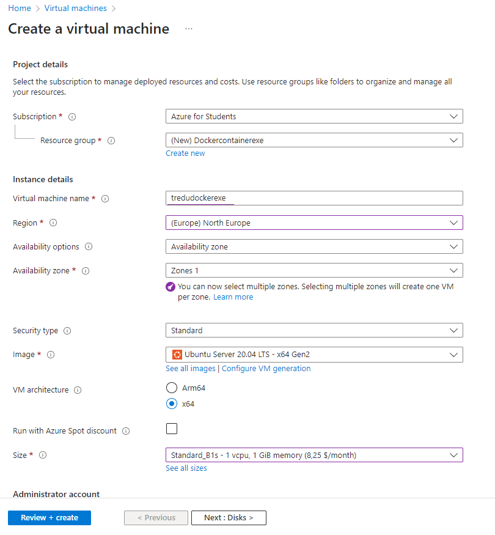
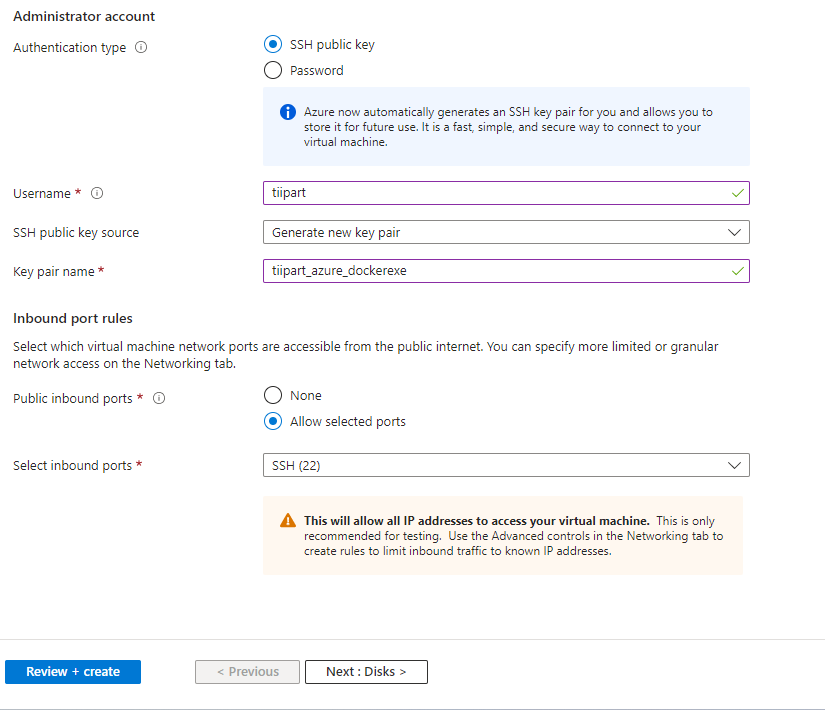
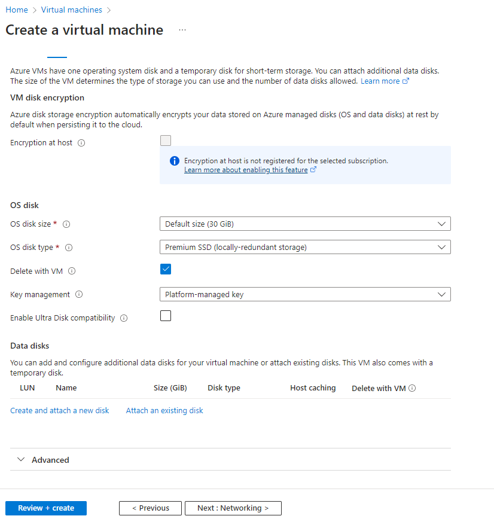
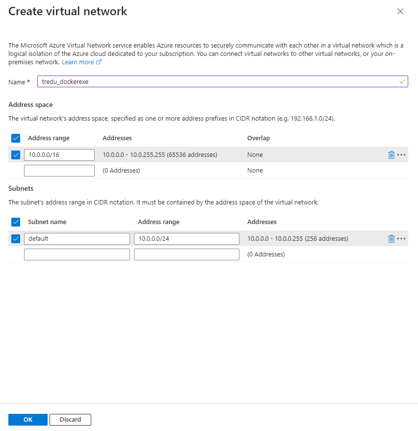
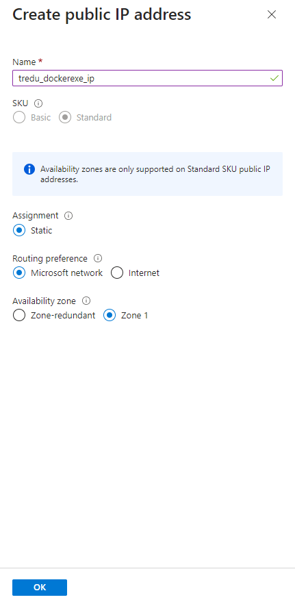
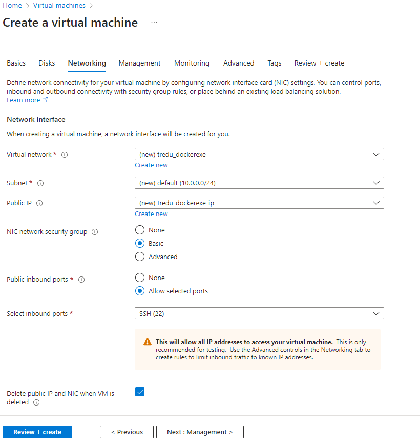
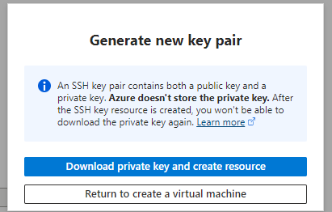
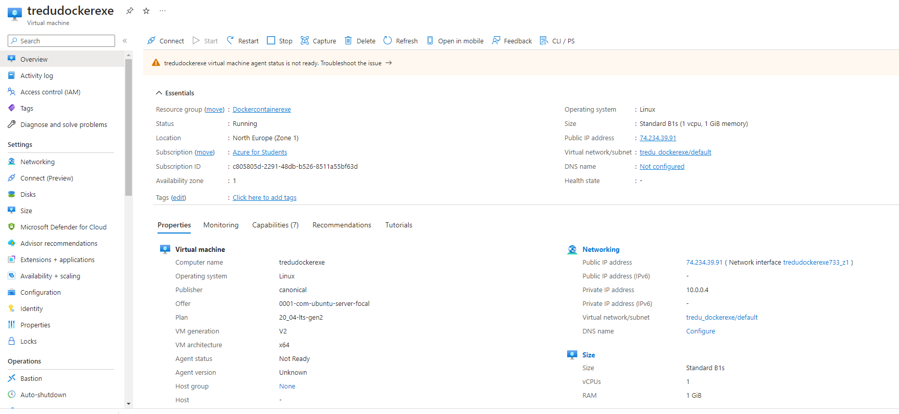
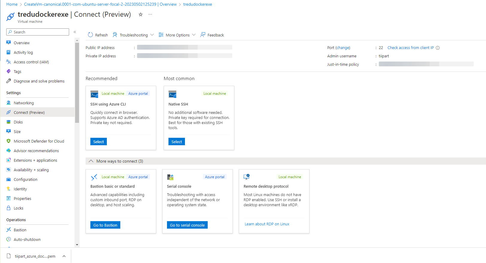
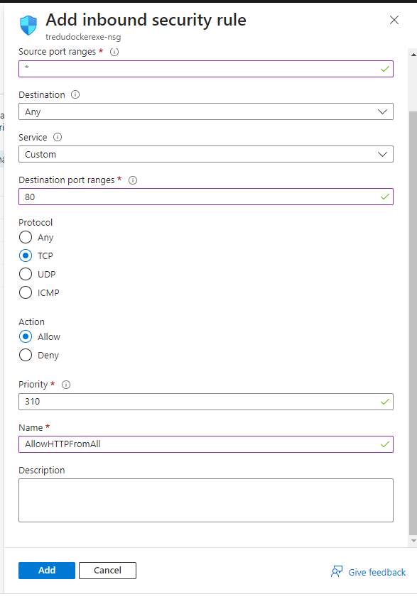

## Virtuaalikoneen käynnistys Azureen

### SSO (Single-Sign-On) kirjautuminen ja vappusatanen

Kirjaudu [Azureen](https://azure.microsoft.com/en-us/get-started/azure-portal) Tredun opiskelijatunnuksilla (etunimi.sukunimi@edu.tampere.fi).

Käytössäsi on *Azure for students* - subscription, joka antaa 100USD creditin yhden vuoden aikana käytettäväksi. Älä siis tuhlaa! Sulje serverit aina tunnin jälkeen! Voit tarkistaa jäljellä olevan creditin [täältä](https://www.microsoftazuresponsorships.com/Balance).

### Ubuntu-serverin käynnistys

Käynnistä itsellesi yksi Ubuntu - virtuaalikone ja lataa *.pem - file, joka sisältää avain parin (*private-public key*) serverin hallintaan. Tallenna tämä tiedosto K-levylle .ssh kansioon äläkä anna sitä muille (näillä saa *root* - oikeudet serveriin).

1. Avaa virtuaalikoneet (*Virtual machines*)


2. Luo uusi virtuaalikone (*Create*)


3. Valitse koneen koko (size): General purpose B1 (1 vCPU, 1 GiB RAM)


4. Konfiguroi kone: 
    - anna koneelle nimi
    - luo uusi resurssiryhmä 
    - valitse region: North Europe
    - valitse image: Ubuntu Server 20.04 LTS - x64 Gen2



5. Kongiguroi admin - tili:
    - valitse SSH - public key (turvallisempi kuin salasana)
    - anna käyttäjänimi ja key pair name
    - valitse: Generate new key pair



6. Valitse *Default disc size (30GiB)*



7. Valitse vertuaaliverkon asetukset (hyväksy default)



8. Luo uusi julkinen IP-osoite (*Create public IP address*)



9. Konfiguroi virtuaaliverkko: 
    - salli sisääntuleva SSH-liikenne porttiin 22 (*Public inbound ports*)



10. Luo virtuaalikone (*Review + create*), valitse *Download private key and create resource*



11. Tallenna ladattu *.pem - tiedosto K-levylle .ssh - kansioon


### Ubuntu-serveriin yhteyden ottaminen

1. Avaa virtuaaliserveri ja valitse *Connect*



2. Valitse *Native SSH* (käytämme Git Bash:iä SSH-yhteyden muodostukseen)



3. Kopioi ssh-komento (sisältää serverisi IP-osoitteen ja käyttäjätunnuksen, vaihda itse *.pem - tiedoston nimi), aja Git bash:issä (vastaa *yes*):

    ```cmd
    ssh -i ~/.ssh/my_pemfile_name.pem my_username@my_server_ip
    ```

4. Jotta serverille pääsee myös Internetistä, käy konffaamassa *Security group*:iin HTTP-portti 80 auki:



---

Onnittelut, olet nyt Linux-serverin onnellinen root. Happy hacking. 

Tämän jälkeen voit asentaa serverille tarvittavia ohjelmia jne.


