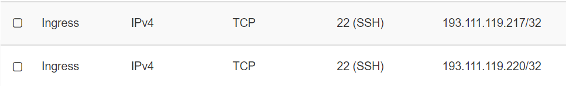
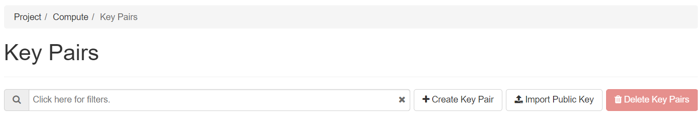

## Kontin ajaminen CSC:llä

### Build container

Tee (build) koodistasi *container image* ja tallenna se valitsemaasi *container registry*:yn, esim. Docker Hub:

[Ohjeet notesdemo-json versiolle](https://otredu.github.io/docker/notesdemo.html)

### SSH-yhteys serveille

Ota SSH-yhteys serverille (saat opettajalta linux-käyttäjätunnuksen ja salasanan). Varmista että koulun public IP-osoite on sallittu. Jos ei ole lisää koulun IP osoite *security group*:iin incoming port: 22:



1. luo itsellesi *keypair* osoitteessa [http://pouta.csc.fi](http://pouta.csc.fi) ja tallenna lataamasi *.pem - tiedosto k-levylle .ssh - kansioon. Tiedosto sisältää *rsa-private key*:n, joten älä anna sitä muille.



2. avaa Bash ja siirry .ssh kansioon, ota ssh-yhteys serverille:

    ```cmd
    cd .ssh
    ssh -i "my_own.pem" myteam@server_ip
    ```

    Huom. voit myös itse tehdä *keypair*:in:

    ```cmd
    cd .ssh
    ssh-keygen 
    ```  	

    Kun *ssh-keygen* kysyy tiedoston nimeä, anna sellainen (esim. *fs_rsa_id*). Kopioi *fs_rsa_id.pub* - tiedoston sisältämä *public key* ja tallenna se serverille *import public key* - toiminnolla tai tuo se suoraan tiedostona.

3. Poista applikaatiostasi kaikki viittaukset *localhost*:iin (jos sellaisia siellä vielä on). Tee uusi build ja push:aa uusi image dockerhub:iin (Windows-koneella)

    ```cmd
    $ docker build . -t my_docker_user/my_app:my_tag
    $ docker login
    $ docker push my_docker_user/my_app:my_tag
    ```

4. Lataa uusi image dockerhubista ubuntuun (ssh-yhteyden avulla) ja käynnistä se opettajan antamaan porttiin (tässä 81):

    ```cmd
    $ docker login
    $ docker pull my_docker_user/my_app:my_tag
    $ docker run -d -p 81:3001 my_docker_user/my_app:my_tag
    ```

Nyt jokaisen ryhmän/opiskelijan applikaation pitäisi aueta osoitteesta:

    ```cmd
    http://team1.my_server_ip
    http://team2.my_server_ip
    jne.
    ```

Huom! Opettaja on asentanut sertifikaatit, joten reverse-proxy pakottaa yhteyden HTTPS:ksi (suojattu yhteys).