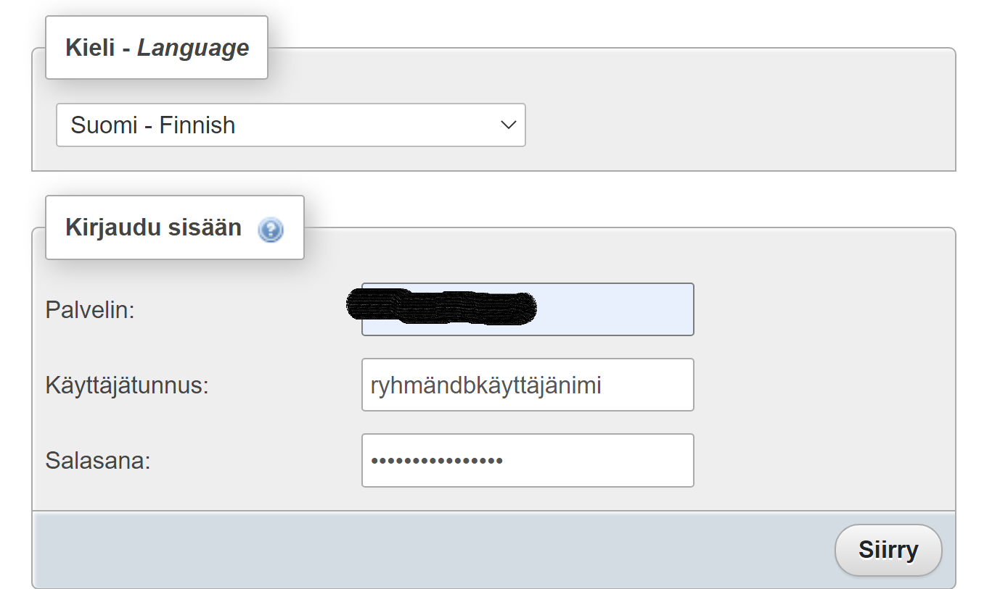

## PHPMyAdmin

PHPMyAdmin:in avulla voidaan ottaa yhteys myös jollakin ulkoisella palvelimella tai pilvipalvelussa toimivaan tietokantaan. Silloin docker:in käynnistyskomentoon sijoitetaan ko. tietokannan url sekä tietokannan nimi.


Esim. jos haluat ottaa yhteyden cpanelissa sijaitsevaan MySQL-tietokantaan, käynnistä PhpMyAdmin:istä sellainen versio, jossa voi antaa remote host:in osoitteen:

```cmd
docker run --name myadmin -d -e PMA_ARBITRARY=1 -p 8085:80 phpmyadmin
```

Nyt voit kiinnittyä koulun cpanel:iin:



Remote-tietokannan osoitteen voi antaa myös käynnistyskomennossa.

Esim. jos otat yhteyttä Azuressa olevaan tietokantaan kopioi tietokannan url ja nimi seuraavaan docker käynnistyskomentoon:

```cmd
docker run --name phpmyadmin-azure -d -e PMA_HOST=<your_db_url>:3306 -p 8084:80 phpmyadmin/phpmyadmin
```