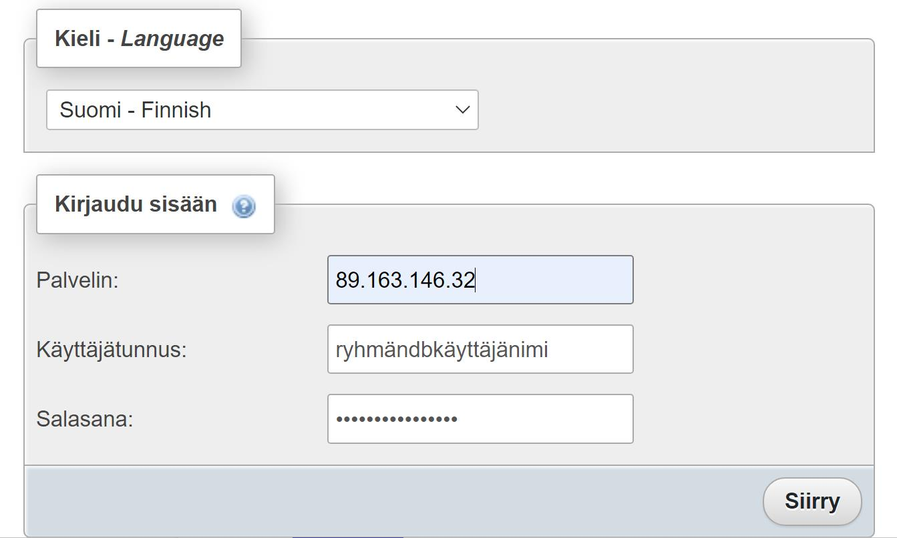

## PhpMyAdmin:in käyttö remote tietokannan kanssa

Projektissa käytetään yhtä yhteistä tietokantaa koko projektitiimin kanssa. Yksi opiskelija luo tietokannan ja käyttäjän omaan CPANEL:iinsa ja antaa käyttäjätunnuksen ja salasanan muulle ryhmälle. Muut pääsevät tietokantaan Docker:issa pyörivän PhpMyAdminin kautta.

1) Käynnistä Docker:in Windows valikosta
2) Aja CMD:ssä/Bash:issa: 
    docker run --name myadmin -d -e PMA_ARBITRARY=1 -p 8085:80 phpmyadmin
 
