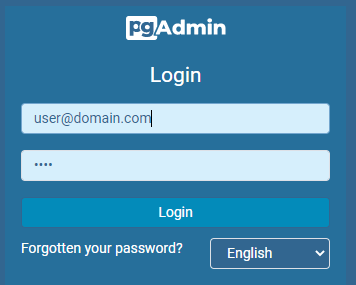
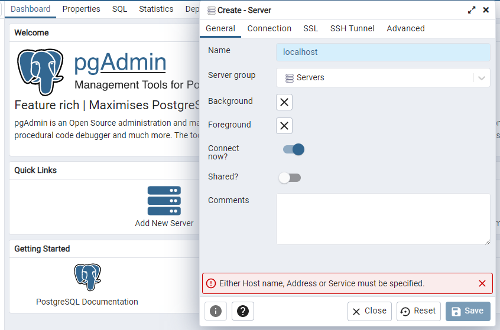
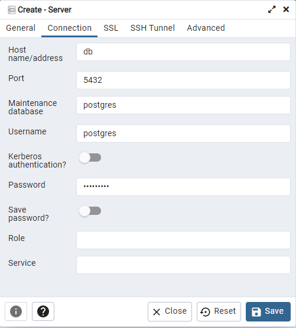
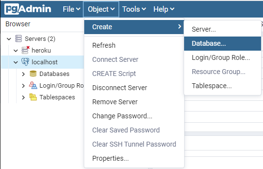
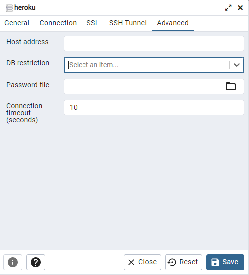

### Postgres ja Pgadmin4 (localhost)

Asenna konellesi Postgres-tietokanta ja Pgadmin4 käyttäen docker-compose:a:

1. Tallenna seuraava teksti tiedostoon nimeltä docker-compose.yml:

    ```yml
    version: '3.1'

    services:
    db:
        image: postgres
        restart: always
        ports:
        - 5432:5432
        environment:
        POSTGRES_USER: postgres
        POSTGRES_PASSWORD: mypass123

    pgadmin4:
        image: dpage/pgadmin4
        restart: always
        ports:
        - 8080:80
        environment:
        PGADMIN_DEFAULT_EMAIL: user@domain.com
        PGADMIN_DEFAULT_PASSWORD: root
    ```

2. Käynnistä CMD ja kirjoita:

    ```cmd
    docker-compose up -d 
    ```

3. Avaa Pgadmin4 selaimessa ja kirjaudu sisään

    http://localhost:8080

    

    - käyttäjätunnus: user@domain.com
    - salasana: root

4. Yhdistä serveriin

    1) Lisää serveri (add new server)

    

    2) Täytä kirjautumistiedot

    

    - käyttäjätunnus: postgres
    - salasana: mypass123

---


5. Jos teet oman tietokannan lisää uusi tietokanta

    Object -> Create -> Database

    


--- 

5. Jos tietokanta on jo olemassa (esim. remote server), aseta sen nimi filteröintiehdoksi (DB restrictions):

    
