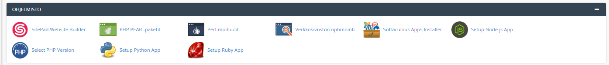

## Web-hotelliin asentaminen (node)

*cpanel*:ssa on tuki *node*-pohjaisille sovelluksille (huomaa, että kaikissa cpanel-asennuksissa sitä ei ole kuitenkaan mukana).

### Tietokannan siirtäminen

Luo webhotelliin uusi tietokanta MySQL-tietokannat -työkalun avulla. Lue sille uusi käyttäjä ja salasana. Anna käyttäjälle kaikki oikeudet.

Muokkaa *knexfile.js*-tiedostoa niin, että se sisältää edellä luomasi tietokannan ja käyttäjän tiedot kohdassa: *production* (host, database, user ja password). *host*-osoitteen saat *cpanel*:in oikeasta yläkulmasta kohdasta *shared IP address*.

```js
module.exports = {
  development: {
    client: 'mysql',
    connection: {
      user: 'root',
      password: 'mypass123',
      database: 'notes_db'
    }
  },

  production: {
    client: 'mysql',
    connection: {
      port: 3306,
      host: 127.0.0.1,
      database: user123_notes_db,
      user: user123_admin,
      password: passwordForUser123
    },
    pool: {
      min: 2,
      max: 10
    },
    migrations: {
      tableName: 'knex_migrations'
    }
  }
};
```

Muista, että knexfile.js pitää lisätä *.gitignore*:en.

Webhotelli ei hyväksy tietokantayhteyksiä kuin luotetuista lähteistä. Lisää Tredun IP-osoite *whitelist*:lle, joka löytyy *Etä-MySQL*-työkalun alta. Saat IP-osoitteen selville esim. avaamalla sivuston [http://www.whatismyip.com/ip-address-lookup/](https://www.whatismyip.com/ip-address-lookup/)

Nyt voit ajaa tietokantasi webhotellin MySQL-tietokantaan käyttäen knex-migrations-työkalua.

```cmd
npx knex --env production migrate:latest
```

Vastaavasti aja *seed*:it tietokantaan:

```cmd
npx knex --env production seed:run
```

### React-build

Tee frontend:stä *build* ja tallenna se backend:in juureen. Muista muuttaa backendin koodissa *express*-reitityksen (app.js) *static*-polku "*build*":ksi.

```cmd
npm run build
```

```js
app.use(express.static(path.join(__dirname, 'build')));
```

### Tietostojen siirtäminen webhotelliin

Poista *backend*-kansiosta node_modules ja .env (näitä ei siirretä webhotelliin, node_modules:it asennetaan webhotellissa).

Käytä [WinSCP-ohjelmaa](https://winscp.net/eng/downloads.php#additional), siirrä tiedostot webhotelliin. Valitse FTP-protokollaa (portti 21). Löydät WinSCP:n tarvitsemat tiedot webhotellin kohdasta *FTP-tilit* (*Määritä FTP-työasemaohjelma*).

Siirrä backend-kansio webhotellin tiedostoihin (esim. tee node-niminen kansio, EI public_html:n sisälle).

### Alidomain

Tee ohjelmaasi varten uusi alidomain käyttäen cpanel:in *Alitoimialueet*-toimintoa.

### Node app:n konffaaminen

Luo uusi Node.js-sovellus *Setup Node.js App*-työkalun avulla.



Täytä kohdat:

- Application root = hakemisto, josta backend-koodisi löytyy)
- Application URL = valitse luomasi alidomain
- Application startup file = bin/www tai index.js riippuen siitä, missä tiedostossa käynnistät webserverin
- Passenger log file = errorlog-tiedosto


Nyt asenna node_modules ajamalla npm (*Run NPM install*). Tallenna välillä.

Nyt lisää ohjelman tarvitsemat ympäristömuuttujat (samat kuin .env:ssä).

Huom! Tietokanta, database, user ja password ovat samat kuin *knexfile.js*:ssä (host on localhost):


Tallenna ympäristömuuttujat. Nyt voit käynnistää ohjelmasi ja kaiken pitäisi toimia kun avaat alidomain-osoitteen selaimessa.
