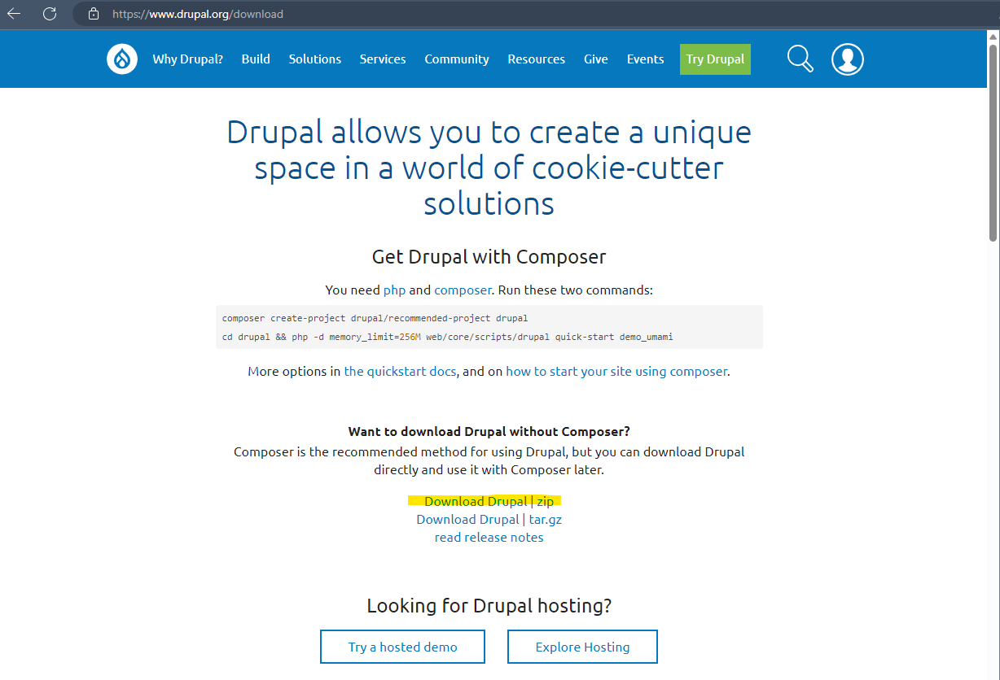
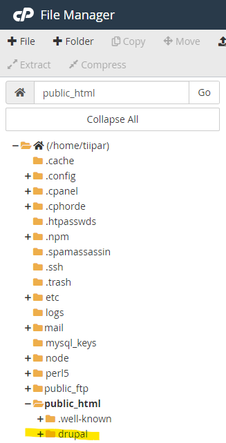
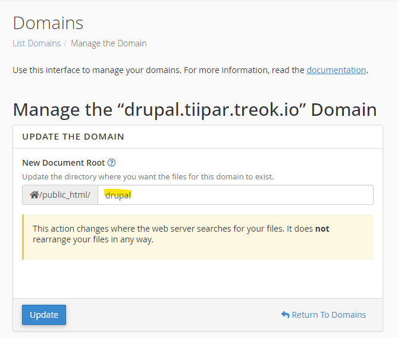
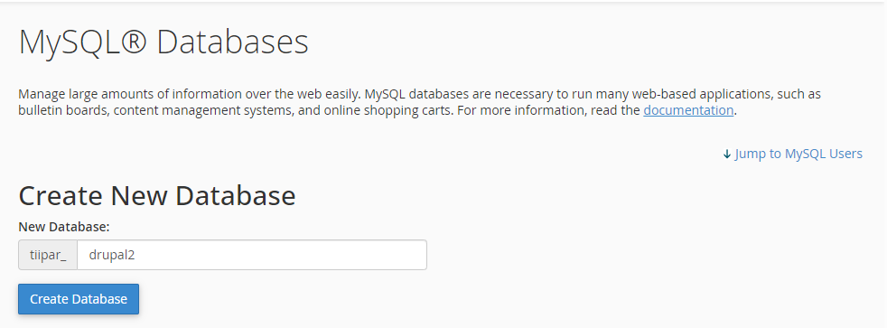
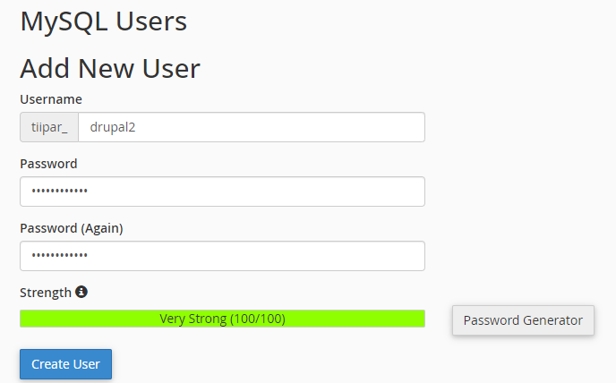
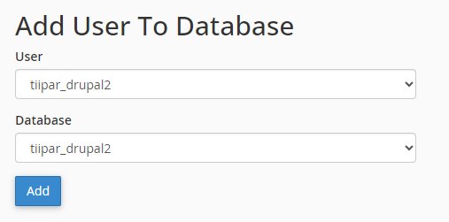
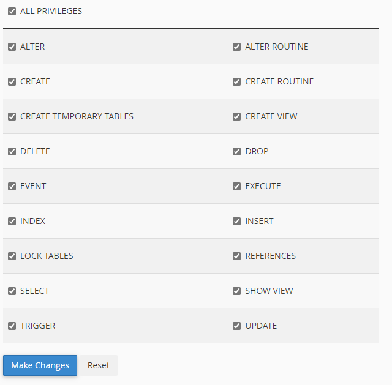
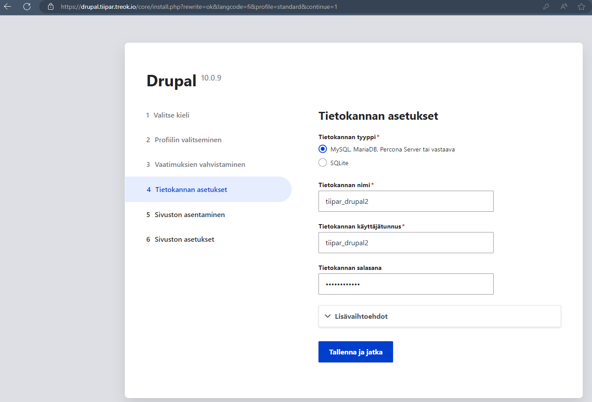

## Asenna Drupal cpanel:iin

1. Lataa uusin version [Drupal](https://www.drupal.org/download):ista (lataa zip)

2. Lataa se cpanel:in File Managerilla hakemistoon public_html ja pura zip - paketti (hiiren oikealla *Extract*)

3. Tee cpanel:in kautta uusi domain esim. drupal.etusuk23.treok.io ja aseta sen *Document Root*:ksi puretun zip-paketin sijainti esim. */public_html/drupal*.

4. Luo cpanel:issa tietokanta sekä käyttäjä, ota talteen salasana. Ne tehdään kohdassa *MySQLDatabases*. Muista yhdistää käyttäjä tietokantaan (anna kaikki oikeudet).

5. Avaa sivustosi osoite selaimessa ja suorita Drupal:in asennus, anna tekemäsi tietokannan nimi, käyttäjä sekä salasana, kun niitä kysytään:

