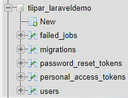
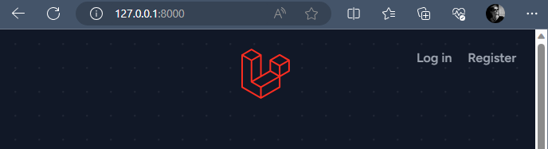
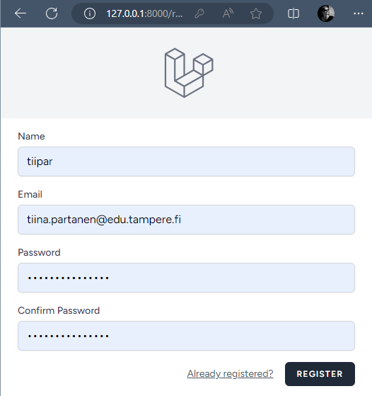
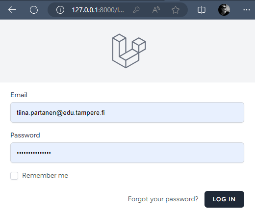

## Laravel asennus

1. Varmistu, että koneelle on asennettuna PHP ([asenna XAMPP](https://www.apachefriends.org/download.html) sekä Composer ([asenna Composer](https://getcomposer.org/download/)). 

2. Tee tyhjä repo ja aja sen juuressa terminaalissa (cmd) Laravel:in asennusskripti:

    ```cmd
    > composer create-project laravel
    > laravel my_project_name
    ```

2. Tee uusi tietokanta sekä käyttäjä cpanel:iin, muokkaa nämä tiedot *.env* - tiedostoon:

    ```cmd
    DB_CONNECTION=mysql
    DB_HOST=my_cpanel_ip_address
    DB_PORT=3306
    DB_DATABASE=my_new_database_name
    DB_USERNAME=my_new_database_user
    DB_PASSWORD=my_new_database_password
    ```

3. Käynnistä sivusto terminaalissa:

    ```cmd
    cd my_project_name
    php artisan serve
    ```

4. Asenna Laravel Breeze (sisältää rekisteröitymisen, kirjautumisen, salasanan palautuksen jne.) sekä Blade (Blade UI-templaatit) 

    ```cmd
    composer require laravel/breeze --dev

    php artisan breeze:install blade
    ```

5. Käynnistä Vite dev-engine (päivittää selaimeen UI-templateihin tehdyt muukset reaaliajassa):

    ```cmd
    npm run dev
    ```

6. Aja *migrations* tietokannalle (luo mm. users-taulun rekisteröitymistä sekä kirjautumista varten).

    ```cmd
    php artisan migrate
    ```

    Migrationeiden jälkeen tiedokannan pitäisi näyttää tältä:

    

7. Asennus on nyt valmis. Sinulla on sivustopohja, jossa on valmiina:
    - rekisteröityminen
    - kirjautuminen/uloskirjautuminen
    - salasanan uusiminen (tämä ei tosin vielä toimi, koska sitä ei ole vielä konffattu valmiiksi)

    
    
    


8. Tee yksinkertainen blogi-sivusto näiden ohjeiden mukaisesti [Creating Chirps](https://bootcamp.laravel.com/blade/creating-chirps)

9. Email-notifikaatioiden testaamiseksi käynnistä MailPit Docker:issa:

    ```cmd
    docker run -d --restart unless-stopped --name=mailpit -p 8025:8025 -p 1025:1025 axllent/mailpit
    ```

    Konffaa *.env* lähettämään sähköpostit localhost:iin (MailPit:ille, joka pyörii Dockerissa):

    ```cmd
    MAIL_MAILER=smtp
    MAIL_HOST=127.0.0.1
    MAIL_PORT=1025
    ```

    Näet nyt email-notifikaatiot osoitteessa: http://localhost:8025/

9. Asenna sivusto cpanel:iisi ja konffaa se lähettämään oikeasti sähköpostia. 


