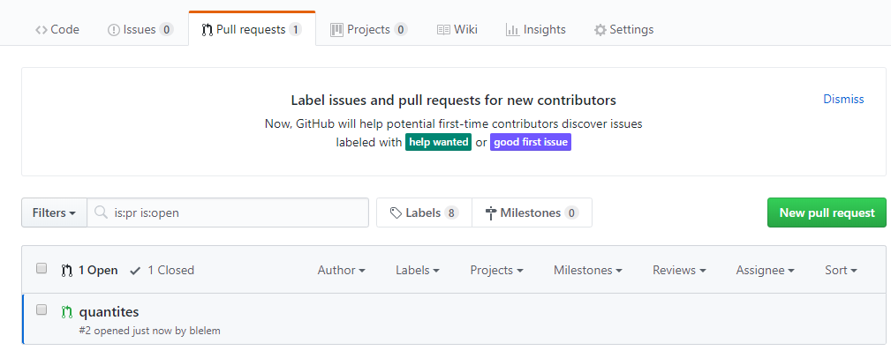
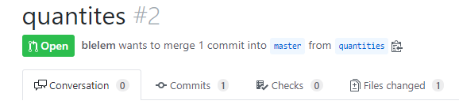
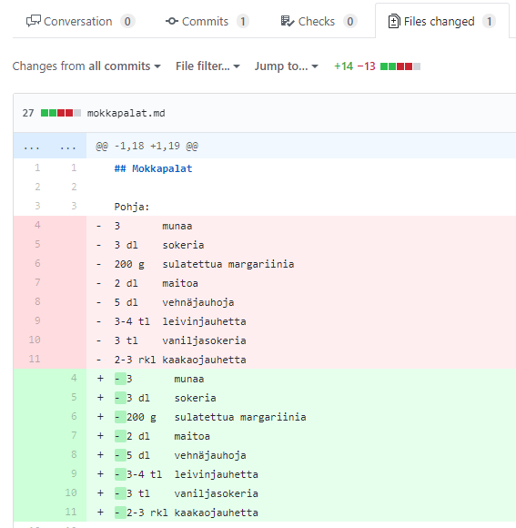
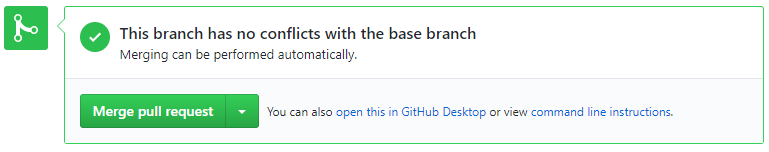
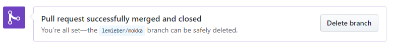

## Repon kloonaus

Kopioi repon osoite githubista:

 

 Tee kloonaus:

    git clone <liitä tähän hiiren oikealla napilla repon osoite>

Jos kloonaat jonkun muun repon, poista .git-tiedosto (se osoittaa repon omistajan *remote*-repoon). Tee tarvittaessa oma *local*-repo (git init).

## Pull request

Jos taas haluat tehdä *pull request*:in alkuperäisen omistajan repoon, tee itsellesi ensin oma haara (*branch*). Oma haara tarvitaan, koska *master*-haaraan ei pitäisi koskaa lisätä koodia, ilman että se katselmoidaan ensin.

    git checkout -b haaran_nimi

Kun teet tähän juuri luotuun haaraan *push*:in, se pitää tehdä ensimmäisellä kerralla tällä tavalla:

    git push --set-upstream origin haaran_nimi

Nyt repoon ilmestyy uusi haara, johon tekemäsi muutokset siityvät. Huom! Tämä ei onnistu, ellei repon omistaja ole lisännyt sinua yhteistyötahoksi (*collaborator*) reponsa asetuksissa (*settings*-välilehti).

Jotta repon omistaja huomaa, että olet tehnyt uusia muutoksia voit nyt tehdä hänelle *pull request*:in github-sivustolla (mene repon *branch*-välilehdelle ja valitse *create pull request* uuden haaran kohdalla). Repon omistaja saa nyt sähköpostia, ja hän voi nyt katsoa muutokset ja hyväksyä ne (*merge*). Repon omistajan kannattaa aina katsoa mitä koodissa on muutettu (*files changed*), ennen *Merge pull request*:in painamista.

Repon omistaja näkee tehdyt *pull request*:it ko. välilehdeltä: 

Kun *pull request*:in avaa, voi muutoksia katsella *files changed* kohdasta:  

Muutokset näkyvät vihreällä pohjalla:

Jos muutokset olivat ok, voit hyväksyä ne painalla *merge pull request*:

Nyt muutokset on otettu mukaan *master*-haaraan:

Repon omistajan on nyt muistettava vielä tehdä *git pull*, jotta uudet muutokset tulevat myös lokaaliin repoon.