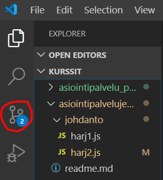
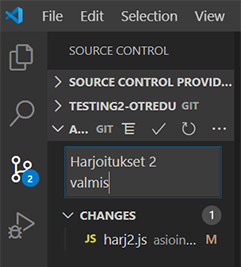
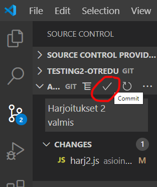
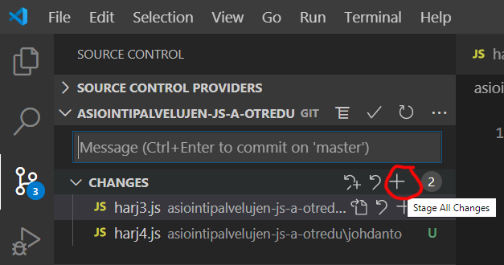
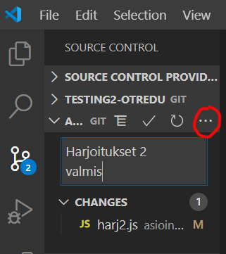
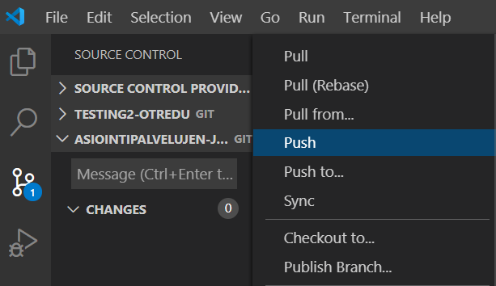
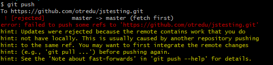
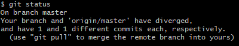
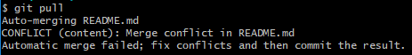
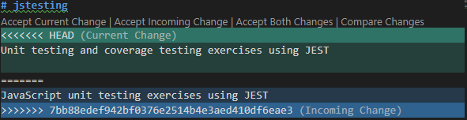

## Muutosten päivittäminen Github:iin

### Muutokset Git Bash:illä

Jos *local*- ja *remote*-repo ovat olemassa (tehty uusi [repo]("./uusirepo.html") tai [kloonattu vanha]("./kloonaus.html")), tiedostoja päivitetään Github:iin ajamalla:

    git add *
    git commit -m "Second update"
    git push

### Muutokset VSCodesta

Githubiin voi päivittää muutokset suoraan VSCodesta. Git:iin tallentamattomat muutokset näkyvät sinisenä numerona. Lisäksi tiedoston vieressä lukee muutoksen tyyppi:
    - M (muutettu, modified)
    - U (uusi tiedosto, untracked) - D (poistettu, deleted)

1. Valitse vasemmalta versionhallinta (git-logo)



2. Tallentamattomat muutokset näkyvät kohdan "changes" alla.



3. Kirjoita *commit*-viesti (kuvassa Harjoitukset 2 valmis) ja valitse commit (v-merkki):



HUOM! Joskus VSCode "autostageing" ei toimi ja joudut lisäämään ne mukaan *commit*:iin (paina + merkkiä).



4. Tiedostot eivät vielä siirtyneet remote-palvelimelle, avaa valikko ... merkin alta ja valitse *push*:





HUOM! Jos teet tätä ensimmäisen kerran uudella koneella, saatat saada virheen, jossa sanotaan että "username" puuttuu.

Aja sen jälkeen gitbash:issä seuraavat komennot:

```cmd
git config --global user.name "oma nimi"
git config --global user.email "oma.nimi@jokuposti.fi"
```

## Epäsynkka *local*:in ja *remote*:n välillä

Joskus muutoksia tulee useammalta *local*-repository:ltä. Silloin *remote* ja koneesi *local*-repo ovat ns. epäsynkassa. Näin voi käydä jos vaikka teet töitä kahdella eri koneella, joissa on omat *local*-reponsa. Jos teet vaikka kotona töitä, ja teet *push*-operaation *remote*-repoon, seuraavan kerran kun aloitat työt koulun koneella lataa tekmäsi päitykset seuraavasti, ennen kuin jatkat hommia:

    git pull

Jos unohdat tehdä *pull*:in ja aloitat koodaamisen, teet *commit*:eja, *local*-repoosi, *push*-operaatio ei enää onnistukaan, koska *local* ja *remote* ovat nyt epäsynkassa.



Hae ensin muutokset *remote*-reposta:

    git fetch
    git status



Tässä vaiheessa git *status* ilmoittaa, että *remote*-repo on sinua edellä *ahead* ja sinun tulee yhdistää ne tekemällä *pull*:in.

    git pull

*auto-merge* ei aina onnistu, varsinkaan jos muutokset ovat samassa tiedostostossa. Jos gitbash ilmoittaa kohdanneensa *merge conflict*:in, sinun pitää ne korjata konfliktit itse. 



Avaa ko. tiedosto VSCode:lla. Valitse vertailu, niin muutosten editointi on helpompaa.



Lopuksi muutokset pitää *push*:ata *remote*-repoon (add-commit-push).