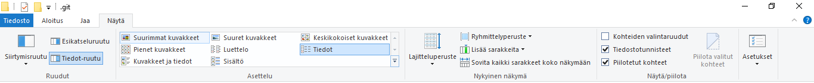

## Useamman käyttäjätilin käyttäminen

Joskus on tarpeen käyttää kahta tai useampaa Github-käyttäjätiliä samalla koneella. Näitä ohjeita seuraamalla voit liittää repositoryn haluaamaasi Github-tiliin.

### SSH-avainten luominen

Avaa CMD ja luo ensin uusi pari SSH-avaimia:

```cmd
> ssh-keygen -t rsa -C “your_email_address”
```

Ohjelma kysyy kohdetiedostoa, kopioi ehdotettu polku ja nimeä tiedosto järkevästi esim.

```cmd
/c/Users/your_username/.ssh/id_rsa_GOODNAME
```

Ohjelma kysyy myös *passphrase* - salasanaa, jonka voit jättää halutessasi myös tyhjäksi.

Tämän jälkeen em. kansiossa pitäisi olla kaksi tiedostoa, toisessa on *private key* ja toisessa *public key* (.pub).

### SSH-avaimen tallentaminen Github:iin

Avaa edellisessä luotu *public key* - tiedosto esim. Notepad++ - ohjelmalla ja kopioi sen sisältämä avain. Kirjaudu Github.com:iin ja valitse: *Settings -> SSH and GPG keys -> Add new key* ja liitä kopioimasi avain tähän ja tallenna.

### Git config

Jotta Gitbash tietää etsiä *private key* tiedostoa oikeasta paikasta ja käyttää oikeaa käyttäjätiliä Github:in kanssa, lisää seuraavat rivit *.git* - kansiossa sijaitsevaan *config* - tiedostoon.

Huom! *.git* - kansio on normaalisti piilotettu, joten jos et näe sitä ota piilotetut kansiot näkyviin resurssienhallinnassa:



Lisää seuraavat rivit repositoriosi *.git/config* -tiedostoon (esim. Notepad++:lla):

```cmd
[core]
	sshCommand = ssh -i ~/.ssh/id_rsa_GOODNAME
[remote "origin"]
	url = git@github.com:your_username/your_repository.git
[user]
	email = your_email_address
	name = your_username
```

Tämän jälkeen repon käyttö pitäisi onnistua normaalisti eli seuraa [uuden repon ohjeita](./uusirepo.md).

Huom! Tämä vaihtaa käyttäjätilin vain ko. repolle, muut repot toimivat kuten ennenkin.

## Lisätietoa

- [How to have 2 or more GitHub accounts in one machine](https://medium.com/@pinglinh/how-to-have-2-github-accounts-on-one-machine-windows-69b5b4c5b14e)