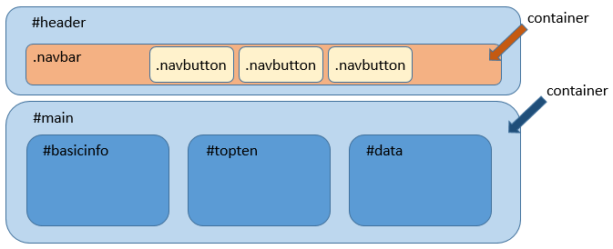

## CSS-demo 1

CSS-määrittelyt tehdään yleensä omaan tiedostoonsa. Tässä harjoituksessa emme muokkaa HTML:ää ollenkaan vaan muotoilemma valmista HTML-dokumenttipohjaa CSS:n avulla.

Kopioi oheinen HTML-dokumentti ja tallenna se omaan kansioonsa *demo1*. Anna sille nimeksi esim. css_demo.html. Tee myös uusi CSS-tiedosto, anna sille nimeksi css_demo.css. Dokumentille on luotu korkeantason rakenne käyttämällä HTML:in *div* tagejä. Jotta niihin on helpompi viitata CSS-määrittelyissä niille on annettu *id* ja *class* attribuutteja. Dokumentti koostuu kahdesta pääosiosta (*div*:stä), joille on annettu id:t *header* ja *main*. *main*:in sisällä on kolme *div*:iä joille on myös annettu *id*:t. *main* toimii tässä ns. *flexbox container*:ina ja sen sisällä olevat *div*:t ovat *flex item*:eja ([lue lisää flex-box:ista](https://css-tricks.com/snippets/css/a-guide-to-flexbox/)). Flex-boxin avulla saamme aseteltua sisältöä sivulle vierekkäin, allekkain jne. *header*:in sisällä on toinen *flexbox container*: *navbar*. Sen sisällä on *navbutton*:eja. Nämä on määritelty *id*:n sijaan *class*:in avulla, eivätkä ne ole *div*:ejä vaan *ul*- ja *li*-tagejä. *flexbox container*:in tai *flex item*:in ei siis tarvitse aina olla *div* (kuvassa siniset elementit ovat *div*:ejä, vrt. kuvaa alla olevaan koodiin).



```html
<!DOCTYPE html>
<html lang="fi">
    <head>
        <meta charset="UTF-8">
        <title>CSS demo</title>
        <link rel="stylesheet" href="css_demo.css">
    </head>
    <body>
        <div id="header">
        <h1 class="header">Tervetuloa näille sivuille!</h1>
            <ul class="navbar">
                <li ><a class="navbutton" href="etusivu.html">Etusivu</a></li>
                <li ><a class="navbutton" href="toinensivu.html">Toinen sivu</a></li>
                <li ><a class="navbutton" href="kolmassivu.html">Kolmas sivu</a></li>
            </ul>
        </div>
        <div id="main">
        <div id="basicinfo">
            
            <ul>
                <li><a href="https://courses.p2pu.org/en/courses/2486/content/5078/">Lue lisää CC-lisenssoinnista</a></li>
                <li><a href="https://wiki.uef.fi/pages/viewpage.action?pageId=15008150">Lisää tietoa tekijänoikeuksista</a></li>
            </ul>
        </div>
        <div id="topten">
        <h1>Numeroitu lista</h1>
        <ol>
            <li>eka</li>
            <li>toka</li>
            <li>kolmas</li>
        </ol>
        </div>
        <div id="data">
        <h1>Tietoa</h1>
        <table>
            <tr>
                <td>Tieto 1</td>
                <td>*******</td>
            </tr>
            <tr>
                <td>Tieto 2</td>
                <td>*******</td>
            </tr>
            <tr>
                <td>Tieto 3</td>
                <td>*******</td>
                </tr>
            <tr>
                <td>Tieto 4</td>
                <td>*******</td>
            </tr>
        </table>
        </div>
        </div>
    </body>
</html>
```

### Tekstien muotoilu

### div:ien muotoilu

### Flexbox:in avulla sivulle asettelu

### Navbar:in muotoilu