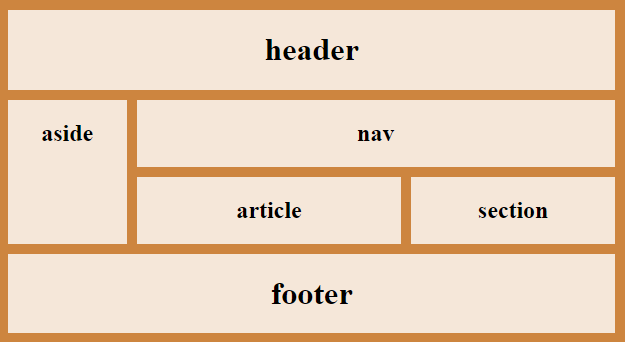

## HTML- ja CSS-harjoituksia 2

### Tehtävä 1: GRID:in ja semanttisten elementtien käyttöä

Tutustu sivun asetteluun *grid*:in ja semanttisten elementtien avulla. Voit ottaa pohjaksi *css-demo2*:in koodin muokata se käyttämään *grid*-asettelua. Muokkaa *HTML*-koodin *class*:it semanttisiksi elementeiksi (**huom** voit jättää sellaiset *div*:it jäljelle, jotka ovat vain asettelun tai muotoilun apuna).

[GRID:in käyttö](https://css-tricks.com/snippets/css/complete-guide-grid/)

[Esimerkki GRID:in käytöstä](https://www.w3schools.com/css/tryit.asp?filename=trycss_grid_layout_named)

[Semanttiset elementit](./semanttiset.html)

Pyri saamaan seuraavanlainen rakenne aikaiseksi:



Toinen vaihtoehto on lähteä liikkeelle tästä HTML-koodista:

```html
<!DOCTYPE html>
<html>
<head>
    <title>GRID-harjoitus</title>
    <meta charset="UTF-8">
</head>
<body>
    <header>
        <h1>header</h1>
    </header>
    <nav>
        <h1>nav</h1>
    </nav>
    <aside>
        <h1>aside</h1>
    </aside>
    <section>
        <h1>section</h1>
    </section>
    <article>
        <h1>article</h1>
    </article>
    <footer>
        <h1>footer</h1>
    </footer>
    </body>
    </html>
```

### Tehtävä 2: Ravintolan sivut

*Tehtävä muokattu Leena Järvenkylä-Niemen tehtävästä*

Laadi lappilaista ruokaa tarjoavalle ravintola Lapintaialle viikon lounaslistasivu. Alimpana tällä sivulla on suunnitelma viikon ruokalistasta.

Laadi sivu käyttäen HTML:ää, validoi se ja tee muotoilut käyttäen CSS:ää. Voit halutessasi jatkaa tehtävässä 1 tehdyllä pohjalla tai luoda täysin uuden rakenteen.

#### Sivulla tulee olla:

- Otsikko
- Taustakuva - ruokaravintolaan sopiva sävytys ja teema (kattaus tms)
- Pehmeä, pyöreä fontti
- Ruokalista (katso alla)
- Ravintolan yhteystiedot (katso alla)
- Lounaan hinta (11 euroa, sisältäen ruokajuoman: vesi, kotikalja, maito)

Sijoita ruokalista suurin piirtein keskelle sivua. Lisää sivun alareunaan eri fontilla kuin muu teksti ravintolan yhdeystiedot. Sijoita muut tiedot parhaaksi katsomiisi paikkoihin. Käytä asetteluun *grid*:iä sekä semanttisia elementtejä.

#### Yhteystiedot ja aukioloajat:

Ravintola Lapintaika,
Ravintolakatu 2,
98765 LAPINMAA

Puh. (012) 345 6789
Sähköposti: varaukset@jokuposti.net

aukioloajat: ma - pe, 10:30 - 15:00

#### Ruokalista:

##### Maanantai

Juusto-vihanneskeittoa ja kokin sämpylä
Paistettua lohta, sinappikastiketta, tilliperunoita ja kasviksia
Marjakiisseliä ja hunajakermavaahtoa

##### Tiistai

Kana-fetajustosalaattia ja kokin sämpylä
Paistettua punakampelaa, pinaattikastiketta ja perunamuusia
Pannukakkua, mansikkahilloa ja kermavaahtoa

##### Keskiviikko

Tomaatti-yrttikeittoa ja kokin sämpylä
Kalkkunaleikettä, BBQ-kastiketta, riisiä ja kasviksia
Omenapiirakkaa ja vaniljakastiketta

##### Torstai

Rapukeittoa ja kokin sämpylä
Poronkäristystä, perunamuusia, puolukkahilloa ja suolakurkkuja
Hedelmäsalaattia ja kinuskikastiketta

##### Perjantai

Savulohisalaatti ja kokin sämpylä
Naudan paahtopaistia, punaviinikastiketta, kermaperunat ja kasviksia
Suklaamousse

### Tehtävä 3: Palautelomake

Tee ravintolalle asiakaspalautelomake, jossa kysytään mahdollisimma monipuolisesti ravintolakokemuksesta. Muista kysyä ainakin päivämäärä, jolloin asiakas on käynyt ravintolassa, kuinka kauan ruokaa joutui odottamaan, palauttetta ruoan mausta, lämpötilasta, ulkonäöstä, hinnasta, palvelusta, vapaan palautteen kenttä jne.  Anna mahdollisuus jättää yhteystiedot, jos asiakas haluaa että ravintola ottaa häneen yhteyttä. Linkitä palautelomake ravintolan pääsivulle. Muokkaa CSS-tiedostoa niin, että saat lomakkeen tyylin sopimaan ravintolan pääsivun tyyliin (voit myös tehdä uuden CSS-tiedoston lomakkeelle).

- Tutustu [lomakekenttiin](./html-lomakkeet.html)

### Lisätehtävä: Mobiiliversio

Tee ravintolan pääsivun ulkonäöstä (rakenne, väritys, sisältö) dynaaminen, niin että mobiililaitteilla katsottuna sen ulkonäkö on erilainen (ei taustakuvaa, ei vierekkäin olevia alueita jne.). Sivun tulee reagoida myös siihen kun laite käännetään pysty- tai vaaka-asentoon. Käytä *@media*-sääntöä CSS:ssä. Jos haluat jättää kokonaan jonkun osan näyttämättä, sen *display*-attribuutin voi asettaa arvoon *none*.

Tutustu responsiivisen sivun tekemiseen [@media-säännön avulla](responsiivisuus.html).

Testaa myös lomakkeen toimiminen mobiililaitteella.