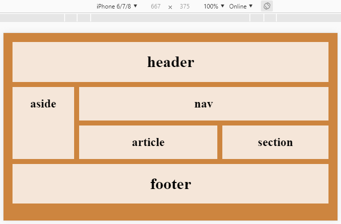

## Responsiivisuus

### @media

Nettisivun asetteluun eri laitteille soveltuvaksi voi vaikuttaa @media-säännöillä. Niiden avulla voidaan määritellä eri CSS-säännöt eri leveyksisille laitteille.

Jotta mobiililaitteen selain tietää, että sivusto on suunniteltu responsiiviseksi, HTML-tiedoston *head*-tagiin pitää lisätä tieto siitä, jotta mobiililaite ei itse yritä skaalata sivua vaan sivusto skaalaa itse itsensä:

```html
<head>
    <meta name="viewport" content="width=device-width, initial-scale=1, maximum-scale=1">
    <link type="text/css" rel="stylesheet" href="myPage.css" >
</head>
```

Tämän jälkeen CSS-tiedostoon voidaan lisätä @media-sääntöjä eri levyisille näytöille. Seuraavassa esimerkissä leveällä näytöllä käytetään *grid*-asettelua, ja kapealla näytöllä *flex-box*-asettelua. Lisäksi kapealla näytöllä jätetään *aside*-elementti kokonaan pois.

```css
@media screen and (max-width: 960px){
  body {
    display: grid;
    grid-template-areas:
      'header header header header header header'
      'aside nav nav nav nav nav'
      'aside article article article section section'
      'footer footer footer footer footer footer';
    grid-gap: 10px;
    background-color: peru;
    padding: 10px;
  }
}

@media screen and (max-width: 480px){
  body {
    display: flex;
    flex-direction: column;
    background-color: #3196F3;
    padding: 3px;
    }
  aside {
    display: none;
  }
}
```

### Testaaminen

Selaimen kehittäjänäkymässä on mahdollista aktivoida responsiivinen näkymä:


Voit kokeilla miltä sivusi näyttää eri laitteilla, vaaka- ja pystyasennossa:




### Lisätietoa

- Tutustu @media-säännön käyttöön [@media w3school](https://www.w3schools.com/cssref/css3_pr_mediaquery.asp)
- Video @media-säännön käytöstä  
[HTML5 and CSS3 Responsive design with media queries](https://www.youtube.com/watch?v=fA1NW-T1QXc)