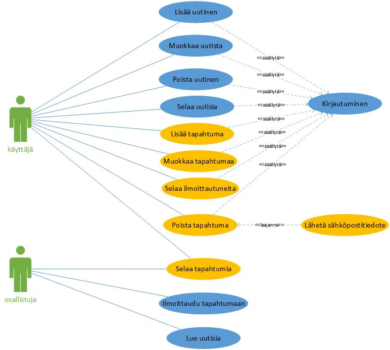

### Esitutkimus

Tehdään esitutkimus, jonka tarkoitus on määritellä tuote korkealla tasolla. 

- Esitutkimusesimerkki [PDF](../docs/lentopalloturnaus_esitutkimus.pdf)

---

Harjoitukset:

1. Käsitteanalyysi

    Tutustu [projektikuvaukseen](http://www.leeniemi.net/syst19/materiaali/Asunnonvuokraus.pdf) ja tee järjestelmään liittyvistä käsitteistä käsitekartta esim. [Bubbl.us](http://bubbl.us) ohjelman avulla. Kokoa käsitteistä sanasto. [Leenan esimerkki](../docs/kasitekartta.pdf)

2. Käyttötapaukset

    Poimi järjestelmän toteutukselta vaaditut käyttötapaukset ja kokoa ne *UML use case* - malliksi.
    
    - Käyttötapaukset [UML use case](../docs/uml_diagrammit.pdf)

3. Brändi-ideointi:

    Luo kuvitteelliselle asunnonvuokrausyritykselle brändi/imago:

    - keksi yritykselle nimi ja tee sille logo (PhotoShop:illa, Canva:lla. Figma:lla tms.)
    - valitse logolle vähintään yksi väri, mieti sen muoto, tee siitä läpinäkyvä (mieti mitkä taustavärit sopivat sen kanssa yhteen)
    - jos logossa ei ole yrityksen nimeä, mieti myös sen kirjoitusasu ja fontti

4. Käyttöliittymäehdotus

    Tutustu käyttöliittymän suunnitteluun [ohje](kayttoliittyman_suunnittelu.html).

    Tee karkea hahmotelma sivuston käyttöliittymäideasta tietokoneella sekä mobiililaitteella. Tee nopeasti muutama suuntaa-antava käyttöliittymäkuva AdobeXD-ohjelmalla (ei toimivaa navigointia, ei tarvitse olla kaikkia kenttiä vielä, eikä kaikkia näkymiä).
    - AdobeXD - prototyyppiharjoitus [ohje](../docs/adobe_xd_demo.pdf)

5. Tee käsiteanalyysin pohjalta ER-kaavio (chen)

     - Tee käsiteluettelon avulla järjestelmän [ER-kaavio](http://appro.mit.jyu.fi/tiedonhallinta/luennot/luento2/#TOC1)
     

6. Kokoa dokumentiksi

    Tee tiivis esitutkimusdokumentti, jossa kerrot:
    - Tuoteidean
    - Tuotteen taustan ja hyödyt
    - Tavoitteet ja vaatimukset (toiminnalliset vaatimukset, ei-toiminnalliset vaatimukset)

    Liitteiksi tulevat:
    - käsitteistö (käsitekartta, sanasto) (tehtävä 1)
    - käyttötapauskaavio (UML use case) (tehtävä 2)
    - käyttöliittymäehdotus (kevyt MockUP) (tehtävä 3 ja 4)
    - ER-kaavio (tehtävä 5)

7. Vertaisarviointi

    Arvioi toisen opiskelijan tekemä esitutkimus, käytä tätä [pohjaa](../docs/vertaisarviointi.dotx)