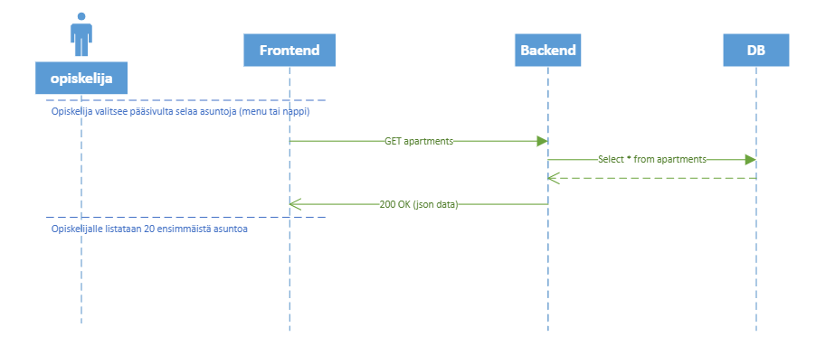

## Ketterä ohjelmistokehitys

### Projektin backlog

Kaikki user storyt

### Sprintin backlog

Sprinttiin valitut user storyt

### Sekvenssidiagrammint

Ennen user storyn koodaamista, tehdään tarkempi suunniteelu, eli sekvenssidiagrammit:

