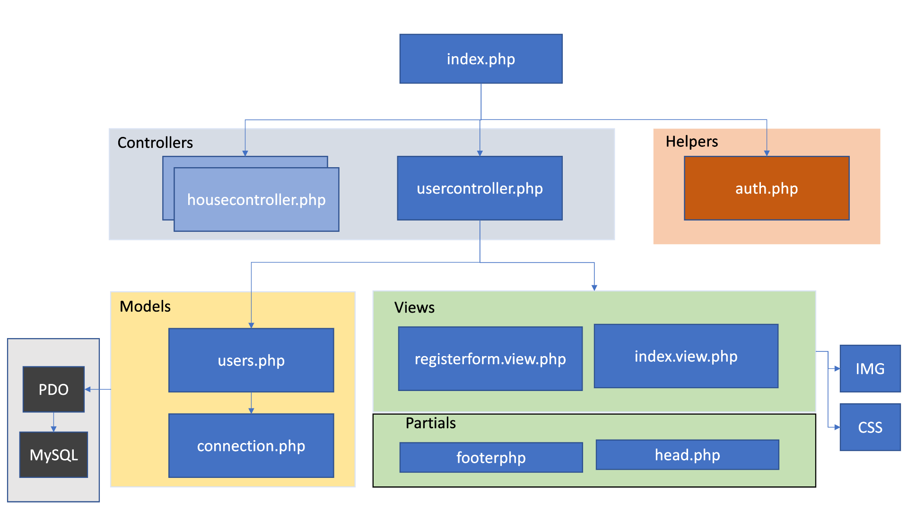

## Ohjelmiston dokumentointi

Projektin lopuksi dokumentoi toteuttamasi user story markdown:in avulla.

### Markdown

Markdown:in avulla voi nopeasti luoda web-sivuja, joten niitä on kätevä käyttää ohjelmiston toteutuksen dokumentoimiseen. Markdown-tiedostot toimivat hyvin github:in kanssa, koska se osaa renderoidä .md-tiedostot suoraan HTML:ksi.

Tutustu markdown-syntaksiin:

1. [cheat-sheet](https://www.markdownguide.org/)
2. [markdown syntax](https://www.markdownguide.org/basic-syntax/)

### Dokumentointi

Dokumentoinnin tarkoitus on antaa nopeasti yleissilmäys ohjelmiston toteutuksesta, jotta joku muu pystyisi jatkamaan ohjelmiston kehittämistä hallitusti, eikä rikkoisi aikaisemmin tehtyjä ratkaisuja.

### Ohjelmistoarkkitehtuuri (SW Architecture)

Ohjelmiston arkkitehtuurin tarkoitus on kuvata miten koodi on jaettu moduuleihin. Esim. jos ohjelmisto on kehitetty MVC-mallin mukaisesti, jatkokehittämisen pitäisi toteuttaa samaa mallia.

Arkkitehtuuri kuvasta selviää ohjelmiston sisäinen rakenne ja riippuvuudet (*dependencies*) sekä ohjelmiston käyttämät ulkoiset palvelut (kuten tietokanta). Riippuvuudet esitetään yleensä nuolten avulla (e.g. moduuli vaatii toisen moduuliin toimiakseen oikein).

Tässä arkkitehtuuriesimerkki rekisteröitymiseen tarvittavista moduuleista (MVC-malli):

### Sekvenssidiagrammi

Sekvenssidiagrammin avulla voidaan kuvata arkkitehtuurikuvassa kuvattujen moduulien yhteistoimintaa. Tässä oikealle kulkeva nuoli kuvaa viestiä (esim. HTTP GET), funktiokutsua (esim. postregisterontroller()) tai muunlaista interaktiota moduulien välillä. Vasemmalle kulkevat viestit ovat paluuarvoja tai response-viestejä (200 OK). Aika kulkee ylhäältä alas (e.g. ylin viesti lähetetään ensin).

Tässä sekvenssidiagrammiesimerkki rekisteröitymisestä:

### Tietokannan tallentaminen

Muistakaa tallentaa versionhallintaan myös tietokanta-dump (SQL-koodi tietokannan luomiseen). Järjestelmän pystyttäminen ja jatkokehittäminen myöhemmin ei onnistu ilman oikeanlaista tietokantaa.

---

Tehtävä 1:

Tee markdown:in avulla projektirepoon kuvaus yhden *user story*:n toteuttamisesta.

Esittele markdown-dokumentissa:

- toteutettu user story (ml. ruudunkaappauskuvia käyttöliittymästä)

- tietokannan rakenne (kuva, josta käy ilmi tietokantataulut sekä niiden relaatiot)

- ohjelmiston arkkitehtuuri (kuva, josta käy ilmi koodimoduulit sekä niiden suhteet, tämän voi piirtää vaikka Power Pointilla)

- kuvaa moduulien toiminta sekä rajapinnat tämän yhden user storyn toteutuksessa (e.g. piirrä siitä sekvenssidiagrammi)

Tehtävä 2.

Ota tietokannasta SQL dump (PhpMyAdmin -> vie/export) ja tallenna se koodirepoon kansioon databasedump. Olisi hyvä, että aina ennen uusia muutoksia tietokannasta otettaisiin varmuuskopio ja tallennettaisiin versionhallintaan, sillä uudet muutokset voivat rikkoa vanhoja toimintoja.