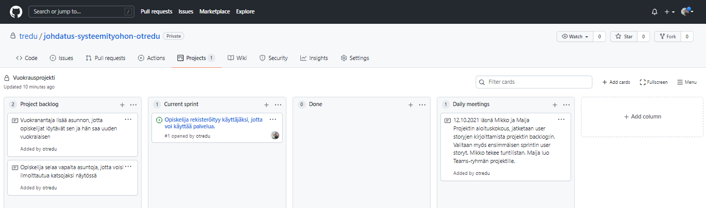

## Projektityöskentely - ryhmätyö

Tässä harjoituksessa toteutetaan asunnonvuokrausjärjestelmästä 1-2 sprinttiä ryhmätyönä.

### Projektirepo

Kaikki projektin koodi, projektin seuranta sekä siihen liittyvät dokumentit tallennetaan projektin repo:on.

Koodin main/master - haara suojataan niin, että siihen ei voi push:ata ilman, että joku toinen ryhmästä katselmoin koodin ensin. Jokainen työskentelee siis omassa haarassaan (*branch*) ja tuo koodia päähaaraan *Pull Request*:in (PR) avulla.

---
Tehtävä 1:

- Liittykää projektirepoon (kutsulinkki Moodlessa).
- Lukekaa [ohjeet projektirepon käyttöön](https://otredu.github.io/github/projektityo.html), suojatkaa repo ja harjoittelkaa ryhmän kanssa *branch*:ien, *PR*:ien ja *merge conflict*:ien tekemistä *readme.md* - tiedoston avulla.

Kehitysympäristö:

- Koululla työskennellessa repo kannattaa kloonata K-levylle, kotona haluamaasi paikkaan C-levylle

- Koululla työskennellessä opettaja antaa projektiryhmälle yhteisen tietokannan opetuspalvelimelta (pääset siihen avaamalla selaimessa osoitteen //samarium/phpmyadmin), kotona voit käyttää XAMPP:in tietokantaa

- *PHP development server* käynnistetään siinä kansiossa, jossa index.php sijaitsee kirjoittamalla terminaaliin (avaa selaimessa osoite localhost:8888):

```cmd
php -S localhost:8888
```

---

### Projektin aloitus

Projektin alussa ryhmä pitää palaverin, jossa valitaan toteutettavat suunnitelmat.

---

Tehtävä 2:

Ladatkaa aikaisemmin tekemänne esitutkimukset projektirepoon, katselmoikaa ne ja valitkaa toteutettava versio. Valitkaa myös tietokantasuunnitelma, jota lähdette toteuttamaan.

--- 
### Projektin backlog

Ketterässä ohjelmistokehityksessä vaatimukset kirjoitetaan *user story*:jen muotoon. Siinä kerrotaan tiivistetysti mitä hyötyä ohjelman toiminnosta on loppukäyttäjälle (yritykselle).

    As <ROLE> I want <ACTION> so that <BUSINESS VALUE>

    As A STUDENT I want to SEARCH FOR APARTMENT so that I CAN RENT IT

Projektiryhmä voi päättää kirjoitatteko *user story*:t suomeksi vai englanniksi. Projektin *backlog*:iin kirjoitetaan projektin alussa KAIKKI mahdolliset user story:t jotka alustavien vaatimusten pohjalta on identifioitu.

---

Tehtävät 3:

Luokaa projektin *github*-repoon uusi *Project* ja tehkää siihen oheisen kuvan mukainen projektiseinä. Kirjoittakaan projektiseinälle kaikki mahdolliset vuokraussivuston *user story*:t kohtaan *project backlog*.



---
### Sprintin backlog

Ensimmäisen sprintin backlog:iin valitaan sellaiset *user story*:t, joiden toteuttaminen on tärkeintä. Tässä vaiheessa siis priorisoidaan *user story*:jä. Niitä pitäisi valita sopiva määrä, että kaikilla projektitiimissä olisi riittävästi tekemistä. Kun sprintin sisältö on valittu, siitä ei poisteta mitään, eikä siihen lisätä mitään. Jos joku saa omat hommansa valmiiksi ennen muita, hän auttaa muita kunnes koko sprintin sisältö on valmiina ja testattuna.

---

Tehtävä 4.

Valitkaa ensimmäisen sprintin sisältö (hinatkaa *user story* kohtaan *Current sprint*). Muuttakaa *user story*:t *issue*:ksi, ja valitkaa niille toteuttaja (avaa *issue* ja valitse *assign*).

---
### Tuntiseuranta

Projektissa kirjataan tunteja, jotta voidaan laskuttaa oikeaa asiakasta tehdystä työstä. Tuntiraportteja voidaan käyttää myös *sprinttien parempaan suunnitteluun jatkossa*. 

---

Tehtävä 5.

Tehkää Excel-pohja tuntiseurantaa varten, ja jakakaa se ryhmän jäsenille.

Voitte käyttää tätä [pohjaa](../docs/tyoajanseuranta.xlsx) tuntien seurantaan (muokatkaa pohjaa sopivaksi).

Kirjatkaan tehdyt tunnit projektin tuntiseurantalistaan joka päivä.

---

### Daily meetings

Jokaisen päivän alussa pidetään lyhyt palaveri siitä miten hommat etenevät. Jos joku on jumissa häntä autetaan, palaverissa ratkotaan myös mahdolliset epäselvyydet *user story*:jen tulkinnassa. Jos joku on saanut user storyn valmiiksi se siirretään kohtaan *Done* ja katsotaan mitä seuraavaksi pitäisi tehdä.

---

Tehtävä 6.

Kirjatkaa projektiseinälle päivittäin palaverien päätökset ja havainnot.
### Systeemitestaus

Sprintin toiminallisuus testataan jokaisen sprintin lopussa, jotta voidaan varmistua koodin toiminnasta.

---

Tehtävä 7.

Sprintin lopussa jokaisen toteuttama koodi integroidaan (PR:t ja merge) main/master-haaraan ja koodille suoritetaan systeemitestaus. Ennen testausta muista tehdä *pull*, että koneellasi on varmasti uusin versio koodista.

Lukekaa ohjeet [systeemitestaukseen](../docs/testitapaukset_ohje.pdf) ja tehkää riittävästi testitapauksia sekä suorittakaa testit. Selkeintä on, että jokainen kirjoittaa testitapaukset omalle/omille user storylleen yhteiseen testipohjaan ja suorittaa testit.

Voitte käyttää tätä [pohjaa](../docs/testitapaukset_esim.pdf) mallina.

HUOM! jos useampi ihminen tekee samaan tiedostoon testitapauksia ja suorittaa testausta, lisätkäa pohjaan sarakkeet *testaaja* ja *testaus pvm*!

---
### Sprintin lopuksi

Sprintin jälkeen pidetään sprintin loppupalaveri ja käydä läpi se miten tiimi selviytyi tehtävistä ja syntyikö laadukasta koodia.

---

Tehtävä 8.

Laatikaa loppupalaverista muistio (Word) ja kirjatkaa siihen:

- milloin sprint alkoi, milloin loppui
- mitkä user storyt saatiin valmiiksi
- mikä onnistui, mikä ei onnistunut
- oliko työnjako toimiva, oliko liikaa tai liian vähän tekemistä
- onko syntynyt koodi laadukasta (ei bugeja, selkeä rakenne että siitä on hyvä jatkaa)
- mitä teette paremmin seuraavalla kerralla

Tallentakaa loppupalaverimuistio sekä testausraportti projektin repoon dokumenttikansioon.

Sitten valitsette seuraavan sprintin user story:t, jaatte työt jne...