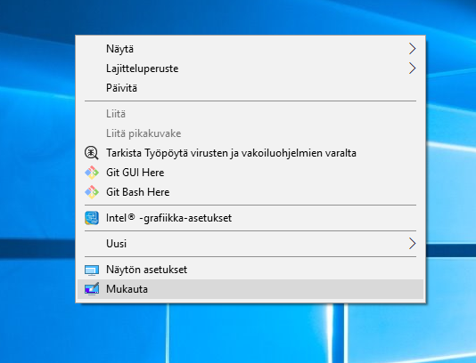
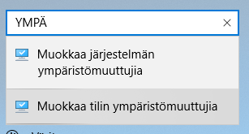
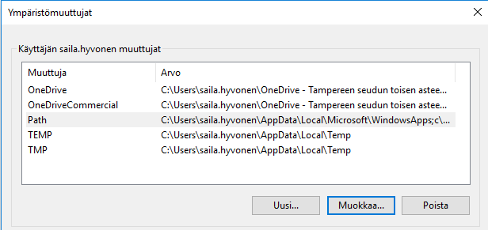
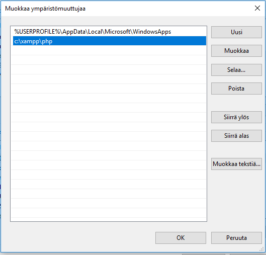
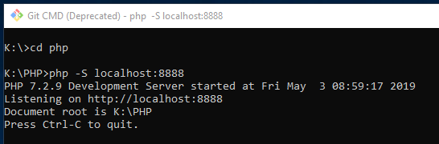
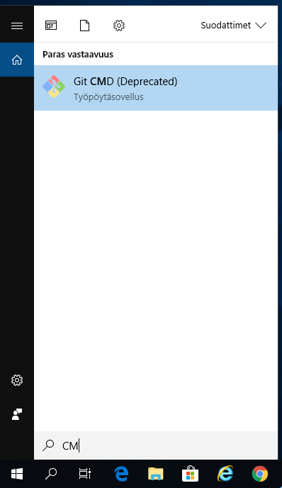

# Ympäristömuuttujien asettaminen ja PHP:n käynnistäminen

## PHP:n asettaminen polkuun

1. Hiiren oikealla näytön päällä -> Mukauta

2.	Kirjoita 
- ympä -> Muokkaa tilin ympäristömuuttujia
- Englanniksi env -> Edit envionment variables for your account

3. Valitse Path -> Muokkaa

5.	Valitse Uusi ja kirjoita c:\xampp\php -> OK -> OK

6.	Kirjaudu ulos ja takaisin sisälle ja oikeasta alakulmasta suurennuslasin kautta aukaise Git CMD

## PHP:n käynnistäminen

Käynnistä PHP - serveri taustalle kuvan mukaan

