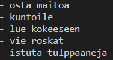

## Harjoitukset 2

**Ennen näitä harjoituksia tutustu materiaaliin [JavaScript-jatkoa](../js/jatkoa.html).**

Tee Visual Studio Code:lla uusi tiedosto, nimeä se *harjoitukset2.js*. Avaa VS:n terminaali ja aja koodi kirjoittamalla konsoliin: *node harjoitukset2.js*.

<iframe width="640" height="360" src="https://web.microsoftstream.com/embed/video/1a56fd4c-5818-4711-8e75-9338ed151660?autoplay=false&amp;showinfo=true" allowfullscreen style="border:none;"></iframe>

### Tehtävä 1

Tee taulukko (array), johon tallennat viisi muistettavaa asiaa (muistilista). Tallenna taulukko muuttujaan. Tulosta taulukon alkiot ranskalaisin viivoin consolille kolmella eri tavalla:

- taulukon alkiot yksi kerrallaan viittaamalla sen indeksiin
- for-loopin avulla
- foreach()-metodin avulla

Tulostuksen malli:

### Tehtävä 2

Lisää edelliseen taulukkoon kaksi uutta muistettavaa asiaa (käytä *push()*-metodia) ja poista siitä ensimmäinen muistettava asia (käytä *shift()*-metodia). Tulosta muutettu taulukko jokaisen muutoksen jälkeen jollakin harjoituksen 1 tyylillä.

<iframe width="640" height="360" src="https://web.microsoftstream.com/embed/video/61f62497-22ba-4333-acf9-164beac7b264?autoplay=false&amp;showinfo=true" allowfullscreen style="border:none;"></iframe>

### Tehtävä 3

Tee olio, johon tallennat keksityn henkilön henkilötiedot: nimi, osoite, ikä, puhelinnumero ja sähköposti (esim. Aku Ankka). Tee funktio, joka ottaa parametrina henkilötieto-olion ja tulostaa konsolille sen sisältämät tiedot. Tulosta konsolille funktiosi avulla keksityn henkilön tiedot. Vinkki: rivinvaihto on \n.

Tulostuksen malli:

### Tehtävä 4

Tee taulukko, jossa on useita henkilötieto-olioita (Hessu Hopo, Iines Ankka, Roope Ankka jne). Tulosta kaikkien tiedot konsolille käyttämällä harjoituksessa 3 tekemääsi funktiota. Tulosta tiedot kolmella eri tavalla:

- yksikerrallaan viittaamalla sen indeksiin
- for-loopin avulla
- foreach()-metodin avulla

### Lisätehtävä 1

Kokeile lisätä henkilötieto-oliolle metodi, joka tekee tulostuksen. Metodi on funktio, joka liitetään olion ominaisuudeksi. Tulosta yksi olio konsolille metodin avulla. Vinkki: muista käyttää *this*.

### Lisätehtävä 2

Tee luokka (class) henkilötieto-olioiden hallintaa (oliolla samat ominaisuudet kuin harjoituksessa 3 + metodi tietojen tulostukseen). Tee sen avulla harjoitus 4 uudelleen.