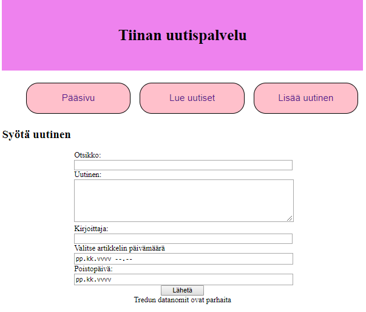

## Uutiset

**Ennen näitä harjoituksia tutustu materiaaliin [PDO-rajapinta](./pdo-rajapinta.html).**

### Tehtävä 1: Sivuston rakenne ja HTML-lomake

Tee kolmen sivun sivusto: pääsivu (index.php),lue uutiset (uutiset.php) sekä lisää uutinen (uusi_uutinen.php) -sivut. Jaa koodi niin, että *head.php* sisältää sivuston otsikon sekä navikointipalkin ja *footer.php* kaikille sivuille yhteisen sivun alareunan. Katso mallia [täältä](./php-jatko.html).

Muotoile sivu käyttämällä *.css*:ää, katso mallia [täältä](../html-css/css-demo1.html).

Tee lomake, jonka avulla voi lisätä uuden uutisen. Tee lomakkeen käsittelijä, joka tulostaa tiedot selaimen ikkunaan.

### Tehtävä 2: Tietokantayhteyden muodostaminen ja kaikkien uutisten hakeminen

Liitä sivustosi käyttämään tietokantaa. Hae kaikki uutiset tietokannasta ja tulosta ne "lue uutiset"-sivulle.

Jaa koodisi kahteen osaan: *uutinen.php* sisältää tietokantaan liittyvät toiminnot ja *uutinen.view.php* muotoilee sivun ulkonäön.

### Tehtävä 3: Lisää uusi uutinen

Liitä lomakkeesi tietokantaan niin, että sen avulla voi lisätä uuden uutisen tietokantaan. Muista sanitoida syötteet.

### Tehtävä 4: Reititys

Lisää koodiisi reititys (router), jaa koodi järkeviin kansioihin (controllers, libraries, views, partials, database).

### Tehtävä 5: Lisää kirjautuminen

Lisää sivustolle rekisteröityminen, sekä session käsittely: kirjautuminen (login) sekä uloskirjautuminen (logout). Muuta koodia niin, että vain kirjautuneena voi lisätä uuden uutisen. Vaihda napit niin, että aluksi näkyvillä ovat napit: rekisteröidy, kirjaudu ja kirjautuneena näkyvillä on luo uusi uutinen sekä kirjaudu ulos.

### Tehtävä 6: Uutisen poistaminen sekä muokkaaminen

Lisää uutisen yhteyteen linkki, jonka avulla sen voi poistaa ja toinen linkki, jonka avulla sitä saa muokattua (uutinen aukeaa lomakkeeseen). Päästä vain kirjautuneena olevat käyttäjät lisäämään, poistamaan sekä muokkamaan uutisia.

### Tehtävä 7. Ota käyttöön ympäristömuuttujat

Ota käyttöön ympäristömuuttujat *.env*-tiedoston kautta. *.env*-tiedosto sisältää tietokannan käyttöön liittyvät tiedot (käyttäjätunnus, salasana, database url, database name).

### Lisätehtävä 1. Database migrations

Ota käyttöön tietokantojen hallintaohjelma (Phinx) ja tee tietokannastasi *migrations*-tiedosto. Testaa se lokaalin *Postgres*-tietokannan kanssa. Testaa ohjelmasi toimivuus lokaalin Postgres-tietokannan avulla.

### Lisätehtävä 2. Julkaise Herokussa

Tee Herokuun uusi projekti, aja tietokantasi Herokuun Phinx:in avulla. Päivitä PHP-koodisi Github:iin ja linkitä repo Herokuun.
