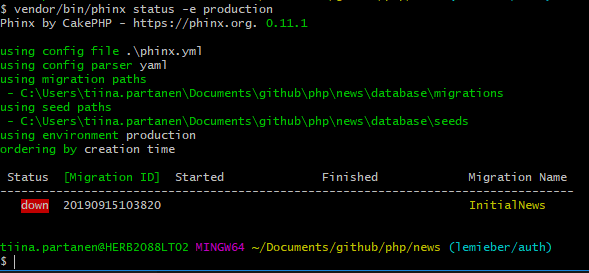

## Heroku, Postgres ja Migrations

### Heroku

Herokun avulla voidaan käynnistää (*deploy*) palvelinkoodia (esim. PHP tai node.js). Koodin voi imuroida sinne suoraan omasta Github-repostansa. 

Luo itsellesi uusi Heroku-sovellus näiden ohjeiden mukaisesti:

- [Heroku-ohjeet](../github/heroku.html)

### PostgreSQL

Herokussa ei ole MySQL-tietokantaa automaattisesti, joten käytämme PostgreSQL:ää sen tilalla.

Lisää sovellukselle tietokanta [Postgres Database On Heroku](https://docs.appery.io/docs/apiexpress-databaseconnection-heroku-postgres). Postgres-tietokannan lisääminen tapahtuu sovelluksen välilehdellä *Resources*, *More add-ons* ja etsimällä hakusanalla *postgres* (valitse ja asenna *Heroku Postgres*). Valitse sovellus, johon lisäät tietokannan.

Voit ottaa yhteyden Herokun Postgres-tietokantaan [PHPPGAdmin](../docker/postgres-heroku.html)-ohjelmalla.

Löydät tarvittavast kirjatumistiedot (url, database name, username, password) avaamalla *Heroku Postgres*-tietokannan ja sen alta kohdan *Settings* -> *Database credentials*.

### Ympäristömuuttujien hallinta Herokussa

Heroku:ssa tietokannan kirjautumistiedot saadaan suoraan ympäristömuuttujan *DATABASE_URL* avulla eli siellä ei tarvita erillistä *.env*-tiedostostoa.

Tämä pitää ottaa huomioon kooditasolla, kun otetaan yhteys tietokantaan. Muuta siis tietokantayhteyden ottamiseen tarkoitettu koodi haarautumaan sen perusteella onko ympäristömuuttuja *DATABASE_URL* olemassa:

```php
if(getenv("DATABASE_URL")){
            // The connection parameters are extracted from the DATABASE_URL environment variable
             $db = parse_url(getenv("DATABASE_URL"));
             $host = $db["host"];
             $port = $db["port"];
             $dbname = ltrim($db["path"], "/");
             $user = $db["user"];
             $password = $db["pass"];
             $connectionString = "pgsql:host=$host;dbname=$dbname;port=$port";
          } else {
              $host = getenv('DB_HOST');
              $port = getenv('DB_PORT');
              $dbname = getenv('DB_NAME');
              $user = getenv('DB_USERNAME');
              $password = getenv('DB_PASSWORD');
              $connectionString = "mysql:host=$host;dbname=$dbname;port=$port;charset=utf8";
          }
```

### Tietokantaskeman luominen ja päivittäminen (database migrations)

Herokussa oleva PostgreSQL-tietokanta on vielä täysin tyhjä. Voit luoda taulut käsin PHPMyAdmin-ohjelmalla (UI:n kautta tai ajamalla SQL-lausekkeita CREATE-table jne.) mutta tämä on hidaasta ja tuottaa helposti virheitä eikä tietokannan rakenne ole tallessa versionhallinnassa (github). Tämän takia otamme käyttöön tietokannan päivittämistyökalun, jonka avulla voimme tallentaa tietokantaskemat versionhallintaan sekä alustaa tietokannan automaattisesti.

#### Asennus ja konfiguraatiotiedosto

Käytämme tässä [Phinx-nimistä ohjelmaa](http://phinx.org). Asenna Phinx composerin avulla:

```cmd
composer require robmorgan/phinx
```

Luo *migrations*-kansio *database*-kansion sisälle. Luo *phinx.yml*-konfiguraatiotiedosto projektisi juureen. Tallenna sinne käyttämiesi tietokantojen tiedot:

*HUOM!* Lisää *phinx.yml* tiedosto .gitignore:een (sisältää salasanoja!).

```yml
paths:
    migrations: '%%PHINX_CONFIG_DIR%%/database/migrations'
    seeds: '%%PHINX_CONFIG_DIR%%/database/seeds'

environments:
    default_migration_table: phinxlog
    default_database: development
    production:
        adapter: pgsql
        host: <your_heroku_db_url>
        name: <your_heroku_db_name>
        user: <your_heroku_db_username>
        pass: <your_heroku_db_password>
        port: 5432
        charset: utf8

    development:
        adapter: mysql
        host: localhost
        name: news
        user: root
        pass: mypass123
        port: 3306
        charset: utf8

version_order: creation
``` 

#### Tietokantataulujen luominen

Luo uusi *migration* eli tietokantaskemaversio, anna nimi CamelCase-muodossa (esim. InitialNews):

```cmd
vendor/bin/phinx create InitialNews
```

Tämä luo sinulle pohjan (kansioon database/migrations), johon voit lisätä koodin, joka luo tarvittavat tietokantataulut. Käytännössä kirjoitat koodin *change*-metodille:

```php
  public function change()
    {
        public function change()
    {
        $news = $this->table('uutinen',['id' => false, 'primary_key' => ['uutinenID']]);
        $news->addColumn('uutinenID', 'integer', ['identity' => true])
              ->addColumn('otsikko', 'string', ['limit' => 50])
              ->addColumn('sisalto', 'string')
              ->addColumn('kirjoituspvm', 'datetime')
              ->addColumn('poistamispvm', 'datetime')
              ->addColumn('kirjoittaja', 'string', ['limit' => 50])
              ->save();

        $users = $this->table('users',['id' => false, 'primary_key' => ['userID']]);
        $users->addColumn('userID', 'integer', ['identity' => true])
              ->addColumn('firstname', 'string', ['limit' => 50])
              ->addColumn('lastname', 'string', ['limit' => 50])
              ->addColumn('username', 'string', ['limit' => 50])
              ->addColumn('password', 'string', ['limit' => 255])
              ->addIndex(['username'], [
                'unique' => true,
                'name' => 'idx_username'])
              ->save();
    }
```

Testaa nyt tietokantayhteys kirjoittamalla (*bash*):

```bash
vendor/bin/phinx status -e production
```

Jos kaikki menee hyvin, näet ruudulla:



Voit tarkistaa tietokannan rakenteen ottamalla [PHPPGAdmin-yhteyden](../docker/heroku-postgres.md) Herokuun.

Jos tietokannan rakenne ei ole haluttu, voit aina ottaa takapakkia:

```bash
vendor/bin/phinx rollback -e production
```

### Lisätietoa

- [Heroku Postgres-documentation](https://devcenter.heroku.com/articles/heroku-postgresql)
- [CakePHP Phinx](https://book.cakephp.org/3.0/en/phinx)
- [Phinx: AbstractMigration-class](http://docs.phinx.org/en/latest/migrations.html#the-abstractmigration-class)