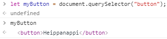
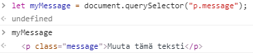
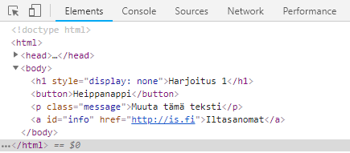
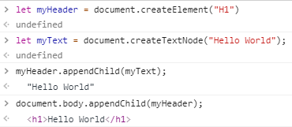

## Document Object Model (DOM)

### Mikä on DOM?

JavaScript:in avulla voidaan muokata dynaamisesti selaimessa auki olevaa HTML-sivua. Muokkaaminen tapahtuu DOM-rajapinnan kautta (Document Object Model Interface). DOM esittää HTML-dokumentin puumaisena rakenteena, jonka juuressa (root) on HTML-elementti.  

Tässä esimerkkikuva Wikipediasta:


Kuvassa olevia elementtejä kutsutaa _node_:ksi. _Parent_-nodella on _child_-nodeja (_decendant_-node), ja jos lapsia on useita ne ovat toisilleen _siblings_-node:ja. _Text_-node on oma tyyppinsä ja se sisältää tekstiä. Puuta voi selata järjestyksessä _root_-nodesta eteenpäin, kyselemällä aina seuraavaa jälkeläistä, sisarusta jne. Toinen, suorempi tapa, on etsiä elementtejä muokattavaksi niiden _CSS-selector_:eiden avulla. _querySelector_ etsii elementtejä tyypin (esim. "div", "h1"), luokan (esim. ".error") tai id:n (esim. "#info") avulla.  

## Demo 1: Elementtien etsintä
Kokeillaan _querySelector_:ia selaimessa. Avaa seuraava HTML-sivu selaimeen:

```html
<!DOCTYPE html>
<html>
<head>
    <meta charset="UTF-8">
    <title>DOM demo 1 ja 2</title>
</head>
<body>
    <h1>Harjoitellaan elementtien käyttämistä</h1>
    <button>Heippanappi</button>
    <p class="message">Muuta tämä teksti</p>
    <a id='info' href="http://is.fi">Iltasanomat</a>
</body>
</html>
```

Avaa selaimen kehittäjänäkymä painamalla **Ctrl+Shift+j** (valitse "Console"-välilehti ellei jo ole valittuna).

Kirjoita prompt:iin (> merkin jälkeen ja paina *enter*):

```js
let myButton = document.querySelector("button");
```

Nyt myButton:in pitäisi sisältää ko. elementti. Testaa se kirjoita prompt:iin:

```js
myButton
```

Tämä on ensimmäinen _button_:-elementti, joka dokumentista löytyi.


Kirjoita prompt:iin ja testaa:

```js
let myMessage = document.querySelector("p.message");
```

Tämä on ensimmäinen _.message_:luokkaan kuuluvan <p>-elementti, joka dokumentista löytyi.



Kirjoita prompt:iin ja testaa:

```js
let myLink = document.getElementById("info");
```

Tämä on dokumentissa oleva elementti, jonka id:n arvo on _info_.

Vinkki: Voit katsella DOM-elementtirakennetta, kun valitset *element* välilehden.


## Demo 2: Elementtien muuttaminen

Myt käytetään hyväksi demo 1:ssä tallennettuja elementtejä, ja muutetaan niiden attribuutteja.

Vaihdetaan napin tekstiksi "Paina tästä". Koska teksti on html-tagien välissä siihen viitataan attribuutilla *.innerHTML*:

```js
myButton.innerHTML = "Paina tästä";
```

Vaihdetaan linkki osoittamaan osoitteeseen "https://startti.tredu.fi/". Uusi URL pitää tallentaa sekä attribuuttiin *href*, että *innerHTML*:ään. Miksi?

```js
myLink.href = "https://startti.tredu.fi/";
```

Vaihda myös myMessage-elementin teksti.

Voit myös muuttaa elementtien CSS-tyylejä. Tekstin värin vaihtaminen onnistuu näin:

```js
myMessage.style.color = "red";
```

Koko dokumentin CSS-tyyliin pääsee käsiksi näin:

```js
document.body.style.backgroundColor = "pink";
```

## Demo 3: Elementtien luominen

Koko HTML-dokumentin voi rakentaa käyttämällä JavaScriptiä. Aloitetaan siis lähes puhtaalta pöydältä, avaa tämä tyhjä dokumentti selaimeen:

```html
<!DOCTYPE html>
<html>
<head>
    <meta charset="UTF-8">
    <title>DOM demo 3</title>
</head>
<body>
</body>
</html>
```

Luodaan h1-elementti, ja sen tekstiä varten oma *textnode*.

```js
let myHeader = document.createElement("H1")
let myText = document.createTextNode("Hello World");
```
Liitätään tekstiä sisältävä *node* h1-elementin lapseksi, ja koko paketti body-elementin lapseksi:

```js
myHeader.appendChild(myText);
document.body.appendChild(myHeader);
```
Tutki miltä DOM-puu näyttää nyt. Sivulle ei tule mitään näkyviin ennen kuin lapsielementit on liitetty *body*-elementtiin.



## Demo 4

Koodia on nyt ajettu kehittäjänäkymän kautta. Koodi voidaan tietysti liittää script-tagien avulla suoraan HTML-sivulle. Tässä demo 2:n heippanapin tekstin muuttaminen on paketoitu funktioksi *klikkaus*, ja sitä kutsutaan kun nappia painetaan (katso button:in *onclick*).

```html
<!DOCTYPE html>
<html>
<head>
    <meta charset="UTF-8">
    <title>DOM demo</title>
</head>
<body>
	<script>
		function klikkaus(){
			let myButton = document.querySelector("button");
			myButton.innerHTML = "Paina tästä";	
		}
	</script>
    <h1 style="display: none">Harjoitus 1</h1>
    <button onclick="klikkaus()">Heippanappi</button>
    <p class="message">Muuta tämä teksti</p>
    <a id='info' href="http://is.fi">Iltasanomat</a>
</body>
</html>
```
Muuta nyt demo 2:n tekstin värin vaihtaminen funktioksi ja liitä sen p-elementin *onclick*-attribuuttiin.

## Linkkejä

- elementin etsiminen [QuerySelector](https://www.w3schools.com/jsref/met_document_queryselector.asp)
- elementin tyylin muuttaminen [Style Object](https://www.w3schools.com/jsref/dom_obj_style.asp)
- elementin luominen [CreateElement](https://www.w3schools.com/jsref/met_document_createelement.asp)
- lapsen lisääminen [AppendChild](https://www.w3schools.com/jsref/met_node_appendchild.asp)
- lapsen lisääminen väliin [InsertBefore](https://www.w3schools.com/jsref/met_node_insertbefore.asp)