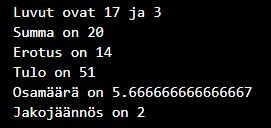

## JavaScript Harjoitukset 2.1

Tee Visual Studio Code:lla uusi tiedosto, nimeä se harjoitukset2_1.js. Avaa VS:n terminaali ja aja koodi kirjoittamalla konsoliin: node harjoitukset2_1.js. Tee kaikki tehtävät samaan tiedostoon. Testaa funktioiden toiminta usealla eri syötteellä, jätä kaikki testit näkyville tiedostoon.

### Tehtävä 1: Matemaattiset operaatiot & muuttujat

Luo kaksi muuttujaa, joihin talletat kokonaisluku tyyppiset arvot. Luo lisäksi 5 muuttujaa, joihin talletat aiemmin luomiesi muuttujien summan, erotuksen, tulon, osamäärän ja jakojäännöksen. Tulosta muuttujien arvot mallin mukaisesti.

### Tehtävä 2: Matemaattiset operaatiot funktiona

Tee funktio, joka saa parametrina kaksi lukua ja laskee niiden summan, erotuksen, tulon, osamäärän ja jakojäännöksen. Funktio tulostaa saadut tulokset tehtävän 1 mukaisesti. Kutsu funktiota vähintään kolmellä eri lukuparilla.

### Tehtävä 3: Toistorakenne

Tee toistorakenne, joka tulostaa konsoliin parittomat luvut välillä 1-10, mutta alkaen luvusta 10 ja pienenevään suuntaan.
Vinkki: luvun parittomuuden voi tarkistaa sen ja luvun 2 jakojäännöksen avulla.

### Tehtävä 4: Ympyrän piiri, säde ja pinta-ala

Tee funktio, joka saa parametrina ympyrän halkaisijan ja laskee ympyrän säteen, piirin ja pinta-alan, ja tulostaa vastaukset konsolille.

*Vinkki 1:* Piin arvon saa tarkasti funktiolla Math.PI.

*Vinkki 2:* Ympyrän ala lasketaan pii * r^2, piiri lasketaan 2 * pii * r, jossa r=säde. Säde puolestaan on halkaisija/2.

### Tehtävä 5: Tilikauden tulos

Tee funktio, joka saa kaksi lukua parametrina (tuotto ja kulut) ja laskee tilikauden tuloksen ja ilmoittaa, onko se voittoa vai tappiota. Funktio siis palauttaa sanan "voittoa" tai "tappiota".
Tulos lasketaan kaavalla tuotto – kulut. jos vastaus on negatiivinen, tilikausi on tappiollinen, muuten se on voitollinen.
Testaa ohjelmaa eri arvoilla ja tulosta vastaus konsolille.

### Tehtävä 6: Nelilaskin

Tee funktio, joka toimii yksinkertaisena nelilaskimena. Funktio saa parametrina kaksi lukua sekä tiedon siitä, minkä laskutoimituksen, yhteen-, vähennys-, kerto- vai jakolaskun, niillä halutaan tehdä ("+", "-", jne). Funktio tulostaa valitun laskutoimituksen sekä laskun vastauksen konsolille. Testaa funktion toiminta useilla eri arvoilla. Tee ehtorakenne käyttäen switch – case rakennetta.

### Tehtävä 7: Suurempi luku (Switch case)

Muuta edellisten harjoitusten tehtävä 4. Suurempi luku ([Harjoitus1](harjoitukset-perusrakenteet1.html)) if-else-rakenteen sijaan switch–case-rakenteeksi

### Tehtävä 8: Tuumat senteiksi

Tee funktion, joka muuntaa annetut tuumat senttimetreiksi ja palauttaa vastauksen.

Tee toinen funktio, joka tulostaa konsoliin tekstin “X tuumaa on Y senttimetriä”. X:n paikalle tulostuu annettu muuttujan tuumamitta-arvo ja Y:n paikalle senttimetriarvo.

### Tehtävä 9: On välissä

Tee funktio, joka tarkistaa, onko annettu luku välissä 0 – 10. Jos luku on ko. välillä, se palauttaa arvon *true*, muuten *false*. Testaa funktiota vähintään neljällä eri arvolla, joista yksi on yli 10, yksi alle 0, yksi suurempi kuin 0 ja pienempi kuin 10 ja yksi raja-arvo (0 tai 10, eivät kuulu välille).

### Tehtävä 10: Valuuttalaskin

Tee funktio, joka laskee paljonko käyttäjä saa valuuttaa. Funktio saa parametreina valuuttakurssin ja euromäärän. Palvelumaksu on 2.50€, ja se vähennetään ennen muunnosta. Muista riittävän informatiiviset tulostukset.

### Tehtävä 11: Fahrenheit

Tee funktion, joka muuntaa annetun lämpötilan Celsius-asteikolta Fahrenheit-asteikolle. Kaava:  °F = (°C) • 1,8 + 32
Testaa funktiota vähintään kolmella eri arvolla. Tee toinen funktio, joka käyttää muuntofunktiota, ja joka tulostaa lähtöarvon, tuloksen sekä yksiköt.

### Tehtävä 12: Suurin kolmesta

Tee funktio, joka saa kolme lukuarvoa, hakee niistä suurimman ja tulostaa sekä annetut lukuarvot että suurimman arvon konsolille.

### Tehtävä 13: Suuruusjärjestys

Muuta edellisen tehtävän (12. Suurin kolmesta) funktiota niin, että se järjestää saamansa kolme lukuarvoa suuruusjärjestykseen (pienimmästä suurimpaan) ja tulostaa alkuperäisen sekä suuruusjärjestyksen konsolille sopivien selitysten kera.
