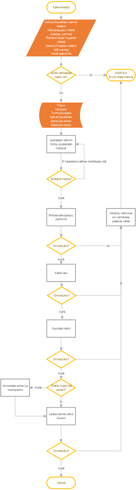

## Automatisointiajattelu

Vuokaavioilla (flow-chart) voidaan esittää ohjelmiston toiminta kuvana. Kuvien piitäminen auttaa asiakkaan vaatimusten ymmärtämisessä sekä ratkaistavan ongelman pilkkomisessa pienemmiksi osiksi. Esim. kahviautomaatti voisi toimia näin:

--- 

1. Tehtävä

Laadi *Visio*:lla vuokaavio aamutoimistasi. Tuo (*export*) valmiit kuvat ulos Visiosta *png*-muodossa. Tee kuvista *automatisointiajattelu.md*-sivu orientaatio-repoon.

2. Tehtävä

Laadi *Visio*:lla parin kanssa tilakaavio ohjelmistokehittäjä-opiskelijan tavallisesta vuorokaudesta/koulupäivästä (jakakaa tiedosto molemmille OneDrivessä). Liitä tämäkin kuva em. sivulle.

