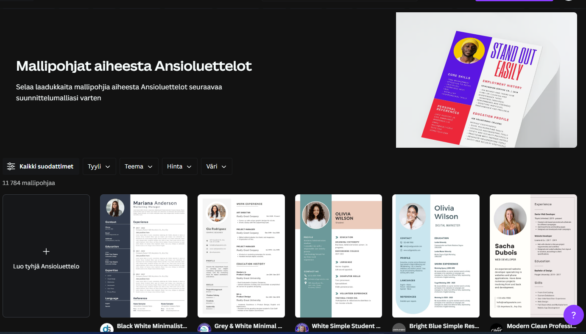

## CV:n tekeminen Canva:lla

Canva-ohjelmalla on helppoa tehdä näyttäviä CV:tä. Saat käyttöösi ilmaisen oppilaitostilin, kun kirjaudut siihen käyttäen edu-tunnukseen liitettyä google-tiliä (etunimi.sukunimi@edu.tampere.fi).

1. Kirjaudu Canvaan
    - [canva.com](https://www.canva.com/fi_fi/)

2. Valitse valmis mallipohja (kirjoita hakukenttään "ansioluettelot" tai "CV")

    

3. Kerro itsestäsi (ominaisuuksistasi sekä taidoistasi), kiinnostuksistasi sekä siitä mitä haluaisit isona tehdä: olet tulevaisuuden toivo, joten keskity tulevaisuuteen. Merkitse huolellisesti mitä olet opiskellut ja merkitse teknisiin taitoihisi osaamisesi taso (oma arvio), jos mahdollista. Voit tehdä CV:n suomeksi tai englanniksi. Lisää kuva itsestäsi, jäät paremmin mieleen ja se konkretisoi henkilöä tekstin takana.

    -[opettajan malli-cv](./docs/CV_Partanen_Tiina_2020.pdf)
    -[opettajan malli-cv, eng](./docs/CV_Partanen_Tiina_2020_eng.pdf)

