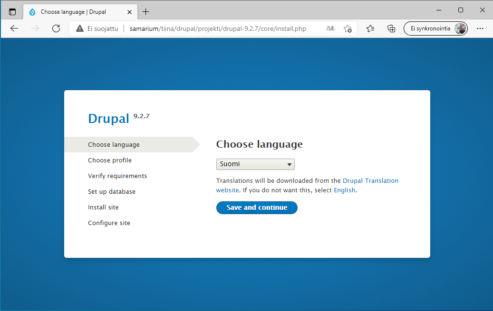
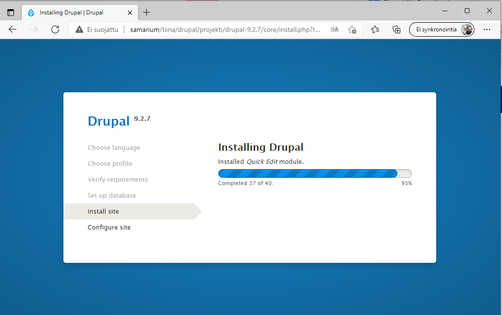
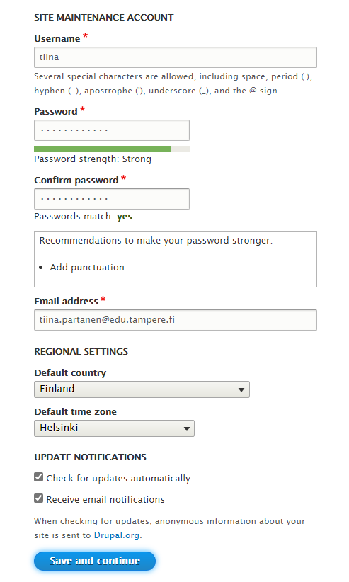
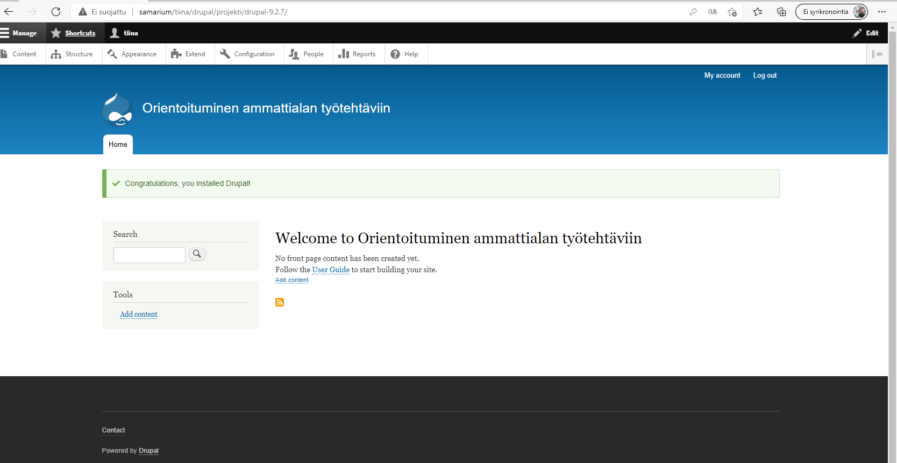

## Drupal asennus

1) Lataa [drupal.zip](https://www.drupal.org/download) ja kopioi se samarium:ille omaan kansioosi. Pura paketti valitsemalla se hiirellä ja valitsemalla hiiren oikealla näppäimellä "pura tähän".

2) Avaa selaimen kautta hakemisto, johon purit Drupal.zip:in esim: 

    ```cmd
    samarium/2108TiviPOk02/etunimi.sukunimi/drupal-9.2.8/drupal-9.2.8
    ```

3) Valitse asennusohjelmassa kieli:

    

4) Täytä asennusohjelman pyytämät tiedot (saat tietokannan käyttäjänimen *database username* ja salasanan *database password* opettajalta). Valitse tietokannan nimeksi sama kuin *database username*.

    

5) Odota että asennusohjelma suorittaa asennuksen loppuun (tässä kestää jonkin aikaa)

    

6) Luo itsellesi admin-tunnukset (ota nämä talteen!):

    

7) Asennus on valmis!

    