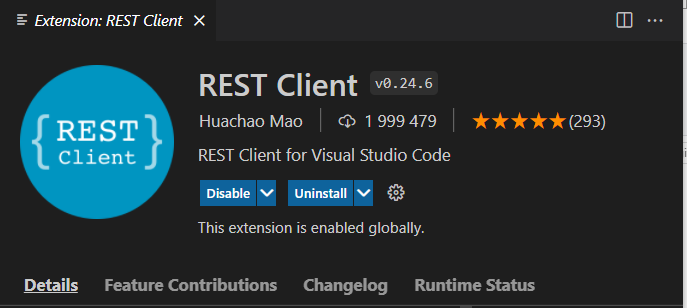

## Notes-demo osa 1

Tässä harjoituksessa harjoitellaan tiedon hakemista palvelimelta (backend) sekä tiedon tallentamista palvelimelle. Palvelimena  käytetään json-serveriä, joka on hyvä työkalu fronttikoodarilla, silloin kun varsinaista backend:iä ei vielä ole käytössä.

### JSON-serverin asennus ja käynnistys

Tee uusi kansio notesdemo. Tee siihen *db.json*-tiedosto, kopioi sinne tämä [json-muotoinen *notes*-tieto:](https://fullstackopen.com/osa2/palvelimella_olevan_datan_hakeminen).

Asenna ja käynnistä json-serveri kansioon notesback.

```cmd
> cd c:/users/oma.nimi/documents/react/notesdemo/notesback
> npx json-server --port=3001 --watch db.json
```

Avaa selaimella osoite: http://localhost:3001/notes.

json-server toimii kehitysaikaisena backendinä. Oikean tietokannan sijaan tiedot tallennetaan *json*-tiedostona levylle.

*Huom!* Jos olet tehnyt toisella kurssilla notes-backendin, voit käyttää suoraan sitä JSON-serverin tilalla.

Kun näissä tehtävissä viitataan *notes-backend*:iin, se tarkoittaa joko em. JSON-serveriä tai node/express:illä itse tehtyä backend:iä.

### Tehtävä 0 (REST-rajapinnan toiminnan ymmärtäminen)

Tutustu REST-rajapinnan toimintaan JSON-serverin ja REST Client:in avulla. VS Codeen voi asentaa REST client laajennoksen, jonka avulla voi lähettää REST - *request*:eja ja vastaan ottaa *reponse*:ja.



Tee *test*-kansio ja sen sisälle tiedosto *notes_get.http*, joka sisältää *REST-request*:in, jonka metodina on GET:

```http
GET http://localhost:3001/notes HTTP/1.1
```

Kun nimeät testitiedostot \*.http - päätteellä niin ne toimivat (eli ne voi lähettää VS-codesta). Lähetä testi (paina ruudulla olevaa *Send Request*).

Jos kaikki toimii ok, JSON-serverin pitäisi palauttaa 200 OK, ja kaikki *notes*-endpointin sisältämät muistiinpanot.

Uusi muistiinpano lähetetään POST-metodilla *json*-muodossa:

```http
POST http://localhost:3001/notes HTTP/1.1
content-type: application/json

{
    "content": "Uusi viesti",
    "date": "2020-01-10T17:30:31.098Z",
    "important": false
}
```

Muistiinpano poistetaan DELETE:n avulla käyttämällä id:tä: 

```http
DELETE http://localhost:3001/notes/1 HTTP/1.1
```

Muistiinon sisältöä muokataan PUT-metodin ja id:n avulla:

```http
PUT http://localhost:3001/notes/2 HTTP/1.1
content-type: application/json

    {
      "content": "Browser is a nice tool",
      "date": "2020-01-10T18:39:34.091Z",
      "important": false
    }
```

Tallenna ylläolevat testit *test*-kansioon. 

Harjoitus: tee REST-testi, joka pyytää vain yhden tietyn muistiinpanon id:n avulla.

Lisätietoa [REST-rajapinnasta](../tietokannat/rest-json.html)
### Tehtävä 1 (Tietojen hakeminen backendiltä)

Tee uusi React-sovellus ajamalla create-react-app:

```cmd
> cd c:/users/oma.nimi/documents/react/
> npx create-react-app notesfront
> cd notesfront
> npm start
```

Asenna *axios*-kirjasto ja hae sen avulla *notes*-tiedot notes-backendiltä. Tulosta muistiinpanot consolille.

```cmd
> cd notesfront
> npm install axios --save
```

Lisää app.js tiedostoon:

```js
import axios from 'axios'

const App = () => {
// konsolille saadaan tulostumaan Promise
const promise = axios.get('http://localhost:3001/notes')
console.log(promise)

return (
    ...
)
}
```

Promise on *asynkronisen* - kutsun käsittelyyn tarkoitettu tietorakenne JavaScriptissä. Sen tila voi olla jokin näistä kolmesta: *fail*, *success* tai *pending*. Varsinainen data saadaan *promise.data* kentästä.

Jotta tietoa voidaan muokata, saadut tiedot tallennetaan *notes*-tilamuuttuujaan. Jotta osaamme lukea *data*-kentän oikealla hetkellä, jäämme odottamaan *response*-viestiä *then*-rakenteen avulla:

```js
import axios from 'axios'
import {useState} = 
const App = () => {
// tilamuuttuja:    
const [notes, setNotes] = useState([]);
// konsolille saadaan tulostumaan palvelimelta saatu data
axios
  .get('http://localhost:3001/notes')
  .then(response => {
    const notes = response.data
    console.log(notes)
    // tallennus tilamuuttujaan:
    setNotes(note)
  })

return (
    ...
)
}
```

Nyt konsolille tulee sama tulostus monta kertaa! Korjataan se niin, että tiedot haetaan palavelimelta vain komponentin latausvaiheessa. Otetaan käyttöön ns. eventHook. Paketoidaan edellinen kooti *startHook()* - funktion sisään ja kutsutaan sitä kerran komponentin latautumisvaiheessa.

```js
  const startHook = () => {
    axios.get('http://localhost:3001/notes').then(response => {
    const notes = response.data
    console.log(notes)
    setNotes(notes);
    })}

  useEffect(startHook, []);
```

Nyt muistiinpanot haetaan vain kun *App.js* renderöidään ensimmäisen kerran.

Voit laittaa toistaiseksi kaiken axios-koodin *apps.js*-tiedostoon.

### Tehtävä 2: haettujen tietojen renderöinti ruudulle

Tee uusi komponentti, joka saa *prop*:ina edellisen tehtävän tilamuuttujaan tallennetut muistiinpanot ja tulostaa ne listana (li-elementteina). Tulosta lisäksi tärkeät muistiinpanot punaisella ja ei tärkeät sinisellä.

*Vinkki:* tee *App.css* - tiedostoon kaksi *class*:ia, *.important* ja *.normal*. Seuraava koodi valitsee näistä käytöön kulloinkin sopivimman:

```js
  <li className={note.important ? "important" : "normal"}>
```

### Tehtävä 3: uuden (kovakoodatun) muistiinpanon lähettäminen backendille

Lähetä axioksen avulla backend:ille uusi, aluksi kovakoodattu, muistiinpano (*notes*-olio). Tee uusi funktio *addNote*, ja liitä se "lisää muistiinpano" -nappiin.

```js
  const addNote = () => {
    const note = {content: "uusi viesti", 
                  date: new Date().toISOString(), important: false};
    axios.post(baseURL, note).then(response => {
      console.log(response.data)
    })
  }
```

```jsx
<button onClick={addNote}>Lisää kovakoodattu</button>
```

Katso konsolilta, mitä backend palautti. Katso myös, että uusi muistiinpano tallentui json-serverille (*db.json*).

*Huom* id-tulee serveriltä, älä lähetä sitä.


### Tehtävä 3

Tee uusi komponentti, joka tulostaa ruudulle kaikki muistiinpanot ranskalaisilla viivoilla.


### Tehtävä 4

Tee lomakekomponentti, jonka avulla saadaan syötettyä uusi muistiinpano, sekä sen tärkeys (true/false) esim.*check-box*:in avulla. Tallenna lomakekentät tilamuuttujiin ja lähetä uusi *notes*-olio notes-backendille, kun lomake *submit*:oidaan.

Muista päivittää axios-kutsun jälkeen *notes*-tilamuuttuja, jotta ruutu päivittyy!

### Tehtävä 5

Lisää jokaiselle muistiinpanolle poistanappi.Lisää myös toiminnallisuus, jolla voi muuttaa muistiinpanon tärkeyttä (esim. klikkaamalla muistiinpanoa). Muista päivittää onnistuneen *axios*-kutsun jälkeen *notes*-tilamuuttuja vastaamaan notes-backend:in tilannetta (poistettu muistiinpano poistetaan myös notes-tilamuuttujasta, vanha muistiinpano korvataan muutetulla).

### Tehtävä 6

Tee *dropdown*-valikko, jonka avulla filteröit ruudulle näkyviin vain tärkeät muistiinpanot.

---

Toinen vaihtoehto on käyttää erillistä modulia *axios*-kirjaston kutsuille:
[Ohjeet axios:en käyttöön löytyvät täältä (Axios ja promiset):](https://fullstackopen.com/osa2/palvelimella_olevan_datan_hakeminen) tai voit ladata valmiin koodin [täältä](./axios-service.html).
