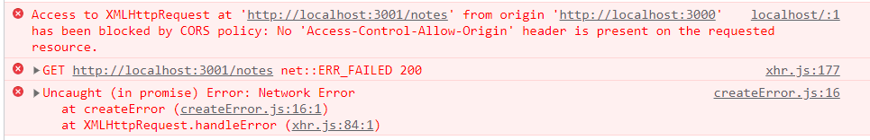

## Notes-demo osa 4

### node/express

Nyt siirrymme pois JSON-serverin käytöstä ja teemme oikean *backend*:in käyttämällä *node/express*-kirjastoa. Sen avulla toteutamme webbiserverin, joka vastaa *frontend*:in pyyntöihin. Backend käyttää tietokantaa tiedon tallentamiseen ja sen tehtävä on myös huolehtia autentikoinnista.

Tee nyt uusi kansio *notesback* notesdemon sisälle ja luo sinne uusi *package-json:*

```cmd
npm init
```

Asenna *node/express* sekä käyttämäsi tietokannan tuki (*mysql2*, jos MySQL 8 tai uudempi) sekä apukirjasto tietokannan käyttämiseen (*knex*):

```cmd
npm install express --save
npm install mysql2 --save
npm install knex --save
```

Tee .gitignore ja laita sinne vähintään nämä:

```cmd
node_modules/
/node_modules
*.env
/build
build/
knexfile.*
```

Tee projektin juureen *index.js* tiedosto ja kopioi sinne seuraava koodi:

```js
const express = require('express')
const app = express()

app.get('/', (req, res) => {
  res.send('<h1>Hello World!</h1>')
})

const PORT = 3001
app.listen(PORT, () => {
  console.log(`Server running on port ${PORT}`)
})
```

Käynnistä webbiserveri konsolilta:

```cmd
node index.js
```

### nodemon

Avaa selaimessa *localhost:3001*. Kokeile vaihtaa teksti joksikin muuksi ja tallenna. Teksti ei vaihdu, vaikka lataat sivun uudelleen, muutokset otetaan käyttöön vasta kun serveri uudelleen käynnistetään. Koska serverin käynnistäminen jokaisen muutoksen jälkeen on työlästä, otetaan käyttöön *nodemon*, joka monitoroi tiedostoja ja ottaa lennossa käyttöön muutokset.

```cms
npm install nodemon --save-dev
```

```cmd
npx nodemon index.js
```

Kokeile muuotksia nyt uudelleen, muutosten pitäisi tulla käyttöön kun sivun lataa uudelleen.

Tallenna tämä scriptiksi package.json:iin:

```js
"start": "npx nodemon index.js",
```

Jatkossa backend:in voi käynnistää kuten frontinkin "npm start".

### Tietokantayhteys

Käynnistä tietokanta, johon olet tehnyt notesdemon tarvitsemat taulut: *notes* ja *users*. Alustetaan tietokantayhteys *knex*:in avulla, lisää index.js:iin:

```js
const options = {
    client: 'mysql2',
    connection: {
        host: '127.0.0.1',
        user: 'root',
        password: 'mypass123',
        database: 'notesdemo_db'
    }
}
const knex = require('knex')(options);
```

### GET notes

Toteutetaan *GET*-metodi, joka palauttaa kaikki muistiinpanot (lisää Hello World:in alle):

```js
app.get('/notes', (req, res) => {
    knex('notes').select('*')
        .then((rows) => {
            console.log(rows);
            res.json(rows);
        })
})
```

*req* on *http*-request ja *res* *http*-response. Kun tietokanta palaa haetun tiedon kanssa, se lähetetään res.json()-metodilla.

Testaa koodin toiminta avaamalla selaimessa http://localhost:3001/notes. Tee myös REST-client testitiedosto kansioon *tests* (huom. tiedostopäätteen pitää olla *.http* että sen voi lähettää):

```http
GET http://localhost:3001/notes HTTP/1.1
```

Koska pyyntö voi myös epäonnistua (tietokantayhteys ei toimi), lisätään *catch*-haara (*then*:in jälkeen):

```js
        .catch((err) => {
            console.log('SELECT * NOTES failed')
            res.status(500).json(
                { error: err }
            )
        })
```

### .env

Tietokantasalasanoja ei saisi koskaan kovakoodata suoraan koodiin, koska koodia pitää pystyä ajamaan erilaisissa ympäristöissä (lokaalikehitysympäristö, tuotantoympäristö, testausympäristö), joten siirretään ne omaan *.env* - tiedostoonsa, joka on tietoturvasyistä *.gitignore*:ssa. Tee backend:in juureen uusi tiedosto .env:

```cmd
DB_HOST = localhost
DB_USER = root
DB_PASS = mypass123
DB_DATABASE = notesdemo_db
DB_TYPE = mysql2
DB_PORT = 3306
PORT = 3001
```

Nämä tiedot voidaan ottaa koodissa käyttöön *dotenv*-kirjaston avulla:

```cmd
npm install dotenv --save
```

Tehdään utils-kansioon *config.js*-tiedosto, joka lukee *.env*:istä tietokantayhteyden tarvitsemat ympäristömuuttujat ja exporttaa ne *knex*:in vaatimassa muodossa:

```js
require('dotenv').config()

let PORT = process.env.PORT

let DATABASE_OPTIONS = {
    client: process.env.DB_TYPE,
    connection: {
        host: process.env.DB_HOST,
        user: process.env.DB_USER,
        password: process.env.DB_PASS,
        database: process.env.DB_DATABASE
    }
}

module.exports = {
    DATABASE_OPTIONS,
    PORT
}
```

Ota *config.js* käyttöön *index.js*:ssä ja poista kovakoodattu *options*:

```js
const config = require('./utils/config')
const options = config.DATABASE_OPTIONS;
```

Vaihdetaan kovakoodattu portti tulemaan myös .env-tiedostosta:

```js
const PORT = config.PORT;
```

Tallenna kopio *.env* - tiedostosta nimellä *.env-local* (hyvä, että .env - tiedoston templaatti on tallessa versionhallinnassa).

### Tietokantayhteyden debuggaus

Jos haluat näydä millaista SQL:ää knex generoi lisää tämä rivi tiedoston alkuun (const knex:in alapuolelle):

```js
knex.on('query', console.log);  // DEBUG
```

### POST notes

Toteutetaan myös uuden muistiinpanon lisääminen:

```js
app.post('/notes', (req, res) => {
   const note = req.body;
   console.log(note);
} 
```

Tässä vastaanotetusta viestistä otetaan talteen *body*:ssä lähetetty *json*.

Testaa, että backend saa json:in oikein (tallenna *tests*-kansioon):

```js
POST http://localhost:3001/notes HTTP/1.1
content-type: application/json

{
    "content": "Uusi viesti",
    "date": "2022-01-10T17:30:31.098Z",
    "important": false
}
```

Ruudulle tulostuu nyt vain *undefined*. Tämä johtuu siitä, että json-parseria ei ole otettu käytöön. Lisätään se:

```js
app.use(express.json());
```

Tämä on ensimmäinen ns. *middleware*, jonka otamme käyttöön. Se suoritetaan ennen jokaisen *req*-viestin käsittelyä. Nyt viesti saadaan backendiin ok.

Viedään uusi note vielä tietokantaan:

```js
   const newNote = {
        content: note.content,
        important: note.important,
        date: new Date(note.date),
        user_id: 1 /* TÄMÄ KORJATAAN KIRJAUTUMISEN JÄLKEEN */
    }

   knex('notes').insert(newNote)
   .then(id_arr => {
       console.log(id_arr);
       newNote.id = id_arr[0];
       res.json(newNote);
   })
```

Lisää myös *catch*-haara.

Ennen tietokantaan lisäämistä, olisi hyvä tarkistaa, että kaikki vaaditut tiedot on annettu, ja informoida käyttäjää jos jotain puuttuu:

```js
 if (note.content === undefined || note.date === undefined || note.important === undefined) {
        return res.status(400).json(
            { error: "check json-data" }
        )
    }
```

Testaa, että tämä toimii lähettämällä puutteellinen json-note.

### DELETE notes

Muistiinpanon poistaminen perustuu poistettavan muistiinpanon id:hen. Se saadaan poimittua *req.params*:in avulla:

```js
app.delete('/notes/:id', (req, res) => {
    const id = req.params.id;
    console.log(id);
})
```

Testaa REST-viestillä (tallenna tests-kansioon):

```http
DELETE http://localhost:3001/notes/5 HTTP/1.1
```

Poistetaan nyt viesti tietokannasta:

```js
knex('notes').where('id', '=', id).del()
        .then(status => {
            console.log("delete ok")
            res.status(204).end();
        })
```

Lisää myös *catch*-haara.

### PUT notes

Olemassa olevan muistiinpanon muokkaaminen vaatii sekä json-bodyn, että *reg.params.id*:n:

```js
app.put('/notes/:id', (req, res) => {
    const id = req.params.id;
    const note = req.body;

    const updatedNote = {
      content: note.content,
      important: note.important,
      date: new Date(note.date)
    }

    knex('notes').update(updatedNote).where('id', '=', id)
        .then((response) => {
            console.log(response)
            res.status(204).end();
        })
})
```

Lisää body:n kenttien tarkistus ja virheilmoituksen lähettäminen sekä *catch*-haara tietokantaoperaatioon. Testaa lähettämällä muutettu muistiinpano.

```http
PUT http://localhost:3001/notes/5 HTTP/1.1
Content-Type: application/json

{
    "content": "Muutettu muistiinpano",
    "date": "2022-01-10T17:30:31.098Z",
    "important": true
}
```

### Testaus front:in kanssa

Nyt tekemäsi backend:in pitäisi pystyä toimimaan React-front:in kanssa yhdessä. Käynnistä notesdemon React-osuus ja testaa sen toiminta uuden backend:in kanssa (HUOM! Älä käynnistä jsonserveriä enää).

Notes-frontend ei tunnu saavan muistiinpanoja backendiltä vaan konsolille tulostuu vieheilmoitus:



Tämä johtuu siitä, että frontend (http://localhost:3000) ja backend (http://localhost:3001) pyrivät eri osoitteissa ja tietoturvasyistä selain estään niiden keskustelun keskenään. CORS-tulee sanoista Cross-Origin-Resource Sharing. Tämän ongelman voimme ratkaista käyttämällä proxy:ä, jolloin selaimen kannalta frontend ja backend ovat samassa osoitteessa.

Muuta react-frontend:in baseURI:ksi:

```js
const baseURL = '/notes';
```

ja lisää front:in *vite.congig.js*:ään:

```js
server: {
    proxy: {
      '/notes': {
        target: 'http://localhost:3001',
        changeOrigin: true,
      }
    }
    }
```

Nyt yhteys front:in ja back:in välillä toimii. Palaamme CORS:iin vielä myöhemmin.

---

---> [Notesdemo, osa 5](./notesdemo_osa5.html)