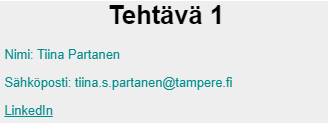

## Harjoitukset 1

### Demo 1

Tee uusi React-sovellus ajamalla create-react-app:

```cmd
> cd c:/users/oma.nimi/documents/react/
> npx create-react-app harj1
> cd harj1
> npm start
```

Tee uusi komponentti, joka tulostaa ruudulle ensimmäisellä tunnilla opitut uudet asiat ranskalaisina viivoina.

Muuta komponentti ottamaan sen sisältämät tiedot parametreina eli propseina. Välitä tiedot app-tasolta komponenttitasolle. Tuo opitutasiat taulukkomuodossa ja käytä map:ia.

### Tehtävä 1

Tee komponentti, joka tulostaa ruudulle parametreina (props) annetut tiedot. Kutsu komponenttia kaksi kertaa eri tiedoilla.



### Tehtävä 2

Tee komponentti, joka tulostaa ruudulle taulukon muodossa parametrina annetun listan (array) kurssiolioita.

Vinkki: tee alikomponentti, joka tekee yhden rivin ja kutsu sitä map:in avulla.


### Tehtävä 3

Lisää sivulle napit, joita painamalla tehtävä osion saa piiloon/näkyville.

Vinkki, tarvitset tässä tehtävässä tilamuuttujia (*useState*). Tarvitset myös callback-funktion, joka reagoi onClick-eventtiin. Tilamuuttujat voi alustaa joko *app.js*-tasolla tai komponenteissa.


### Tehtävä 4

Tee komponentti, joka tulostaa ruudulle alekkain parametrina annetut taidot (array). Sijoita ylimmäiseksi input-kenttä, jonka avulla voi lisätä uuden taidon listaan viimeiseksi.


Vinkki, tarvitset useamman tilamuuttujan (*useState*). Yhteen tallennetaan kaikki *skills*-tiedot, toiseen tallennetaan ruudulla oleva *newSkill*. Tarvitset myös callback-funktiot näiden molempien muokkaamiseen (onChange- ja onSubmit-eventtien käsittelyn yhteyteen). Tässä tehtävässä kannattanee pitää tilamuuttujat *app.js*-tasolla ja välittää ne propseina komponenteille.

### Tehtävä 5

Lisää sivulle kuvia, kuvatekstejä sekä kuvan otsikkoja. Tallenna yhteen kuvaan liittyvät tiedot olioon esim. attribuutteihin: *imageurl*, *title* ja *description*. Tallenna kuvatietoja sisältävät oliot taulukkoon erilliseen tiedostoon. Käytä tilamuuttujaa kuvien tallentamiseen. 

Vinkki: Tee komponentti, joka näyttää yhden kuvan tiedot ja toinen komponentti, joka näyttää kaikkien kuvien tiedot (kutsuu ensimmäistä map:in avulla). Lisää toiminnallisuus, että ensin näytetään vain kuvan otsikko ja otsikkoa klikkaamalla näytetään kuva ja kuvateksti. Otsikkoa uudelleenklikkaamalla ne piilotetetaan.

### Tehtävä 6

Lisää tykkäys-nappi kuvan yhteyteen. Näytä tykkäysten määrä kuvan yhteydessä. Voit tallentaa tykkäysten määrän samaan tilamuuttujaan muiden tietojen kanssa.

### Tehtävä 7

Muokkaa .css - tiedostoa, että elementit myös näyttävät hyvältä.