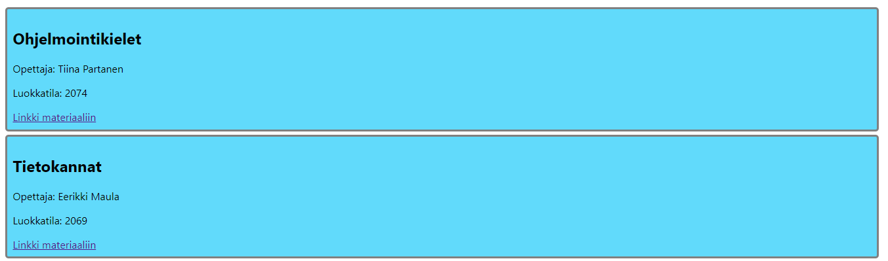
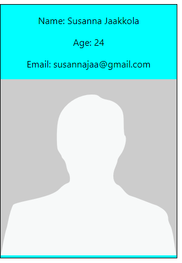
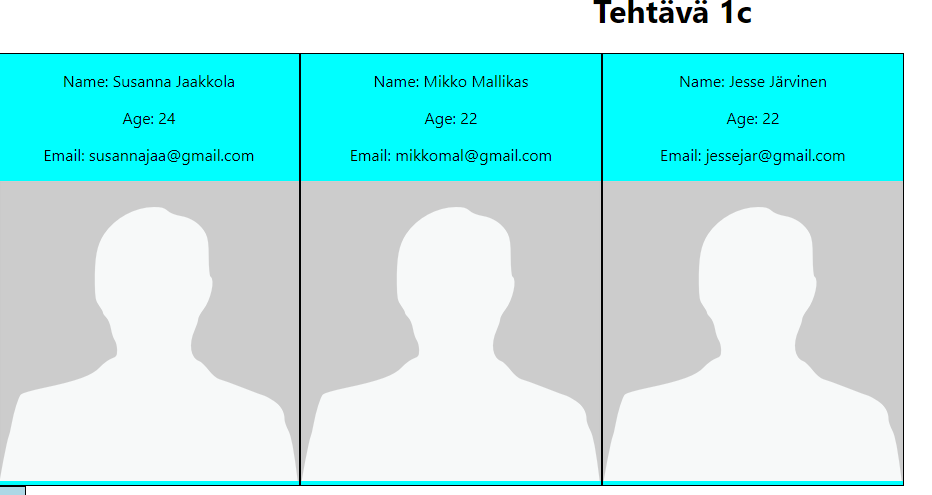
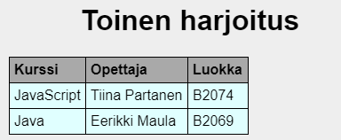
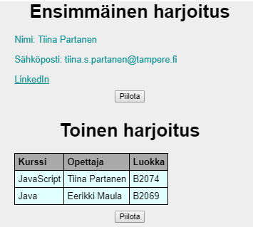
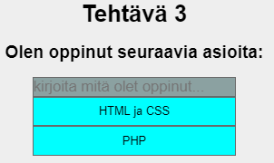

## Harjoitukset 1

### Demo 1

Tee uusi React-sovellus ajamalla create-react-app:

```cmd
> cd c:/users/oma.nimi/documents/react/
> npx create-react-app harj1
> cd harj1
> npm start
```

Tee uusi komponentti, joka tulostaa ruudulle ensimmäisellä tunnilla opitut uudet asiat ranskalaisina viivoina.

Muuta komponentti ottamaan sen sisältämät tiedot parametreina eli propseina. Välitä tiedot app-tasolta komponenttitasolle. Tuo opitutasiat taulukkomuodossa ja käytä map:ia.

### Tehtävä 1a (DEMO)

Tee komponentti, joka tulostaa ruudulle parametreina (props) annetut tiedot. Kutsu komponenttia kaksi kertaa eri tiedoilla.



### Tehtävä 1b (DEMO)

Tee komponentti, joka tulostaa ruudulle parametreina (props) annetun opiskelija-olion tiedot. Kutsu komponenttia kerran, että näet että se toimii. Voit käyttää opiskelijan kuvana placeholder:ia (url).



### Tehtävä 1c (DEMO)

Tee komponentti, joka tulostaa ruudulle parametrina (props) annetun olioita sisältävän taulukon tiedot. Tämä tehdään käyttämällä tehtävän 1b komponenttia ja map:ia.



### Tehtävä 2 (harjoitus)

Tee komponentti, joka tulostaa ruudulle taulukon muodossa parametrina annetun listan (array) kurssiolioita.

Vinkki: tee alikomponentti, joka tekee yhden rivin ja kutsu sitä map:in avulla.



### Tehtävä 3 (harjoitus)

Lisää sivulle kuvia, kuvatekstejä sekä kuvan otsikkoja. Tallenna yhteen kuvaan liittyvät tiedot olioon esim. attribuutteihin: *imageurl*, *title* ja *description*. Tallenna kuvatietoja sisältävät oliot taulukkoon erilliseen tiedostoon.

Vinkki: Tee komponentti, joka näyttää yhden kuvan tiedot ja toinen komponentti, joka näyttää kaikkien kuvien tiedot (kutsuu ensimmäistä map:in avulla).

HUOM! Tämän tehtävän voi tehdä myös [maademon datalla](https://otredu.github.io/js/maademo.html). 


### Tehtävä 4 (DEMO)

Lisää sivulle napit, joita painamalla tehtävä osion saa piiloon/näkyville.

Vinkki, tarvitset tässä tehtävässä tilamuuttujia (*useState*). Tarvitset myös callback-funktion, joka reagoi onClick-eventtiin. Tilamuuttujat voi alustaa joko *app.js*-tasolla tai komponenteissa.



### Tehtävä 5 (harjoitus)

Lisää tehtävään 3 toiminnallisuus, että ensin näytetään vain kuvan otsikko ja otsikkoa klikkaamalla näytetään kuva ja kuvateksti. Otsikkoa uudelleenklikkaamalla ne piilotetetaan.

### Tehtävä 6 (DEMO)

Tee komponentti, joka tulostaa ruudulle alekkain parametrina annetut taidot (array). Sijoita ylimmäiseksi input-kenttä, jonka avulla voi lisätä uuden taidon listaan viimeiseksi.



Vinkki, tarvitset useamman tilamuuttujan (*useState*). Yhteen tallennetaan kaikki *skills*-tiedot, toiseen tallennetaan ruudulla oleva *newSkill*. Tarvitset myös callback-funktiot näiden molempien muokkaamiseen (onChange- ja onSubmit-eventtien käsittelyn yhteyteen). Tässä tehtävässä kannattanee pitää tilamuuttujat *app.js*-tasolla ja välittää ne propseina komponenteille.

### Tehtävä 7a

Tee lomake, jonka avulla voit lisätä sivulle yhden div:in, jossa on sisällä linkki, linkin kuvaus ja tykkäysnappi. Näytä tykkäysten määrä linkin perässä.

*Vinkki:* käytä tilamuuttujia, two-way bindingia, onSubmit ja onChange - eventhandlereitä.

### Tehtävä 7b

Lisää edelliseen tehtävään toiminnallisuus, että linkit lisääntyvät sivulle alekkain.

### Tehtävä 7c 

Toteuta edellinen tehtävä olioilla, niin että tykkäysten määrä tallennetaan olion attribuuttiin (oliot tilalamuuttujassa, taulukkona). Näin saadaan tykkäysten määrä samaan paikkaan kuin muutkin tiedot.

### Tehtävä 8

Muokkaa .css - tiedostoa, että elementit myös näyttävät hyvältä.

### Lisätehtävä 1

Tee uusi komponentti, jonka avulla voi lisätä uuden kuvan tiedot tykkäyslistalle.

Vinkki: tilamuuttuja voi olla myös olio. Katso ohjeita olion käytöstä tilamuuttujana täältä:

- [Tilamuuttujien käsittely](./immutable-state.html)