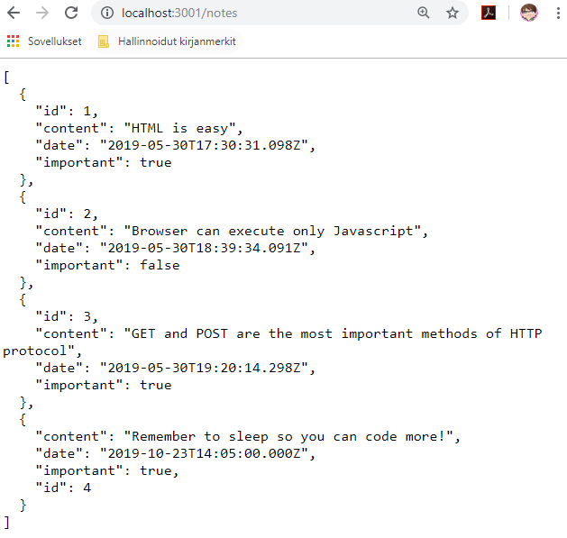
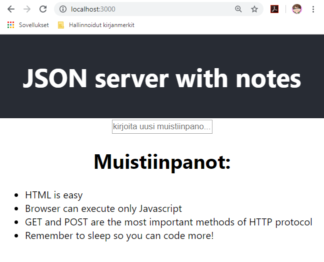

## Harjoitukset 3

### JSON-serverin asennus

Tee uusi kansio demo2. Tee siihen *db.json*-tiedosto, kopioi sinne tämä [json-muotoinen *notes*-tieto:](https://fullstackopen.com/osa2/palvelimella_olevan_datan_hakeminen).

Asenna ja käynnistä json-serveri kansioon demo2.

```cmd
> cd c:/users/oma.nimi/documents/react/demo2
> npx json-server --port=3001 --watch db.json
```

Avaa selaimella osoite: http://localhost:3001/notes.

json-server toimii kehitysaikaisena backendinä. Oikean tietokannan sijaan tiedot tallennetaan *json*-tiedostona levylle.

*Huom!* Jos olet tehnyt toisella kurssilla notes-backendin, voit käyttää suoraan sitä JSON-serverin tilalla.

Kun näissä tehtävissä viitataan *notes-backend*:iin, se tarkoittaa joko em. JSON-serveriä tai node/express:illä itse tehtyä backend:iä.

### Tehtävä 1

Tee uusi React-sovellus ajamalla create-react-app:

```cmd
> cd c:/users/oma.nimi/documents/react/
> npx create-react-app demo3
> cd demo3
> npm start
```

Asenna *axios*-kirjasto ja hae sen avulla *notes*-tiedot notes-backendiltä. Tulosta muistiinpanot consolille.

```cmd
> npm install axios --save
```

Tallenna saanut tiedot *notes*-tilamuuttuujaan. Muuta hakeminen *event*-hookiksi, joka suoritetaan vain kun *apps.js* renderöidään ensimmäisen kerran.

Voit laittaa toistaiseksi kaiken axios-koodin *apps.js*-tiedostoon. [Ohjeet axios:en käyttöön löytyvät täältä (Axios ja promiset):](https://fullstackopen.com/osa2/palvelimella_olevan_datan_hakeminen) tai voit ladata valmiin koodin [täältä](./axios-service.html).

### Tehtävä 2

Tallenna axioksen avulla json-servejille (tai notes-backendille) uusi kovakoodattu muistiinpano (*notes*-olio). Katso json-serveriltä, että se ilmestyi myös sinne.

*Huom* id-tulee serveriltä, älä lähetä sitä.'



### Tehtävä 3

Tee uusi komponentti, joka tulostaa ruudulle kaikki muistiinpanot ranskalaisilla viivoilla.



### Tehtävä 4

Tee lomakekomponentti, jonka avulla saadaan syötettyä uusi muistiinpano, sekä sen tärkeys (true/false) esim.*check-box*:in avulla. Tallenna lomakekentät tilamuuttujiin ja lähetä uusi *notes*-olio notes-backendille, kun lomake *submit*:oidaan.

Muista päivittää axis-kutsun jälkeen *notes*-tilamuuttuja, jotta ruutu päivittyy!

### Tehtävä 5

Lisää jokaiselle muistiinpanolle poista- ja päivitä-napit ja toteuta toiminnallisuus. Muista päivittää onnistuneen *axios*-kutsun jälkeen *notes*-tilamuuttuja vastaamaan notes-backend:in tilannetta (poistettu muistiinpano poistetaan myös notes-tilamuuttujasta, vanha muistiinpano korvataan muutetulla).

### Tehtävä 6

Tee *dropdown*-valikko, jonka avulla filteröit ruudulle näkyviin vain tärkeät muistiinpanot.

### Lisätehtävä 1 (node/express -backend)

Toteuta käyttäjän rekisteröityminen ja kirjautuminen. Vain kirjautunut käyttäjä voi lisätä, muokata tai poistaa muistiinpanoja. Muistiinpanoja voi lukea ilman kirjautumista.

*Huom* Tämä vaatii lisää koodia myös backendiin sekä muutoksen tietokantaan.

### Lisätehtävä 2 (node/express -backend)

Lisää userid kenttä muistiinpanoon, niin että kirjatunut käyttäjä voi muokata ja poistaa vain omia muistiinpanojaan.

*Huom* Tämä vaatii lisää koodia myös backendiin ja muutoksen tietokantaan.
