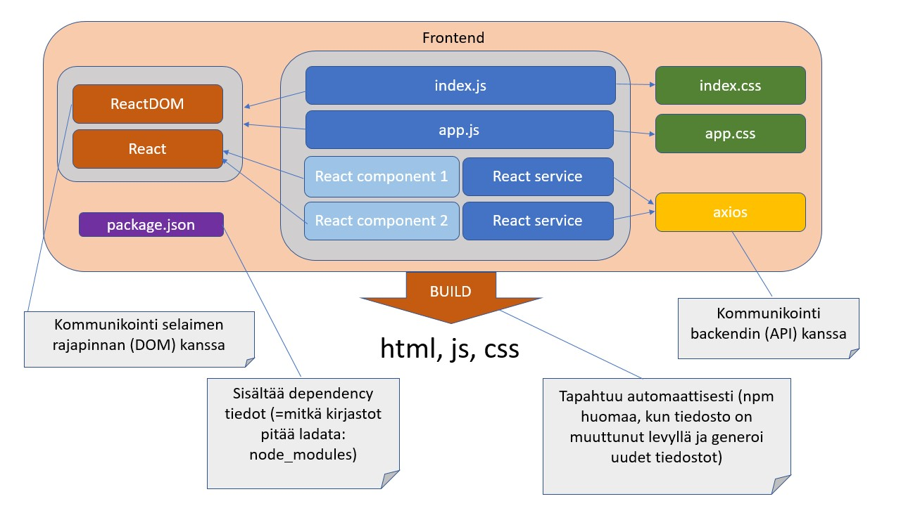

## Johdanto

### React

Kurssilla opitaan tekemään SPA (*Single Page Application*) React-kirjaston avulla. React on JavaScript-kirjasto, joka piilottaa ohjelmoijalta selaimen DOM-rajapinnan ja mahdollistaa HTML-koodin ja JavaScript:in kirjoittamisen sekaisin kätevän mutta aluksi hieman oudon näköisen JSX-syntaksin avulla. Kurssilla opitaan myös käyttämään JavaScriptiä tehokkaasti.

### Materiaali

Kurssin oppimateriaalina käytetään soveltaen Helsingin Yliopiston FullStack MOOC:in osia 1 ja 2. Harjoitustehtävät palautetaan Github:in ja Herokun avulla opettajalle (*ei seurata sinisellä pohjalla olevia FS MOOC:in koodin palautusohjeita*). HUOM! Kurssin suorittamiseksi pitää tehdä tietty määrä harjoitustehtäviä (eivät ole samat kuin FS MOOC:issa).

