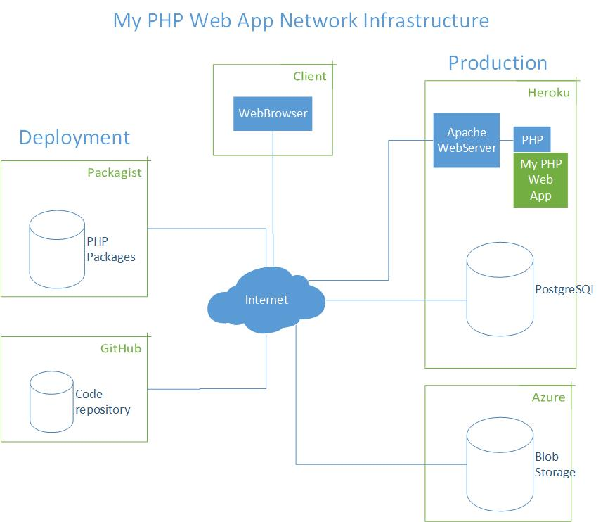
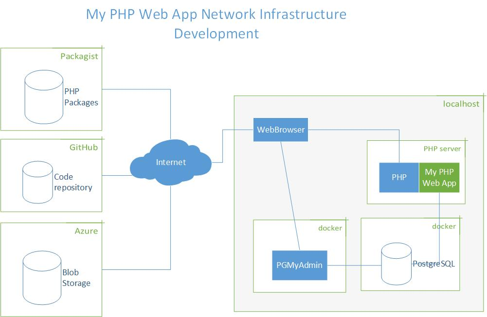

## Ohjelmistoarkkitehtuuri

Ohjelmistotuotannossa käytetään erilaisia korkeantason arkkitehtuurikuvia esittämään järjestelmän riippuvuuksia. 

### Web-infrastruktuuri (Web infrastructure)

Web-sovellukset toimivat joko yhdessä kaiken sisältävässä webhosting palvelusta tai se koostetaan useammasta eri mikropalveluista. Näiden palvelujen suhdetta toisiinsa voidaan kuvata Web-infrastruktuurikuvalla.

Tässä kuvassa on cpanelin avulla toteutettu web-hosting palvelu:

Mikropalveluista koostuvassa web-sovelluksessa on useita servereitä, jotka toteuttavat eri toiminnallisuudet.

*Production* kuvaa tässä lopullista sovelluksen toimintaympäristöä ns. tuotantoympäristöä. ja *Deployment* sitä kun sovellus asennetaan/käynnistetään tuotantoympäristöön.

Vastaava kuva voidaan piirtää kehitysympäristöstä (*Development*). Tässä *localhost* on ohjelmistokehittäjän oma kone.

### Ohjelmistoarkkitehtuuri (SW Architecture)

Ohjelmistoarkkitehtuurikuva kertoo ohjelmiston sisäisestä rakenteesta. Tästä kuvasta selviää ohjelmiston sisäinen rakenne sekä sen käyttämät ulkoiset palvelut.

