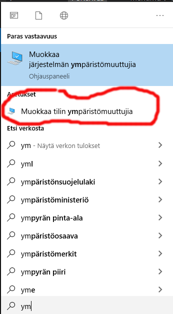

## Lokaalin ohjelmistoympäristön asentaminen

Jos koneessasi ei ole oikeaa versiota php:sta, php on mutta se ei käynnity tai composer puuttuu voit asentaa/konffata ne itse:

### PHP:in asentaminen polkuun

Avaa Windows:in käynnistysvalikosta *ympäristömuuttujat* (kirjoita hakukentään "ymp"), valitse *tilin ympäristömuuttujat*:



Valitse *path*, ja *muokkaa*. 


Valitse *uusi* ja kirjoita siihen puuttuvat polku:

```cmd
c:\xampp\php
```

### Composer:in asentaminen

- Voit asentaa omaan profiiliisi [uusimman Composerin](https://getcomposer.org/download/)), tämä ei vaadi asennusoikeuksia.

### PHP 8:n asentaminen lokaalisti

1. Lataa [php.zip](https://windows.php.net/download/) ja pura se projektikansioosi kansioon *php8*
2. Uudelleen nimeä tiedosto *php.ini-development -> php.ini*
3. Aktivoi seuraava rivi (poista ;)

    ;extension_dir = "ext"

4. Aktivoi lisäksi seuraavat extensiot php.ini-tiedostossa:


### .env

Tarkista että sinulla on *.env* olemassa. Tässä CodeIgniter 4:n .env:

[.env](env.text)

### Ajele menemään

> php8/php composer install

### Ongelma nro 1: $sensitiveDataInTrace

Jos koodisi ei toimi enää composer updaten jälkeen (valittaa että *$sensitiveDataInTrace* ei ole määritelty)

Lisää tiedostoon *app/Config/Exceptions.php* seuraava rivi:

```php
public $sensitiveDataInTrace = [];
```
