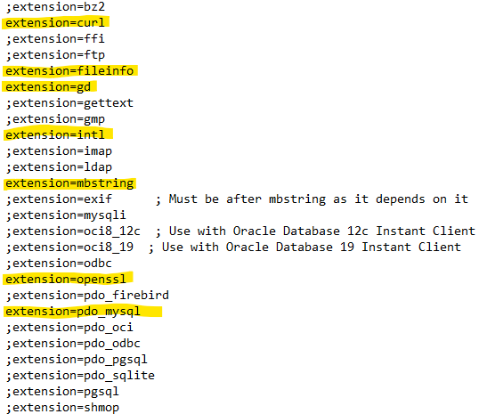

## Lokaalin ohjelmistoympäristön asentaminen

Jos koneessasi ei ole oikeaa versiota php:sta, tai composerista voit asentaa ne itse:

### Composer:in asentaminen

1. Aja terminaalissa seuraavat komennot (ks. [uusin Composer](https://getcomposer.org/download/)):

```cmd
php -r "copy('https://getcomposer.org/installer', 'composer-setup.php');"
php -r "if (hash_file('sha384', 'composer-setup.php') === '906a84df04cea2aa72f40b5f787e49f22d4c2f19492ac310e8cba5b96ac8b64115ac402c8cd292b8a03482574915d1a8') { echo 'Installer verified'; } else { echo 'Installer corrupt'; unlink('composer-setup.php'); } echo PHP_EOL;"
php composer-setup.php
php -r "unlink('composer-setup.php');"
```

2. Tämä lataa tiedoston composer.phar. Voit uudelleen nimetä sen *composer.phar -> composer*

### PHP 8:n asentaminen

1. Lataa php.zip ja pura se projektikansioosi
2. Uudelleen nimeä tiedosto *php.ini-development -> php.ini*
3. Aktivoi seuraava rivi (poista ;)

    ;extension_dir = "ext"

4. Aktivoi lisäksi seuraavat extensiot php.ini-tiedostossa:



### Ajele menemään

> php/php composer install

