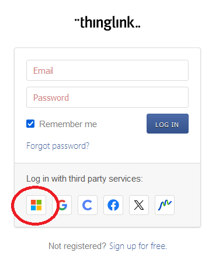

### Käytettävyys ja saavutettavuus

- Nielsenin käytettävyysohjeistus[PDF](https://otredu.github.io/docs/nielsen.pdf)

- Saavutettavuusohjeita:

    -  [Perusohjeet](https://saavutettavuusopas.fi/saavutettavuus-ja-kaytettavyys/)
    -  [Värikontrastin tarkistaminen](https://saavutettavuusopas.fi/tarkista-varikontrasti-helposti/)
    -  [Digipalvelulaki](https://www.saavutettavuusvaatimukset.fi/digipalvelulain-vaatimukset/)
    -  [WCAG-kriteerit](https://www.saavutettavuusvaatimukset.fi/digipalvelulain-vaatimukset/tietoa-wcag-kriteereista/)
    - [WCAG 2.1: lain vaatimukset A- ja AA-tason kriteerit](https://www.saavutettavuusvaatimukset.fi/digipalvelulain-vaatimukset/wcag-2-1/)
    - [ARIA](https://developer.mozilla.org/en-US/docs/Web/Accessibility/ARIA)

- Screen reader - ohjelma (vaatii asennusoikeudet)
    - [NVDA](https://www.nvaccess.org/download/)

---
Harjoitukset:

1. Sivuston käytettävyyden arviointi Nielsenin ohjeistuksen mukaan (parityö)

    - Käykää pareittain läpi viime syksyn PHP-harjoitustyö (mielellään jonkun muun ryhmän tekemä) ja arvioikaa sivuston käytettävyyttä Nilsenin käytettävyysohjeiden perusteella [PDF](https://otredu.github.io/docs/nielsen.pdf)

    - Tehkää yhteenveto havainnoista, positiivisista sekä negatiivisista käyttämällä [ThingLink](https://www.thinglink.com/):iä.
        1. Kirjaudu valitsemalla Microsoft-kirjautuminen (käytä koulun *edu.tampere.fi*-tunnuksia). 

        

        2. Ottakaa tutkitusta sivusta ruudunkaappauskuva (*snip*-toolilla), tuokaa se ThingLink:iin ja liittäkää ongelmalliseen kohtaa uusi *tagi*. Kerro tagi-tekstissä havaitsemastasi ongelmasta ja mihin Nielsenin sääntöön se liittyy (jotain jokaisesta 10 Nielsenin säännöstä).
        3. Kootkaa havainnot yhteen linkkaamalla erilliset ThingLink-sivut yhteen. Palauttakaa opettajalle linkki työn etusivulle.

2. Saavutettavuus-harjoitus (parityö)

    - Asenna Chrome-selaimeen saavutettavuustestauksessa käytettävä lisäosa [AxeDevTools](https://chromewebstore.google.com/detail/axe-devtools-web-accessib/lhdoppojpmngadmnindnejefpokejbdd)

    - Avaa testattava sivu, avaa Chromen *Developer tools* (*Ctrl-Shift-i*), valitse *axeDevTools*

        

    - Käynnistä *Scan ALL of my page* ja tutki mitä ongelmia sivustolla on saavutettavuuteen liittyen

        

        

        

    - Kirjaa ThingLink:iin myös nämä havainnot tagien taakse (10 kriittisintä havaintoa eri sivuilta ja miten ne korjattaisiin). 

    - Linkatkaan erilliset ThingLink-sivut yhteen ja palauttakaa opettajalle linkki ThingLink-sivustollenne.

--- 
Lisätehtävä:

Käytettävyystestaus - harjoitus [ohje](https://otredu.github.io/docs/kaytettavyystestaus_ohje.pdf), [raportin malli](https://otredu.github.io/docs/kaytettavyystestaus_raportti_esim.pdf), [testilomake malli](https://forms.office.com/Pages/ResponsePage.aspx?id=M9Bc85cb2EyN5Fb9SCc54WsSyi1-z3pJnm3SqkRCtihUMFlLRk5XNEYzN0NNVDgxOE1SWFZXQU1YNi4u)