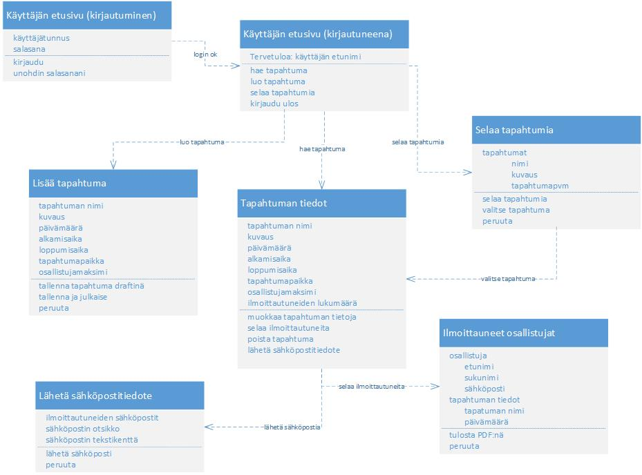

### Toiminnallinen määrittely

- [Use casesta näyttökarttaan](https://docplayer.fi/396513-Haaga-helia-kayttotapaukset-1-tietojenkasittely-tietosysteemin-maaritys-kayttotapaukset.html)
- [Käsitteistä ER-käsitekaavioon ja tietokantasuunnitelmaan](http://www.leeniemi.net/syst19/index.php?sivu=kasitteet)

### Käyttöliittymän suunnittelu

- [Visuaalinen ilme](http://www.leeniemi.net/syst19/materiaali/Kayt_sommittelu.pdf)
- [Typografia](http://www.leeniemi.net/syst19/materiaali/Kayt_typografia.pdf)
- [Värit](http://www.leeniemi.net/syst19/materiaali/Kayt_varit.pdf)
- [Logo- ja tyyliopas](http://www.leeniemi.net/syst19/materiaali/Kayt_logo_tyyliopas.pdf)
- [Suunnittelun vaiheet](http://www.leeniemi.net/syst19/materiaali/Kayt_webvaiheistus.pdf)

--- 
Tehtävät:

1. Tietokantasuunnitelma

    Tee järjestelmälle ER-käsitekaavio (Visio: Chen) sekä tietokantamalli (Visio: UML database). Suunnittele tietotyypit sekä tietokannan testaaminen.

    - 
    - 
    - Tietokannan suunnitteludokumentti - malli

2. Käyttöliittymän toiminnallinen suunnittelu

    Suunnittele käyttöliittymän toiminta näyttörakennekaavion avulla:
    - 

3. Käyttöliittymän ulkoasun suunnittelu

    Tee sivustolle MockUp:in pohjalta tyyliopas (HTML,CSS). [HSL-esimerkki](https://www.hsl.fi/tyyliopas)

4. Ohjelmiston arkkitehtuurin suunnittelu

    Kuvaa ohjelmiston arkkitehtuuri (moduulit) korkealla tasolla.

5. Kokoa suunnitteludokumentiksi

    Kokoa edelliset tehtävät yhdeksi dokumentiksi ja palauta.