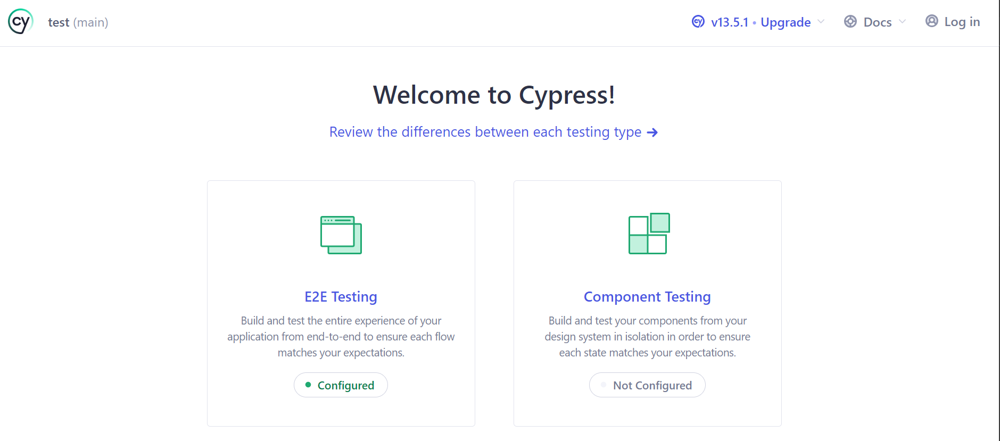
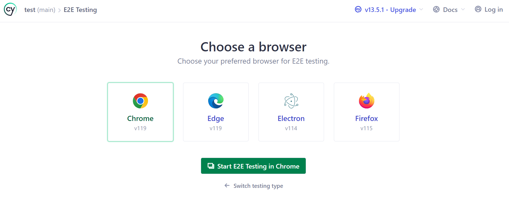
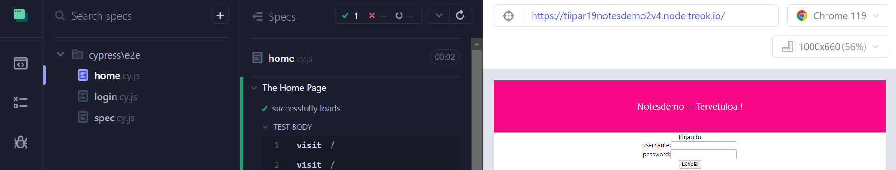

## Cypress - testaustyökalu

*Cypress* on JavaScript-pohjainen testaustyökalu, jonka avulla voidaan testata web-applikaatioita (E2E) sekä backend-toiminnallisuuksia (REST API). Tässä demossa käytetään E2E 

### Cypress:in asennus

Tee uusi kansio *testing*, siirry sen sisään ja asenna Cypress:

```cmd
    cd testing
    npm init
    npm i cypress --save-dev
```    

Käynnistä Cypress:

```cmd
    npx cypress open
```

Cypress aukeaa, valitse *E2E* testaus (*end-to-end*).



Valitse selaimeksi *Chrome* ja paina *Start testing*:



### Testien lisääminen

Avaan kansio *Specs* ja lisää sinne uusi testitiedosto: *home.cy.js*.

Ensimmäinen testi avaa nettisivun:

```js
describe('Notesdemo-test-demo', () => {
  it('Visits notesdemo-test-page', () => {
    cy.visit('https://tiipar19notesdemotest.node.treok.io')
  })
})
```

Koska tätä osoitetta joudutaan kirjoittamaan moneen kertaan. Lisätään se *cypress.config.js* - tiedostoon: 

```js
module.exports = defineConfig({
  e2e: {
    baseUrl: 'https://tiipar19notesdemotest.node.treok.io/',
  },
});
```

Nyt voidaan testi kirjoittaa yksinkertaisemmin:

```js
describe('Notesdemo-test-demo', () => {
  it('Visits notesdemo-test-page', () => {
    cy.visit('/')
  })
})
```

Testit ajetaan valitsemalla tiedosto ruudun vasemmasta *Specs* listasta. Tiedosto suoritetaan ja mahdolliset virheet näkyvät ruudun keskiosassa. Selainnäkymä on ruudun oikeassa ruudussa.



Koska sisäänkirjautuminen tehdään testauksen lähdes jokaisessa vaiheessa, tehdään siitä oma erillinen apumetodi, jota voidaan kutsua muista testeistä.

Lisää tiedostoon *support/commands.js* 

```js
Cypress.Commands.add('login', (username, password) => {
    cy.visit('/')
  
    cy.get('input[id=username]').type(username)
  
    // {enter} causes the form to submit
    cy.get('input[id=password]').type(`${password}{enter}`, { log: false })
  
    // we are logged in!
    cy.contains('tester1')

  })

  ```

  Seuraavaksi lisätään *login*-kutsu testitiedostoon:

  ```js
  const username="tester1";
  const password="salasana";
  const test_message = "Cypress testing";

  describe('The Home Page', () => {
  it('successfully loads', () => {
    cy.visit('/') // defaults to baseURL in config-file
    
    cy.login(username, password)

  })
})
  
```
Testataan uuden muistiinpanon lisääminen, lisää testiin seuraavat rivit:

```js
   cy.get('input[id=importance]').click()

   cy.get('input[id=newnote]').type(`${test_message}{enter}`)
```

Viimeisenä kirjaudutaan ulos:

```js
    cy.get('button[id=logout]').click()
```

Huomaa, että tälle sivustolle on helppo lisätä automaatiota, koska kaikilla UI-elementeillä on *id*:t, joten niihin on helppo viitata. 

### Paremmat testit

Edellä oleva testikoodi käy kyllä läpi joitakin sivuston toimintoja onnistuneesti mutta se ei testaa, että sivusto muuttuu halutulla tavalla. Lisätään paremmat/tarkemmat testit, jotka validoivat myös toiminnon lopputuloksen. Jotta tätä voidaan testata luotettavasti, täytyy jokaisen testaajan rekisteröidä oma testikäyttäjä, muuten toisten tekemät lisäykset ja poistot sotkevat testien lopputuloksen. Rekisteröi itsellesi uusi testikäyttäjä ja muuta ko. tiedot *login*-metodiin.

Muutetaan myös testitiedosto rakennetta niin, että testien alussa hoidettavat muodollisuudet kuten sivuston avaaminen ja sisäänkirjautuminen ajetaan ennen (*beforeEach*) kutakin testiä. Tiedostoon loppuun lisätään toiminnallisuudet kuten uloskirjautuminen, jotka ajetaan jokaisen testin jälkeen (*afterEach*). 

```js
describe('Notesdemo basic tests', () => {
  beforeEach(() => {
      cy.visit('/') // defaults to baseURL in config-file
      cy.login(username, password)
    })

...

  afterEach(()=> {
    cy.get('button[id=logout]').click()
  })
})
```

Tämä testi varmistaa, että tärkeä muistiinpano saa oikean *class*:in:

```js
  it('add new important', () => {
    cy.get('input[id=importance]').click()
    cy.get('input[id=newnote]').type(`${test_message} important{enter}`)
    cy.get("p").contains("Cypress testing important").and('have.class', 'important')
  })
```

Tämä testi varmistaa, että tavallinen muistiinpano on myös oikeanlainen ruudulla:

```js
  it('add new basic', () => {
    cy.get('input[id=newnote]').type(`${test_message} normal{enter}`)
    cy.get("p").contains("Cypress testing normal").and('have.class', 'basic')
  })
```

Tämä testi testaa muistiinpanon tärkeyden muuttamisen:

```js
  it('change importance', () => {
    cy.get("p").contains("Cypress testing important").click()
    cy.get("p").contains("Cypress testing important").and('have.class', 'basic')
  })
```

Tämä testi testaa muistiinpanon poistamisen (yksikin testi riittäisi mutta haluamme, että sivusto jää testien jälkeen samanlaiseksi kuin ennen testejä):

```js
  it('delete important', () => {
    cy.get("p").contains("Cypress testing important").and('have.class', 'basic').find('button').click()
    cy.get("p").contains("Cypress testing important").should('not.exist')
  })
  it('delete normal', () => {
    cy.get("p").contains("Cypress testing normal").and('have.class', 'basic').find('button').click()
    cy.get("p").contains("Cypress testing normal").should('not.exist')
  })
```

Nyt sivuston perustoiminnallisuudet on testattu. 

## Harjoitustehtävät:

1. Kirjoita testi, jolla testataan rekisteröityminen valideilla tiedoilla sekä puutteellisilla tiedoilla (ei saisi rekisteröityä, eli jos käyttäjänimi tai salasana on liian lyhyt tai tyhjä). Tee tälle uusi testitiedosto eli *spec*. 

2. Testaa rekisteröityminen myös niin ettei kahta samannimistä käyttäjää pysty lisäämään, ja että sivusto ilmoittaa oikean virheviestin. Tämän voi lisätä edellisen kanssa samaan tiedostoon.