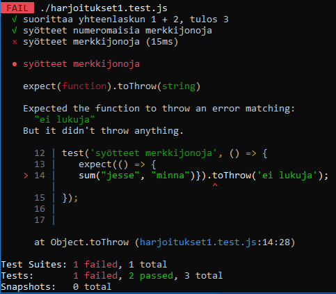
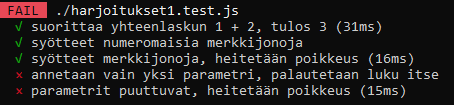

## Demo 1

Ennen tämän demon suorittamista, asenna [JEST](jest.html) ja tee em. ohjeiden mukainen testiympäristön testi (aja yksi testi *sum* funktiolle). Kertaa myös [JavaScriptin perusrakenteet](../js/alkeita.html).

Seuraavassa demossa lisätään testitapauksia *sum*-funktiolle, ja korjataan sitä niin että se toipuu vääränlaisesta syötteestä (käsittelee numeromaiset merkkijonot oikein, toimii jos annetaan vain yksi parametri jne). Lisäksi sen pitäisi heittää poikkeus, jos tilanteesta ei voi toipua.

### Demo 1: Sum-funktion parantelu

Lisätään sum-funktiolle uusi testitapaus, joka testaa toipuuko funktio siitä, että yhteenlaskettavat luvut annetaankin merkkijonomuodossa.

Testattava funktio (omassa *.js tiedostossaan):

```js
function sum(a, b) {
    const result = a + b;
    return result;
}
module.exports = sum;
```

Testifunktio (omassa *.test.js tiedostossaan):

```js
test('syötteet numeromaisia merkkijonoja', () => {
  expect(sum("1", "2")).toBe(3);
});
```

Kun testi ajetaan (npm run test), konsolille tulee ilmoitus siitä, että testi ei mene läpi. Tämä on hyvä asia, nyt tiedämme että testi on kirjoitettu oikein ja se toimii niin kuin sen pitääkin.


Nyt palataan *sum* funktioon ja korjataan se:

```js
function sum(a, b) {
    const result = Number(a) + Number(b);
    return result;
}
module.exports = sum;
```

Seuraavaksi testataan merkkijonoilla, joita ei voi muuttaa numeroiksi. Koska tästä ei voi toipua (kirjaimia sisältävät merkkijonot eivät muutu numeroiksi Number-funktiollakaan), funktio pitäisi heittää poikkeus (*exception*).

Kirjoitetaan testi, ja testataan että se toimii. Huomaa, että tässä testitapauksen syntaksi on hieman erilainen, se annetaan nuolifunktiona ('ei lukuja' on virheilmoitus, jonka voit valita itse).

```js
test('syötteet merkkijonoja, heitetään poikkeus', () => {
   expect(() => {
   sum("jesse", "minna")}).toThrow('ei lukuja');
});

```

Testi toimii hyvin, koska saamme *fail*:


Nyt korjataan *sum*-funktio, niin että testi menee läpi:

```js
function sum(a, b) {
    const result = Number(a) + Number(b);
    console.log(result);
    if(Number.isNaN(result)){
        throw new Error('ei lukuja');
    }
    return result;
}

module.exports = sum;
```

Lisätään vielä testit tapaukselle, jossa toinen parametri on jäänyt vahingossa pois (tai sitä ei ole), ja sellaiselle tapaukselle, että molemmat parametrit on jätetty pois.

```js
test('annetaan vain yksi parametri, palautetaan luku itse', () => {
  expect(sum(4)).toBe(4);
});

test('parametrit puuttuvat, heitetään poikkeus', () => { 
  expect(() => {
    sum()}).toThrow('ei parametreja');
});
```

Nämäkin testit toimivat hyvin, koska saamme *fail*.


Korjataan koodia niin, että nämäkin testit menevät läpi. Lisätään *default*-arvo b:lle (b=0), ja heitetään poikkeus, jos a:n arvokin on määrittelemätön.

```js
function sum(a, b=0) {
    if(a === undefined || a === null){
        throw new Error('ei parametreja');
    }
    const result = Number(a) + Number(b);
    if(Number.isNaN(result)){
        throw new Error('ei lukuja');
    }
    return result;
}
module.exports = sum;
```

### Yhteenveto

Yksikkötestien avulla ohjelmoija testaa oman koodinsa oikean toiminnan kaikissa tapauksissa, myös mahdollisilla väärillä syötteillä. Jos koodissa on ehtolause, sen jokainen haara pitää testata jne. Testin testaaminen on tärkeä välivaihe, että voidaan olla varmoja siitä, että virhe on testattavassa koodissa eikä itse testissä.

Yksikkötestit kirjoitetaan ja tallennetaan yhdessä testattavan koodin kanssa, ja ne ajetaan uudelleen ennen integrointivaihetta. Niitä ajetaan myös aina kun koodia on muokattu, jotta nähdään onko jo kerran toiminut koodi mennyt muutoksista rikki. Tätä kutsutaan *regressio*-testaukseksi.

Nyt kun nämä testit toimivat ja jatkat [harjoituksia 1](harjoitus1.html), voit nopeuttaa *jest*:in ajamista skippaamalla nämä testit (nopeuttaa jestin ajamista). Voit hypätä testien yli lisäämällä testitiedostoon:

```js
describe.skip('sum-testit', () => {
    ...kaikki tässä oleva skipataan...
}
```