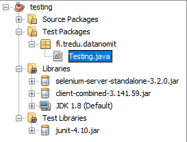
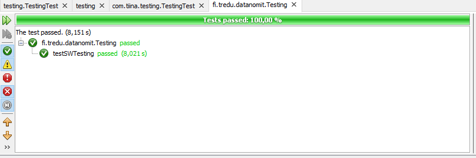

## Headless browser testaustyökaluna

Headless browser -ajuri mahdollistaa selaimen ohjaamisen skriptin tai koodin avulla ohjelmallisesti (esim. Python, Java, JS). Sen avulla voidaan automatisoida testitapauksia selaimessa toimivan UI:n testaamiseksi. Ajurin lisäksi testien ajamiseen käytetään jotan yksikkötestausympäristöä, esim. Javan kanssa JUnit:ia.

### Asentaminen

1. Lataa [Chrome driver](https://sites.google.com/a/chromium.org/chromedriver/downloads) tietokoneellesi.

2. Lataa [Selenium JAR](https://goo.gl/dR7Lg2) ja tuo se NetBeansiin, [katso ohje](http://softwaretestingbooks.com/selenium-webdriver-script-in-netbeans-using-chrome).

### Testausympäristön testaus

Testaa seuraavan koodin avulla, että yhteys selaimeen toimii, muista muuttaa webdriverin osoite oikeaksi (*System.setProperty*).

```java
package testing;

import org.openqa.selenium.By;
import org.openqa.selenium.WebDriver;
import org.openqa.selenium.WebElement;
import org.openqa.selenium.chrome.ChromeDriver;

public class Testing {
    public static void main(String[] args) throws InterruptedException {
    System.setProperty("webdriver.chrome.driver", "C:\\Users\\tiina.partanen\\Downloads\\chromedriver_win32\\chromedriver.exe");
    WebDriver driver = new ChromeDriver();

    // ensimmäinen testi
    driver.navigate().to("http://softwaretestingbooks.com/");
    String appTitle = driver.getTitle();
    System.out.println("Application title is : "+appTitle);

    // toinen testi
    driver.get("http://www.google.com/xhtml");
    Thread.sleep(5000);  
    WebElement searchBox = driver.findElement(By.name("q"));
    searchBox.sendKeys("ChromeDriver");
    searchBox.submit();
    Thread.sleep(5000);
    driver.quit();
    }
}
```

Ensimmäisen testin pitäisi automaattisesti avata sivusto "http://softwaretestingbooks.com/", ja tulostaa sen *title*-kenttä. Toisen testin pitäisi tehdä *google*-haku hakusanalla "ChromeDriver".

### JUnit

Varsinaiset testitapaukset kirjoitettaisiin JUnitin avulla. Lataa JUnit ja asenna se NetBeansiin, [katso ohje](https://junit.org/junit4/faq.html#started_1).

Nyt tehdään uusi *package* kohdan *Test Packages* alle, anna sille nimeksi *fi.tredu.datanomit* ja tee uusi luokka. jonka nimi on *Testing*. Kopioi alla oleva koodi tämän luokan sisälle. Testit ajetaa valitsemalla hiiren oikealla näppäimellä tiedoston päällä *run file*.

Muista taas vaihtaa ChromeDriverin osoite!



```java
package fi.tredu.datanomit;

import org.junit.After;
import org.junit.AfterClass;
import org.junit.Before;
import org.junit.BeforeClass;
import org.junit.Test;
import static org.junit.Assert.*;
import org.openqa.selenium.By;
import org.openqa.selenium.WebDriver;
import org.openqa.selenium.WebElement;
import org.openqa.selenium.chrome.ChromeDriver;

public class Testing {
    private WebDriver driver;
    public Testing() {
    }

    @Before
    public void setUp() {
        System.setProperty("webdriver.chrome.driver", "C:\\Users\\<etunimi>.<sukunimi>\\Downloads\\chromedriver_win32\\chromedriver.exe");
        driver = new ChromeDriver();
    }

    @After
    public void tearDown() {
        driver.quit();
    }

    @Test
    public void testMain() throws Exception {
        driver.navigate().to("http://softwaretestingbooks.com/");
        String appTitle = driver.getTitle();
        assertEquals("Title equals Software testing", "Software Testing Books", appTitle);
    }
}
```

Jos kaikki on alustettu oikein, testi menee läpi.



Lisätestit tehtäisiin kuten *@test* kohdan funktiossa, voit itse keksiä testifunktiolle nimen.

### Lisätietoa

- [Headless testing with Selenium webdriver](http://pragmatictestlabs.com/2017/11/16/headless-testing-selenium-webdriver/)
- [How to run Selenium tests with JUnit](https://www.blazemeter.com/blog/how-to-run-a-selenium-test-with-junit)
- [Introduction to Unit Testing Using JUnit4 on NetBeans IDE](https://dzone.com/articles/introduction-to-the-unit-testing-technique-using-j)