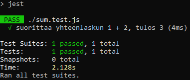

## JEST

JEST:in avulla voidaan automatisoida yksikkötestit JavaScript-komponenteille (funktiot, React-komponentit jne.). Tarkista, että [node.js](https://nodejs.org/en/) on asennettu ennen kuin jatkat.

### JEST:in asentaminen

1. Avaa CMD, tee uusi projektikansio (mkdir), siirry siihen (cd) ja alusta uusi node.js projekti ajamalla:
​
    ```bash
    npm init
    ```
    Vastaa kysymyksiin *yes* tai jätä ne tyhjäksi. Kohtaan *test command* kirjoita: **jest**.
2. Asenna nyt JEST ajamalla:

    ```bash
    npm install --save-dev jest ​
    ```
    --save-dev tallentaa jest:in tiedot package.json tiedostoon kohtaan, jossa listataan kehitysvaiheen riippuvuudet (*dependency*:t).

### Ensimmäinen testi

1. Käynnistä Visual Studio Code, tee uusi tiedosto *sum.js*, joka sisältää testattavan funktion **sum**:​

    ```js
    function sum(a, b) { ​
    return a + b; ​
    } ​
    module.exports = sum;
    ```
2. Tee uusi tiedosto *sum.test.js*, joka sisältää yhden testin:

    ```js
    const sum = require('./sum'); ​

    test('suorittaa yhteenlaskun 1 + 2, tulos 3', () => {
        expect(sum(1, 2)).toBe(3);
    }​);​
    ```
3. Tarkista, että package.json-tiedostosta löytyy testiskripti (tehtiin npm init:llä), jos ei löydy lisää se sinne:​

    ```js
    { "scripts": { "test": "jest" } }​
    ```
4. Käynnistä testiskiptin ajo CMD:n kautta:​

    ```bash
    npm run test​
    ```
    Nyt JEST ajaa kaikki testit, joita se löytää hakemistosta (testit sisältävän tiedoston nimessä tulee olla *.test.*).

    

5. Tallenna GitHub:iin

    Tiedostot kannattaa tallentaa Github:iin. Tee projektille uusi Github-repo seuraamalla näitä [ohjeita](../github/uusirepo.html).