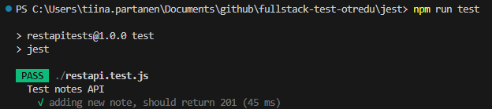
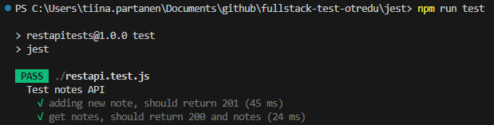
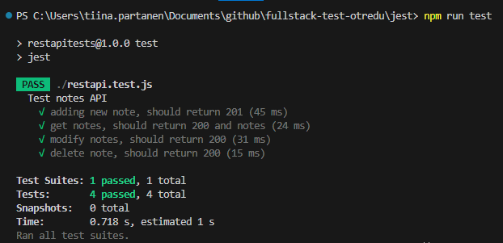

## REST API testaus (jest+supertest)

Fullstack-kehitys saattaa tuntua vaikealta, koska debuggauksessa on huomioitava se, onko bugi frontend:issä vai backend:ssä. Tätä ongelmaa poistaa se, että backend testataan hyvin ennen frontin koodaamista, jolloin tiedetään mitä backend:issä toimii ja debuggaus voidaan keskittää fronttikoodiin.

REST API:lle (backend) on monenlaisia testaustyökaluja, tässä käydään läpi miten *jest*:in sekä *supertest*:in avulla voidaan testata backend-toimintoja.

Esimerkissä testataan backend:iä lokaalisti, eli käynnistä notesdemo1:n backend lokaalisti portiin 3001.

```cmd
cd backend
npm run startdev
```

*Huom!* Jos sinulla ei ole notesdemo1:stä, voit tehdä tämän demon myös käyttämällä [json-serveriä backendinä](../react/json-server.html). 

### Asennus

Tee projektirepoon uusi kansio *restapitests* ja aja sen sisällä terminaalissa:

```cmd
cd restapitests
npm init
npm i jest supertest --save-dev
```

Muokkaa testiscriptiksi *package.json*-tiedostossa *jest*:

```json
  "scripts": {
        "test": "jest --runInBand"
  },
```

*Huom!* Flag *runInBand* on tärke'. Sen avulla testisuitet ajetaan peräkkäin, muuten tietokannan tilanne ei ole ennakoitavissa ja testit eivät mene läpi. Myöskään seedaus ei toimi oikein ilman sitä. 

Testit ajetaan terminaalissa:

```cmd
npm run test
```

### Testaus ilman kirjautumista

Tee uusi testitiedosto *restapi.test.js*. Jotta voimme testata muistiinpanojen hakemista, lisäämistä, muokkaamista ja poistoa (*CRUD*). Huomaa, että tiedoston nimessä tulee olla *.test.*.

```js
const request = require("supertest")
const baseURL = "http://localhost:3001"

describe("Test notes API", () => {
    const newNote = {
      content: "Drink water",
      important: false,
      date: new Date()
    }

    it('adding new note, should return 201', async ()=>{
      const response = await request(baseURL).post("/notes").send(newNote);
      expect(response.statusCode).toBe(201);
    })
})
```

Kun testin ajaa, sen pitäisi mennä läpi:



Testataan seuraavaksi muistiinpanojen hakua. Lisätään uusi testi edellisen *describe*:n sisälle:

```js
    it('get notes, should return 200 and notes', async () => {
      const response = await request(baseURL).get("/notes");
      expect(response.statusCode).toBe(200);
      expect(response.body.length >= 1).toBe(true);
    });
```

Nyt kaksi testiä pitäisi mennä läpi.



Kun testataan muistiinpanon muokkausta, tarvitsemme sen id:n. Otetaan id talteen muuttujaan silloin kun se luotiin. Lisää tiedoston alkuun:

```js
let id = null;
```

sekä uuden muistiinpanon luomiseen (ensimmäinen testi):

```js
     id=response.body.id;
```

tee myös muokattu muistiinpano (lisää newNote:n alapuolelle):

```js
    const updatedNote = {...newNote, important: true};
```

Nyt voimme tehdä testin, jossa muokataan muistiinpanoa *id*:n avulla:

```js
  it('modify notes, should return 200', async () => {
      const response = await request(baseURL).put(`/notes/${id}`).send(updatedNote);;
      expect(response.statusCode).toBe(200);
    });
```

Viimeinen testattava asia on muistiinpanon poistaminen. Tässäkin käytetään em. *id*:tä:

```js
    it('delete note, should return 200', async () => {
      const response = await request(baseURL).delete(`/notes/${id}`)
      expect(response.statusCode).toBe(200);
      })
```

Kaikki testit menivät läpi!



### Testaus kirjautumisen kanssa

Jotta voimme testata toimintoja kirjautuneena, meidän pitää kirjautua ennen testejä ja tallentaa *authtoken* käytettäväksi *authorize*-headerissä.

Lisää muuttuja *token*:ille tiedoston alkuu:

```js
let token = null;
```

Lisätään kirjautuminen ennen testejä:

```js
 beforeAll(async () => {
      response = await request(baseURL).post("/login").send(userData);
      token = response.body.token;
    })
```

Lisätään *authorize*-header + token jokaiseen kutsuun (viimeiseksi):

```js
.get("/notes").set('Authorization', `bearer ${token}`)
```

Nyt kaiken pitäisi toimia myös kirjauneena.

---

Harjoitustehtäviä:

1. Lisää testeihin tarkistuksia, niin että ei tarkisteta pelkkä HTTP-paluuarvo vaan myös saatu json-datan sisältö/tietokannan sisältö operaation jälkeen.

2. Lisää testit kirjautumiselle: oikeat kirjautumistiedot (kirjautuminen onnistuu) sekä väärät kirjautumistiedot (kirjautuminen ei pitäisi onnistua).

3. Tutustu siihen miten jest:in avulla ajetaan [*seed*:it tietokantaan](./cypress_seeds.md) ennen testejen tekemistä. Muuta ylläolevat testit toimimaan niin, että ennen testejä ajetaan seedit.